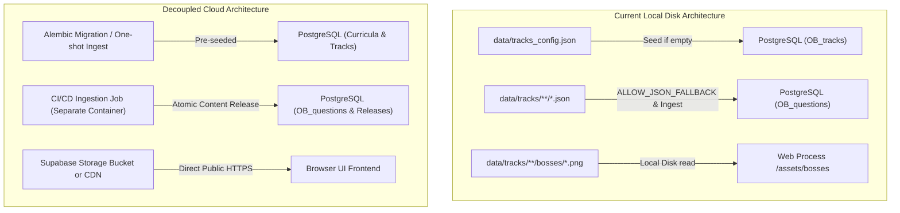

# Decoupling Organic Battles from the `/data/` Folder

This guide details where the `/data/` directory is currently referenced across the Organic Battles codebase, why those dependencies exist, and a phased architectural strategy to completely eliminate filesystem `/data/` dependencies in production.

---

## 1. Where `/data/` is Used in the Codebase Today

The codebase references `data/` across **4 core subsystems**:

### A. Boss Image Asset Serving
- **File**: [`app/main.py`](file:///Users/nkoneru/Downloads/AIApps/OrganicBattles/app/main.py) (lines 66–105, endpoint `/api/assets/bosses/{filename:path}`)
- **Usage**: When the battle screen displays a boss image (e.g., `orbital-ogre.png`, `valence-vanguard.png`), the backend searches for the PNG file on the local filesystem in:
  1. `data/tracks/advanced/bosses/`
  2. `data/tracks/foundational/bosses/`
  3. `data/tracks/default/bosses/`
  4. `data/bosses/`
  5. `data/`

### B. Initial Track & Curriculum Seeding
- **Files**:
  - [`app/infrastructure/database/engine.py`](file:///Users/nkoneru/Downloads/AIApps/OrganicBattles/app/infrastructure/database/engine.py) (lines 340–348, `_seed_tracks_if_empty`)
  - [`app/domain/content/loader.py`](file:///Users/nkoneru/Downloads/AIApps/OrganicBattles/app/domain/content/loader.py) (lines 283–315, `load_tracks_config`)
  - [`app/api/v1/admin.py`](file:///Users/nkoneru/Downloads/AIApps/OrganicBattles/app/api/v1/admin.py) (line 767, `GET /api/v1/admin/tracks/config`)
- **Usage**: If `OB_tracks` and `OB_curricula` tables in PostgreSQL or SQLite are empty, `TracksRepository.seed_if_empty()` parses [`data/tracks_config.json`](file:///Users/nkoneru/Downloads/AIApps/OrganicBattles/data/tracks_config.json) to populate track titles, descriptions, boss lists, and chapter counts.

### C. Content Ingestion Pipeline (Authoring Source)
- **File**: [`scripts/ingest_questions_to_postgres.py`](file:///Users/nkoneru/Downloads/AIApps/OrganicBattles/scripts/ingest_questions_to_postgres.py)
- **Usage**: Reads `chapter_01.json`, `chapter_02.json`, etc., from `data/tracks/<track_id>/` and inserts them into PostgreSQL (`OB_questions` & `OB_content_releases`).

### D. Offline / Emergency Fallback (`ALLOW_JSON_FALLBACK`)
- **File**: [`app/domain/content/loader.py`](file:///Users/nkoneru/Downloads/AIApps/OrganicBattles/app/domain/content/loader.py) (lines 130–175, `load_track_bundle`)
- **Usage**: When `ALLOW_JSON_FALLBACK=true` (in dev or during a complete database outage), the app serves questions directly from `data/tracks/<track_id>/chapter_*.json` instead of querying the database.
*(In production, [`prod.env`](file:///Users/nkoneru/Downloads/AIApps/OrganicBattles/prod.env) sets `ALLOW_JSON_FALLBACK=false`, meaning live gameplay already reads questions exclusively from PostgreSQL).*

---

## 2. Current Contents of `/data/`

```text
data/
├── tracks_config.json          <- Track & curriculum metadata definitions (7.8 KB)
├── organic_battles.db          <- Legacy SQLite database artifact (safe to remove)
└── tracks/
    ├── default/                <- Foundational Default track (30 chapter JSONs + bosses/)
    ├── foundational/           <- Foundational subtracks (Mechanisms, Nomenclature, Vocab JSONs + bosses/)
    └── advanced/               <- Advanced subtracks (Orbital, Pericyclic, SkillBuilder JSONs + bosses/)
```

---

## 3. Decoupling Roadmap

To run Organic Battles in a containerized, serverless, or cloud-native environment (e.g., Docker, Fly.io, Cloud Run, AWS ECS) without shipping large JSON directories and image files in the web process container, follow this **4-phase decoupling strategy**:



### Phase 1: Move Boss Images to Cloud Storage / CDN
Currently, boss PNG images are stored on disk in `data/tracks/.../bosses/`.

- **Option A (Supabase Storage - Recommended)**:
  1. In Supabase Dashboard $\rightarrow$ **Storage**, create a public bucket named `bosses`.
  2. Upload all images from `data/tracks/**/bosses/*.png`.
  3. In the database (`OB_bosses.image_url` / `Question.images_json`), update the image references to the public URL:
     `https://<project-ref>.supabase.co/storage/v1/object/public/bosses/<filename>.png`
  4. The browser loads boss images directly from Supabase Storage CDN, with zero load or disk dependency on the Python backend.
- **Option B (Static Folder)**:
  Move boss images into `static/images/bosses/` alongside other static assets (`static/audio/`, `static/css/`), retiring the `data/` directory search logic.

### Phase 2: Move Track & Curriculum Seeding into Alembic Migration
Currently, `app/infrastructure/database/engine.py` reads `data/tracks_config.json` on startup if tables are empty.

1. Create an Alembic migration (e.g., `0009_seed_curricula_and_tracks.py`) or run a one-time migration script using `ob_migrator` that inserts the contents of `tracks_config.json` directly into `OB_curricula` and `OB_tracks`.
2. Once `OB_tracks` is populated in PostgreSQL, `load_tracks_config(db=db)` always reads from PostgreSQL and never looks for `data/tracks_config.json`.
3. Remove `_seed_tracks_if_empty()` from web process startup.

### Phase 3: Decouple Question Ingestion from Runtime Web Containers
Questions already live in the PostgreSQL database (`OB_questions` and `OB_content_releases`).

1. Add `data/` to `.dockerignore`.
2. The production web container runs with **zero local question JSON files**.
3. The web application only runs `get_content_bundle(mode)` $\rightarrow$ which reads from `shared_track_cache` and `load_db_bundle()` from PostgreSQL.
4. The question authoring JSON files remain in source control for content creators, but question releases are pushed to PostgreSQL via a standalone CI/CD ingestion task (`ob_content_ingest`).

### Phase 4: Clean Up Legacy Files
- Delete the legacy file `data/organic_battles.db` (which is an obsolete SQLite database that is no longer used).

---

## 4. Summary Checklist

| Component | Current Disk Dependency | Target Solution | Benefit |
| :--- | :--- | :--- | :--- |
| **Boss Images** | `data/tracks/.../bosses/*.png` | Supabase Storage public bucket / CDN | Instant caching, browser-direct CDN delivery, 0 MB in web container |
| **Track Metadata** | `data/tracks_config.json` | PostgreSQL `OB_tracks` table via Alembic | 100% database-driven; no runtime file read on boot |
| **Question Catalog** | `data/tracks/**/*.json` | PostgreSQL `OB_questions` via `ob_content_ingest` | Atomic releases; web process requires zero local JSON files |
| **Legacy Database** | `data/organic_battles.db` | Deleted | Removes obsolete SQLite database artifact |
