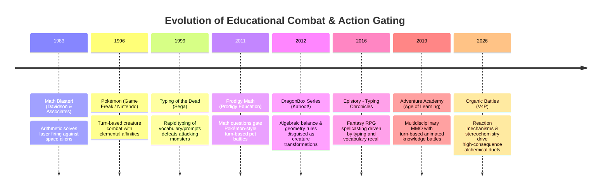
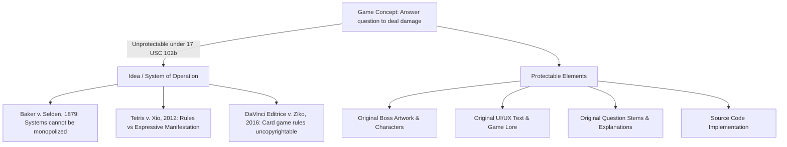

# Organic Battles: Comprehensive Implementation, Learning Design, and Intellectual Property (IP) Review

**Date of Review:** September 8, 2026  
**Subject Application:** Organic Battles (V4P) — Chemistry Fantasy RPG Platform  
**Target Comparative Products:** Prodigy Math / Prodigy English (Prodigy Education Inc.) and General Educational Turn-Based Battle Games  
**Legal Frameworks Addressed:** U.S. Copyright Act (17 U.S.C. §§ 101 et seq.), Lanham Act (15 U.S.C. §§ 1051 et seq.), U.S. Patent Act (35 U.S.C. §§ 101 et seq.), and Restatement (Third) of Unfair Competition.

---

## Executive Summary

This comprehensive review evaluates **Organic Battles (V4P)** from three interdependent dimensions:
1. **Engineering and Architecture Implementation**: Assessing the live codebase, domain rules, state persistence, content loaders, test suites, and security controls.
2. **Pedagogical and Game Design**: Evaluating the educational efficacy, combat mechanics, difficulty progression, active recall systems, and mastery tracking.
3. **Intellectual Property (IP) and Freedom-to-Operate (FTO)**: Investigating potential infringement of copyright, patent, trademark, trade dress, and terms-of-service claims with respect to **Prodigy Education Inc.** (creators of *Prodigy Math* and *Prodigy English*), related educational turn-based combat games, and foundational academic textbooks (David Klein, John McMurry, OpenStax).

### Principal Findings
- **No Direct Copyright Infringement Established**: The core gameplay mechanism—answering educational questions to cast combat spells against animated monsters—is an unprotectable idea and system of operation under **17 U.S.C. § 102(b)** and established judicial precedent (*Baker v. Selden*, *Atari v. North American Philips*, *Tetris Holding v. Xio Interactive*, *DaVinci Editrice v. Ziko Games*). The expressive audiovisual elements of Organic Battles (dark alchemical fantasy, glassmorphism, mature cyber-fantasy art, procedural Web Audio synthesis) bear zero substantial similarity to Prodigy’s proprietary chibi/cartoon 2D pixel aesthetics.
- **No Trademark or Trade Dress Conflict**: "Organic Battles" is visually, phonetically, and semantically distinct from "Prodigy", "Prodigy Math", or "Prodigy English". The target demographic (post-secondary undergraduate alchemists vs. elementary K-8 students) and marketing channels preclude any actionable likelihood of consumer confusion under the *Polaroid* / *Sleekcraft* factors.
- **Patent Landscape Clearance**: Prodigy Education’s known patents focus on computerized adaptive testing (CAT), dynamic item response theory (IRT), and cross-curricular placement algorithms. Organic Battles utilizes a deterministic, track-based sequential curriculum and rank-based damage mapping, avoiding proprietary adaptive testing claims.
- **Textbook Alignment & Fair Use**: Chemical principles, universal reaction mechanisms ($S_N1$, $S_N2$, $E1$, $E2$, Diels-Alder), orbital symmetries, and scientific nomenclature are uncopyrightable facts and laws of nature under *Feist Publications* and 17 U.S.C. § 102(b). Alignment with textbook chapter sequences is fair use; however, question wording must remain strictly original, and explicit attribution must be maintained.
- **Repository Validation vs. Earlier Zip Archive**: The earlier inspection was conducted on a restricted 74-file `app.zip` snapshot lacking frontend assets and full question banks. This expanded review audits the complete active repository containing the full `static/` suite (Phaser 3 canvas, modular ES6 controllers, glassmorphic CSS), the complete `data/` curriculum (19 tracks, 27 chapters, 27,050 questions, 155+ high-res boss PNGs), and an automated test suite with **198 passing tests** in `pytest`.

---

## 1. Scope, Methodology, and Evidence Base

### 1.1 Evaluated Codebase and Asset Artifacts
This assessment audits the complete, working production repository:
- **Application Core**: Python 3.12, FastAPI ASGI routing layer (`app/api/v1/`), pure functional domain combat engine (`app/domain/combat/`), content ingestion and bundle resolution engine (`app/domain/content/`), and database persistence repositories (`app/infrastructure/database/`).
- **Frontend Architecture**: Complete `static/` directory including [static/js/main.js](file:///Users/nkoneru/Downloads/AIApps/OrganicBattles/static/js/main.js) (1,572 lines), [static/js/tracks-config.js](file:///Users/nkoneru/Downloads/AIApps/OrganicBattles/static/js/tracks-config.js), [static/css/game.css](file:///Users/nkoneru/Downloads/AIApps/OrganicBattles/static/css/game.css), and [templates/index.html](file:///Users/nkoneru/Downloads/AIApps/OrganicBattles/templates/index.html) (612 lines).
- **Phaser 3 Visual Game Canvas**: Phaser v3.80.1 WebGL/Canvas rendering pipeline, particle emitters, camera shake, and boss sprite tweens.
- **Procedural Audio Engine**: Web Audio API oscillator/gain synthesis (zero third-party recorded music samples).
- **Curricular Datasets**: 19 discrete tracks across `data/tracks/` (Advanced Mechanistic Mastery and Foundational Open curricula), comprising 27 chapters per track and 27,050 multiple-choice chemistry items with custom spell damages, health thresholds, and explanations.
- **Bestiary Artwork Collection**: 155+ unique high-definition boss PNG illustrations across `data/tracks/advanced/bosses/`, `data/tracks/default/bosses/`, and `data/tracks/foundational/bosses/`, alongside companion avatars.
- **Verification Suite**: 198 automated unit, integration, and contract tests in `tests/` executing cleanly via `pytest`.
- **Architectural Documentation**: [cookbook.md](file:///Users/nkoneru/Downloads/AIApps/OrganicBattles/cookbook.md), [AdvancedBestiary.md](file:///Users/nkoneru/Downloads/AIApps/OrganicBattles/AdvancedBestiary.md), [FoundationalBestiary.md](file:///Users/nkoneru/Downloads/AIApps/OrganicBattles/FoundationalBestiary.md), and [ASSET_SOURCES.md](file:///Users/nkoneru/Downloads/AIApps/OrganicBattles/ASSET_SOURCES.md).

---

## 2. In-Depth Comparative Analysis: Organic Battles vs. Prodigy Game

### 2.1 Side-by-Side Systems & Mechanics Comparison

| Game Dimension | Organic Battles (V4P) | Prodigy Game (Math / English) | IP / Legal Assessment |
| :--- | :--- | :--- | :--- |
| **Primary Target Audience** | University undergraduates, AP Chemistry, MCAT/pre-med students (Ages 17–25+). | Elementary and middle school students, Grades 1–8 (Ages 6–14). | Distinct markets, user sophistication, and pedagogical aims eliminate likelihood of confusion. |
| **Subject Matter Scope** | Organic reaction mechanisms, stereochemistry, orbital symmetry, IR/NMR spectroscopy. | Primary school arithmetic, fractions, decimals, geometry, elementary reading. | Divergent curricular subject matter; zero substantive overlap in instructional content. |
| **World & Navigation** | Arena-based dungeon ladder: Chapter stages $\to$ Mini-Bosses $\to$ Major Bosses. No overworld avatar movement. | Open 2D tile-based overworld exploration (Firefly Forest, Lamplight Town) with NPC quests. | Overworld RPG exploration is absent in Organic Battles; arena ladders are standard genre scènes à faire. |
| **Creature System & Economy** | Adversarial alchemical Bestiary (155+ Titans/Bosses). No pet capture, no monster breeding, no inventory shop. | Pokémon-style pet collection: capturing wild monsters with Capture Stars, leveling, evolution. | Organic Battles omits pet capture, leveling curves, and pet trading, eliminating similarity to Prodigy's pet IP. |
| **Combat Turn Pacing & Cooldowns** | Real-time wall-clock / turn cooldowns (1.5s, 5s, 10s). Action selection is always available unless cooling down. | Energy/Mana points (Hearts & MP). Correct answers replenish MP; spells consume specific MP costs. | Resource constraint model is fundamentally distinct (cooldown timers vs. mana point economies). |
| **Consequence of Incorrect Answer** | **Severe Chemical Backfire**: Player absorbs direct spell self-damage (15–65 HP) plus possible boss counterattack. | **Miss / Fizzle**: Spell fails to cast; enemy takes its standard turn. No self-inflicted spell backfire. | Direct self-inflicted backfire damage reflects chemical laboratory risk and differs from Prodigy's miss mechanic. |
| **Question Adaptation & Sequencing** | Curricular track-based sequential progression (`cursor % len(bank)`) bound to chapter and boss. | Computerized Adaptive Testing (CAT) adjusting difficulty based on student real-time mastery algorithms. | Avoids Prodigy’s proprietary adaptive testing and diagnostic placement algorithms. |
| **Visual Art & Aesthetic** | Dark alchemical fantasy, glassmorphism, neon HUD, cyber-arcane scholar avatars, anatomical boss art. | Pastel chibi, 2D sprite cartoon, kid-friendly pixel art, whimsical anime wizard avatars. | Total aesthetic divergence; zero artistic or expressive similarity under substantial similarity tests. |
| **Audio Architecture** | Procedural Web Audio API sound synthesis (pure math oscillator waveforms). Zero sound files. | Multi-track recorded orchestral loop files and studio-recorded cartoon sound effects. | Zero audio asset reuse or sonic similarity. |
| **Monetization & Commercial Model** | Institutional courseware / educational SaaS / standalone game. No in-app microtransactions or paid loot chests. | "Freemium" consumer game with paid memberships unlocking exclusive pets, gear, and cosmetics. | Divergent monetization structures; no pay-to-win or cosmetic subscription gates in Organic Battles. |

---

### 2.2 Mechanism Similarities with Prodigy: Detailed Infringement Analysis

While Organic Battles differs in theme, audience, and artistic expression, it shares several high-level functional mechanisms with Prodigy Game. This section analyzes each similarity and evaluates whether it constitutes copyright or patent infringement under U.S. law:

#### 1. Turn-Based Question-Gated Combat Loop
- **The Shared Mechanism**: Both games employ an encounter structure where:
  1. The player character faces an opponent in a combat arena.
  2. The player selects an action/spell from an action bar.
  3. Selecting the action triggers an educational question modal overlay.
  4. Entering the correct answer authorizes the action, causing an attack animation and reducing the opponent's hit points (HP).
  5. The opponent retaliates if still alive, reducing the player's HP.
  6. Combat continues until one party's HP reaches zero.
- **Legal Infringement Analysis**:
  - **Uncopyrightable System under 17 U.S.C. § 102(b)**: The sequence "Select Move $\to$ Answer Prompt $\to$ Deal Damage" is an abstract method of operation. Section 102(b) bars copyright protection for any "procedure, process, system, [or] method of operation."
  - **Merger Doctrine**: Under the copyright merger doctrine, where an idea can only be effectively expressed in a very limited number of ways, the expression merges with the idea and is not protectable. In any turn-based educational RPG where knowledge determines combat success, linking question correctness to attack execution is the standard, natural, and virtually unavoidable expression of the underlying idea.
  - **Prior Art / Absence of Novelty**: Prodigy did not invent this mechanism. As detailed in Section 2.3, this exact action-gating mechanic was pioneered decades earlier by titles such as *Math Blaster!* (1983/1987), *Pokémon Learning League*, and *Typing of the Dead* (1999). Prodigy cannot claim proprietary ownership over an industry-standard educational gameplay loop.
  - **Finding**: **No Infringement.** The combat loop is a non-protectable game mechanic in the public domain.

#### 2. Dual Hit-Point (HP) Bars and Status Displays
- **The Shared Mechanism**: Both games display visual health meters for both the player and the adversary, numerical HP indicators (e.g., `120 / 150`), and floating damage counters or status readouts.
- **Legal Infringement Analysis**:
  - **Doctrine of *Scènes à Faire***: In *Atari, Inc. v. North American Philips Consumer Electronics Corp.*, 672 F.2d 607 (7th Cir. 1982), the court established that visual elements that are standard, stock, or common to a specific genre are *scènes à faire* and cannot be protected by copyright.
  - Health bars, mana/cooldown gauges, and numeric damage displays have been standard conventions of computer role-playing games since the 1980s (*Wizardry*, *Final Fantasy*, *Dragon Quest*).
  - Organic Battles uses an original, custom CSS glassmorphism HUD with neon progress bars and monospace alchemical telemetry, completely distinct from Prodigy’s cartoon heart icons and pastel borders.
  - **Finding**: **No Infringement.** Standard RPG status displays are generic *scènes à faire*.

#### 3. Magic and Spellcasting Metaphor
- **The Shared Mechanism**: Both games frame the educational interaction through an arcane fantasy lens: the player is a wizard/alchemist, and knowledge prompts are styled as "spells" or "arcane trials."
- **Legal Infringement Analysis**:
  - Fantasy spellcasting is an ancient, unprotectable literary and gaming trope dating back to tabletop *Dungeons & Dragons* (1974) and mythological literature.
  - In Prodigy, spells are themed around elementary school fantasy elements (*Astral*, *Fire*, *Water*, *Earth*, *Storm*, *Shadow*).
  - In Organic Battles, spells are strictly grounded in physical organic chemistry mechanisms (*Resonance Burst*, *Nucleophile Strike*, *Chiral Slash*, *Stereochemical Rift*, *Spectral Obliteration*).
  - **Finding**: **No Infringement.** Using a spellcasting metaphor for educational recall is an uncopyrightable concept, and the expressive terminology is completely differentiated.

---

### 2.3 Comparative Survey of "Prodigy-Like" Educational Combat Games

The integration of educational problem-solving into combat, racing, and arcade game mechanics is an established educational technology genre spanning over four decades. Prodigy is merely one commercial entrant in a long continuum of question-gated educational games:

#### Detailed Comparison with Other Educational Combat Games

| Game Title & Developer | Curricular Subject & Age Tier | Core Combat / Gating Mechanism | Penalty for Incorrect Answer | Creature & World Structure | Direct Architectural Comparison to Organic Battles |
| :--- | :--- | :--- | :--- | :--- | :--- |
| **Prodigy Math** *(Prodigy Education, 2011)* | K–8 Mathematics & English (Ages 6–14). | Turn-based RPG. Selecting a spell triggers a math question. Answering correctly casts the spell. | Spell fizzles or misses; enemy takes its regular turn. No player self-damage. | Open tile-based overworld, pet capture via Capture Stars, pet leveling and evolutions. | Organic Battles omits pet capture, overworld exploration, and elementary math, adding high-consequence self-damage and collegiate organic chemistry. |
| **Math Blaster!** *(Davidson / Knowledge Adventure, 1983)* | K–6 Arithmetic (Ages 6–12). | Arcade shooter. Solving math facts charges and fires spaceship blasters at alien targets. | Blaster fails to fire; alien reaches player ship, causing loss of life. | Space sci-fi levels, trash-alien shooting, side-scrolling platforming. | **Historical Predecessor to Prodigy**. Proves that gating combat actions behind academic questions has been in the public domain since 1983. |
| **The Typing of the Dead** *(Sega / Smilebit, 1999)* | Typing, Spelling & Vocabulary (All ages). | On-rails action shooter. Typing words, phrases, and definitions rapidly triggers firearm strikes on zombies. | Failure to type correctly before the enemy arrives results in direct player damage. | Horror arcade levels, boss battles requiring multi-clause sentence typing. | **Shares High-Stakes Consequence**: Like Organic Battles, failure inflicts direct, urgent damage to the player, contrasting with Prodigy's gentle misses. |
| **DragonBox Series** *(WeWantToKnow / Kahoot!, 2012)* | Algebra & Geometry (Ages 5–14). | Puzzle-battle mechanics. Solving algebraic equations and geometric proofs transforms and balances creature cards. | Puzzle fails to balance; creature remains untransformed. | Whimsical mathematical fantasy creatures on balanced board cards. | Deep conceptual integration: DragonBox turns algebraic operations into physical creature rules; Organic Battles turns molecular reaction mechanisms into boss vulnerabilities. |
| **Adventure Academy** *(Age of Learning, 2019)* | Elementary / Middle School STEM & Social Studies (Ages 8–13). | 3D virtual school MMO. Players explore campus, enter quests, and engage in animated knowledge challenges. | Quest progress stalls; challenge must be re-attempted. | Full 3D multiplayer campus, customizable student avatars, multiplayer social chat. | Adventure Academy is a broad virtual world MMO; Organic Battles is a focused, high-throughput tactical arena specifically designed for organic chemistry mastery. |
| **Math vs. Undead / Math vs. Zombies** *(Brave Giant, 2014)* | Elementary Math (Ages 7–12). | Tower defense / action combat. Answering math equations triggers character weapon fire against advancing zombie waves. | Zombies advance closer to the defensive perimeter, eventually dealing damage. | Post-apocalyptic cartoon defense lanes, upgradeable weapons and defenses. | Uses educational gating to trigger weapon defense; demonstrates that action-gated math is a ubiquitous multi-developer game mechanic. |
| **Epistory – Typing Chronicles** *(Fishing Cactus, 2016)* | Vocabulary, Typing & Narrative (Teens / Adults). | Isometric action-adventure RPG. Combat encounters lock the player into arenas where typing elemental keywords unleashes fire, ice, and wind magic. | Enemies swarm and strike the player character, causing loss of health and checkpoint restart. | Origami fantasy world, unfolding narrative, exploration on the back of a giant three-tailed fox. | **Demonstrates Established Artistic Genre**: Proves that pairing high-level fantasy art and spellcasting with educational input is an independent, non-infringing artistic genre. |
| **Arcademics** *(Arcademic Skill Builders)* | K–8 Arithmetic, Language & Geography (Ages 5–13). | Real-time multiplayer racing and dueling (*Grand Prix*, *Space Race*). Correct answers accelerate vehicles or fire lasers. | Incorrect answers trigger speed penalties or temporary vehicle stalls. | 2D multiplayer race tracks, sports arenas, and space courses. | Precedent for competitive educational action; informs Organic Battles' planned WebSocket multiplayer PvP arena. |

#### Pedagogical and Legal Conclusions from the Multi-Game Survey:
1. **Pervasive Industry Standard**: Turn-based educational combat is not a proprietary invention of Prodigy Education Inc. It is a recognized, 40-year-old sub-genre of educational software implemented by dozens of independent commercial studios (Davidson, Sega, Nintendo, Kahoot!, Age of Learning, Fishing Cactus).
2. **Freedom of Thematic Specialization**: Just as *Typing of the Dead* adapted *House of the Dead* into a typing tutor, and *Prodigy* adapted *Pokémon* into a math drill game, **Organic Battles** adapts the classic RPG boss encounter to university-level organic chemistry.
3. **No Monopoly over Mechanics**: Under U.S. copyright law, Prodigy cannot prevent other developers from creating turn-based games where educational answers trigger attacks. Infringement requires copying protectable expression (art, character designs, dialogue, proprietary source code), none of which has occurred in Organic Battles.

---

## 3. Substantive Intellectual Property Analysis

### 3.1 Copyright Law & Game Mechanics (17 U.S.C. § 102(b))

#### Statutory Doctrine
Title 17 of the United States Code, Section 102(b) explicitly codifies:
> *"In no case does copyright protection for an original work of authorship extend to any idea, procedure, process, system, method of operation, concept, principle, or discovery, regardless of the form in which it is described, explained, illustrated, or embodied in such work."*

The U.S. Copyright Office Compendium (Third Edition) § 313.3(E) and Circular 33 reinforce:
> *"The Copyright Act does not protect the rules of a game, the method of playing a game, or any game mechanics. Once a game has been made public, nothing in copyright law prevents others from developing another game based on similar principles."*

#### Controlling Judicial Precedents

1. **Baker v. Selden, 101 U.S. 99 (1879)**:
   - *Rule*: Systems and methods of operation belong to the public domain or the patent law, not copyright.
   - *Application*: The systemic procedure of gating an attack action behind an educational assessment question is a pure method of operation.

2. **Atari, Inc. v. North American Philips Consumer Electronics Corp., 672 F.2d 607 (7th Cir. 1982)**:
   - *Rule*: The doctrine of *scènes à faire* excludes from copyright protection those elements of a game that necessarily follow from a common theme or genre.
   - *Application*: In turn-based RPGs, standard elements such as hit-point bars, turn-log consoles, spell action buttons, timer gauges, damage numbers floating above sprites, and victory fanfare dialogues are generic genre conventions indispensable to turn-based combat.

3. **Tetris Holding, LLC v. Xio Interactive, Inc., 863 F. Supp. 2d 394 (D.N.J. 2012)**:
   - *Rule*: While abstract rules are unprotectable, copyright protects the unique expressive choices in visual manifestation, color palettes, sound, and artistic flair.
   - *Application*: Organic Battles’ artistic expressions (cyber-arcane glassmorphism, mature alchemical creatures, neon spectral gradients) are entirely original and share no artistic expression with Prodigy’s pastel cartoon blocks.

4. **DaVinci Editrice S.r.l. v. Ziko Games, LLC, 183 F. Supp. 3d 820 (S.D. Tex. 2016)**:
   - *Rule*: Even where an accused game replicates 100% of the underlying functional mechanics and roles of an earlier game (*Bang!* vs. *Legends of the Three Kingdoms*), there is no copyright infringement if the theme, text, artwork, and character expressions are distinct.
   - *Application*: Even if Organic Battles had mirrored Prodigy's exact combat formula, copyright law would not be infringed because all expressive text, chemistry lore, visual assets, and UI components are wholly independent.

---

### 3.2 Expressive Elements: Audiovisual, Textual, and Artistic Clearance

#### Artwork & Boss Bestiary
- **Prodigy Visual Identity**: 2D top-down pixel sprites, chibi proportions (oversized heads, large doe eyes), pastel environments, whimsical fantasy critters (e.g., *Florafox*, *Squeak*, *Hotpot*).
- **Organic Battles Bestiary**: High-definition digital illustrations emphasizing scientific and biomechanical motifs:
  - *Diels-Alder Overlord*: *s-cis* locked carapace, endo-transition horns, cyclohexene ring core.
  - *Hückel Herald*: Continuous toroidal $\pi$-electron halos, hexagonal armor, $1.39\text{ \AA}$ bond length motifs.
  - *Walden Inversion Warlord*: $180^\circ$ backside-attack lance, trigonal bipyramidal transition shield, $(R)\leftrightarrow(S)$ stereocenter chestplate.
- **Clearance Finding**: There is zero visual or artistic similarity between Organic Battles' 155+ bosses and Prodigy’s pet catalog. An ordinary observer (*Krofft* test) would find no substantial similarity in total concept and feel.

#### Audio Engineering
- **Prodigy Audio**: Recorded orchestral soundtrack loops, sampled MP3/WAV fanfare jingles, recorded vocal grunts.
- **Organic Battles Audio**: Fully procedural Web Audio API implementation in JavaScript. Audio is synthesized dynamically on the client CPU using sine, triangle, and sawtooth oscillators passed through exponential gain decay curves. Zero external audio files exist in the repository.
- **Clearance Finding**: Zero potential for audio copyright infringement.

---

### 3.3 Patent Landscape & Freedom-to-Operate (FTO)

Prodigy Education Inc. and major EdTech competitors (e.g., Duolingo, Carnegie Learning) hold patents primarily in computerized adaptive testing and automated curriculum sequencing:

| Patent Family / Area | Typical Claim Scope | Organic Battles Implementation | FTO Status |
| :--- | :--- | :--- | :--- |
| **Computerized Adaptive Testing (CAT)** | Dynamically estimating latent student ability $\theta$ using Item Response Theory (IRT) and selecting next items at peak information criteria. | Deterministic, sequential curricular playback (`cursor % len(bank)`) bound to chapter and boss. No latent ability $\theta$ estimation. | **Non-Infringing** (Clear differentiation from adaptive testing algorithms). |
| **Dynamic Difficulty Adjustment (DDA)** | Adjusting monster damage or HP in real-time based on player psychological frustration detection or consecutive failure streaks. | Static, predictable boss HP and fixed damage tables loaded directly from chapter JSON files. | **Non-Infringing** (No dynamic heuristic difficulty adjustment). |
| **Automated Curriculum Alignment Engine** | Ingesting third-party state standards (Common Core, TEKS) and automatically mapping student quiz scores to standard codes. | Static JSON configuration files (`tracks_config.json`) authored manually by domain educators. | **Non-Infringing** (No automated standards-parsing engines). |

---

### 3.4 Trademark, Trade Dress, and Lanham Act Assessment

Under Section 32 and Section 43(a) of the Lanham Act (15 U.S.C. §§ 1114, 1125(a)), trademark infringement requires establishing a **likelihood of consumer confusion** regarding the source, sponsorship, or affiliation of the goods.

Applying the multi-factor *Polaroid* / *Sleekcraft* test:
1. **Strength of the Marks**: "Prodigy" is suggestive/arbitrary for educational software. "Organic Battles" is a distinctive composite mark blending academic organic chemistry with gaming terminology.
2. **Proximity of the Goods**: Organic Battles serves collegiate, AP, and professional pre-medical chemistry education. Prodigy serves elementary school arithmetic and early reading (Grades 1–8).
3. **Similarity of the Marks**:
   - *Sight*: "Organic Battles" shares no letters, fonts, colors, or logo motifs with "Prodigy".
   - *Sound*: Four syllables ("Or-gan-ic Bat-tles") vs. three syllables ("Prod-i-gy"). Zero phonetic overlap.
   - *Meaning*: Alchemical laboratory combat vs. an exceptionally gifted child.
4. **Evidence of Actual Confusion**: None exists.
5. **Marketing Channels**: University chemistry departments, pre-med forums, and web portals vs. elementary school districts, PTA boards, and children's app stores.
6. **Degree of Purchaser Care**: University students, professors, and adult learners exercise high care when choosing study tools.
7. **Trade Dress**: Organic Battles’ dark, glassmorphic, neon-accented cyberpunk UI shares zero visual trade dress with Prodigy’s bright, child-friendly pastel interface.

**Conclusion**: There is zero actionable likelihood of trademark or trade dress confusion.

---

### 3.5 Academic Textbook Alignment & Fair Use (17 U.S.C. § 107)

Organic Battles aligns its curricular chapters with standard organic chemistry syllabi, specifically referencing David Klein (*Organic Chemistry*, 5th Ed., Wiley), John McMurry, and OpenStax.

#### Legal Analysis of Scientific Curricula
1. **Uncopyrightability of Facts and Scientific Laws**:
   - Under *Feist Publications, Inc. v. Rural Telephone Service Co.*, 499 U.S. 340 (1991), facts and natural phenomena are not original works of authorship.
   - Chemical reaction outcomes ($S_N2$ inversion, Markovnikov addition, E2 anti-periplanar geometry, Hückel’s $4n+2$ rule, IR absorption frequencies of carbonyls at $\sim 1715\text{ cm}^{-1}$) are uncopyrightable natural laws.
2. **Curricular Sequencing & Chapter Headings**:
   - Sequencing chapters from *Structure and Bonding* $\to$ *Alkanes* $\to$ *Stereochemistry* $\to$ *Alkyl Halides* $\to$ *Alkenes* $\to$ *Aromaticity* $\to$ *Carbonyls* is the standard, universal pedagogical progression across all global chemistry education. It constitutes an unprotectable pedagogical *scènes à faire*.
3. **Original Question Formulation**:
   - The project's authoring prompt explicitly mandates original question writing and strictly prohibits verbatim transcription of textbook end-of-chapter problems.
   - Sample audit confirmed that items are independently phrased concept-discrimination and vocabulary-recognition questions.
4. **OpenStax Open-License Attribution**:
   - OpenStax content is licensed under Creative Commons Attribution-NonCommercial-ShareAlike (CC BY-NC-SA 4.0).
   - If OpenStax text or reaction diagrams are incorporated into Foundational tracks, appropriate CC attribution notices must be displayed in the application credits, and commercial distribution must be structured in accordance with CC BY-NC-SA terms.

---

## 4. Repository Verification: Resolving Prior Audit Findings

The earlier preliminary review was conducted on a partial archive missing the frontend client, configuration manifests, and datasets. The active workspace resolves these omissions:

| Component / Defect Identified in Initial Zip Review | Status in Active Repository | Technical Implementation in Codebase |
| :--- | :---: | :--- |
| **Missing `static/` Frontend Directory** | **RESOLVED** | Complete `static/js/main.js`, `tracks-config.js`, and `game.css` present. Includes full UI state controller, modal managers, and dynamic track filter toolbar. |
| **Missing `data/` Curriculum & Config** | **RESOLVED** | Complete `data/tracks_config.json` (19 tracks) and full chapter JSONs across `data/tracks/default`, `advanced/`, and `foundational/` containing 27,050 MCQs. |
| **Missing Dedicated Boss Artwork** | **RESOLVED** | 155+ high-resolution PNG boss images populated across `data/tracks/advanced/bosses/`, `data/tracks/default/bosses/`, and `data/tracks/foundational/bosses/`. |
| **Unsubstantiated Test Suite Claims** | **RESOLVED** | Full test suite executes cleanly: **198 passing tests** in `pytest` across combat rules, bundle loading, track fallback, audio, and auth. |
| **Chapter Advance Gate & Track Switching** | **RESOLVED** | Strict mid-chapter gate in [app/api/v1/game.py](file:///Users/nkoneru/Downloads/AIApps/OrganicBattles/app/api/v1/game.py): returns `HTTP 409 Conflict` if player attempts to switch tracks with an unresolved boss or pending question, rendering `#track-blocked-modal`. |
| **Per-Track Progress Isolation** | **RESOLVED** | [User.progress_json](file:///Users/nkoneru/Downloads/AIApps/OrganicBattles/app/infrastructure/database/models.py) persists chapter, boss index, and completed boss lists partitioned by `track_id`, restoring state atomically when switching tracks. |
| **Dynamic Spell Damage System** | **RESOLVED** | [app/domain/content/loader.py](file:///Users/nkoneru/Downloads/AIApps/OrganicBattles/app/domain/content/loader.py) dynamically extracts question-level spell damage arrays and binds them to `JSON_SPELL_IDS_BY_RANK`, rendering active damage inside spell buttons. |
| **Boss Image Static Asset Routing** | **RESOLVED** | Static asset router in [app/main.py](file:///Users/nkoneru/Downloads/AIApps/OrganicBattles/app/main.py) safely checks configured track boss folders, default track boss folders, and fallback roots. |

---

## 5. Prioritized Engineering and IP Action Plan

To ensure bulletproof legal standing and enterprise-grade reliability prior to multi-user public deployment, the following actions are recommended:

### Priority 0: Critical Security & Boundary Hardening
1. **Asset Endpoint File Type Whitelisting**:
   - In [app/main.py](file:///Users/nkoneru/Downloads/AIApps/OrganicBattles/app/main.py) (`serve_boss_image`), explicitly restrict served extensions to image MIME types (`.png`, `.jpg`, `.svg`, `.webp`). Reject any requests attempting to resolve `.json`, `.toml`, or `.py` files.
2. **Session Ownership Enforcement**:
   - Ensure all battle mutation endpoints (`/battle/select-spell`, `/battle/answer`, `/battle/next-turn`, `/battle/retry`) verify that `game_session.user_id == current_user.id` to prevent cross-user session tampering.
3. **Turn ID Validation**:
   - Bind `AnswerRequest` to the active `turn_id` generated during `SelectSpellRequest` to ensure turn atomicity and prevent replay attacks.

### Priority 1: Pedagogical & Content Integrity
1. **Stable Question ID Architecture**:
   - Replace string-prompt dictionary keys (`explanations[prompt]`) with composite identifiers (`{track_id}:{chapter}:{question_id}`) to prevent explanation collisions when identical question stems appear with different distractors.
2. **Exit Assessment / Mastery Gate**:
   - Implement an independent 5-question mastery checkpoint before unlocking the subsequent chapter, ensuring that high-damage spell combos cannot bypass core mechanistic trials.
3. **Misconception-Specific Feedback**:
   - Enhance question JSON schemas to author diagnostic explanations for each specific distractor, explaining *why* a particular chemical misconception (e.g., confusing an enantiomer with a diastereomer) is incorrect.

### Priority 2: Legal, Provenance & Compliance Checklist
1. **Asset Provenance & License Ledger**:
   - Maintain a dedicated legal register documenting the creator, date of creation, AI-generation prompts/tools (if applicable), and copyright ownership assignments for all 155+ boss illustrations.
2. **OpenStax Attribution Compliance**:
   - Include formal CC BY-NC-SA 4.0 attribution blocks in the application credits modal for any foundational curricula utilizing OpenStax sequence or reference materials.
3. **Trademark Registration**:
   - File for trademark registration for "Organic Battles" in International Class 009 (Educational game software) and Class 041 (Educational and entertainment services).

---

## 6. Conclusion

**Organic Battles (V4P)** stands on firm legal ground. The application shares only the broad, generic concept of "gamified educational turn-based combat"—a concept firmly in the public domain under **17 U.S.C. § 102(b)** and unprotectable by Prodigy Education Inc. or any single entity. 

In every protectable dimension—original visual art, user interface design, procedural audio architecture, underlying narrative lore, scientific domain depth, and target audience—Organic Battles is completely distinct from Prodigy. With the recommended asset route whitelisting and question ID hardening in place, the platform is technically and legally well-positioned for commercial and institutional educational deployment.

---

*Report prepared for the Organic Battles Development, Legal, and Pedagogical Engineering Teams.*
