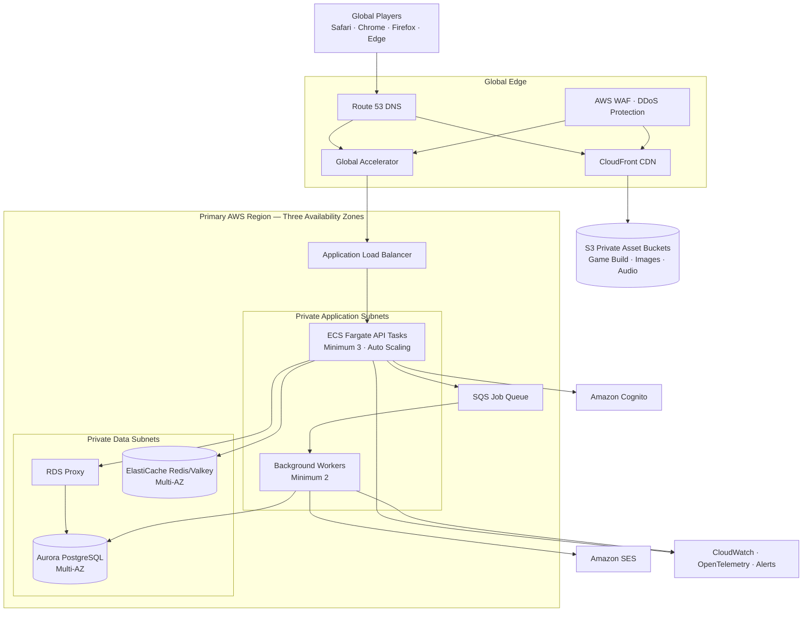
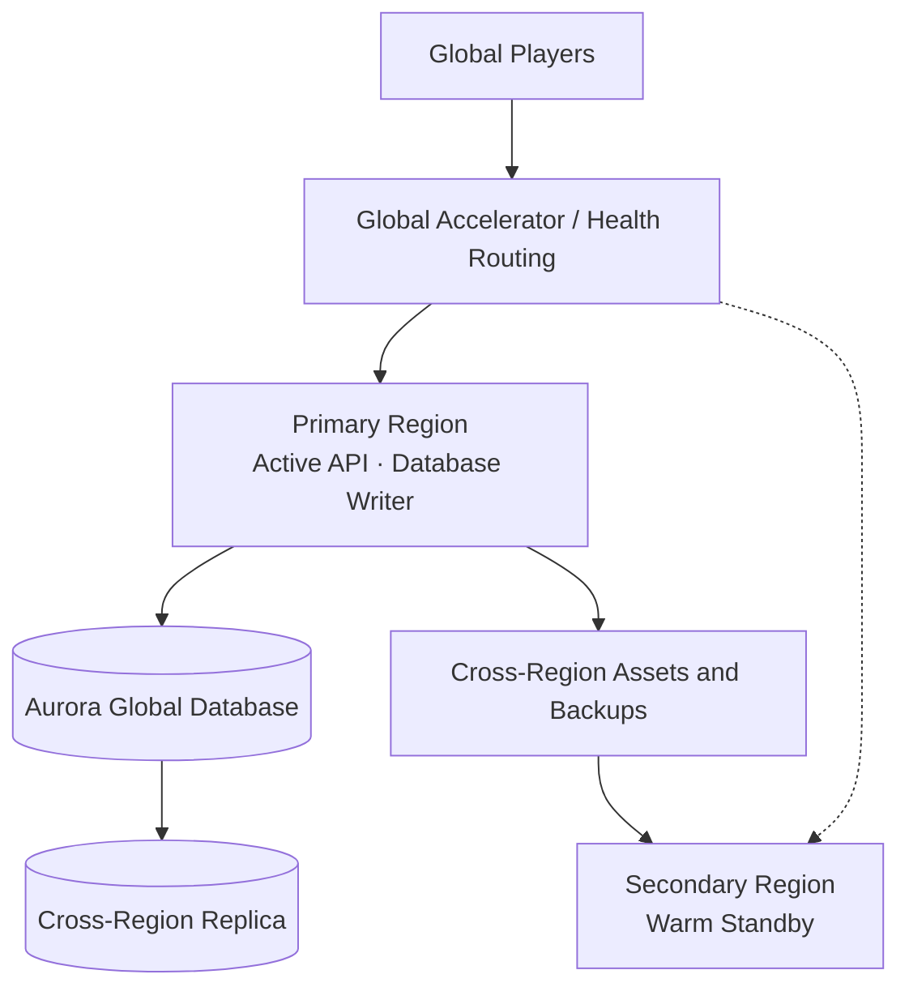
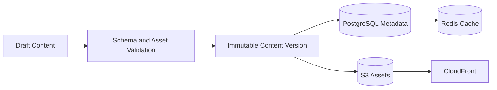

# Organic Battles V3 — Production Upgrade Tasks

## Purpose

Upgrade `OrganicBattlesV3PaidVersion` from a single-process FastAPI, SQLite, and in-memory-session application into a production-grade global game platform with:

- high scalability and high availability;
- low-latency question, answer, boss, avatar, and asset loading;
- secure account registration and authentication;
- reliable progress and battle-state persistence;
- compatibility with macOS Safari, iOS Safari, Chrome, Firefox, Edge, and other leading browsers;
- automated testing, deployment, monitoring, backup, and disaster recovery.

## Recommended approach

Retain **FastAPI** and **Phaser**, but replace the current stateful single-container architecture with:

- a stateless FastAPI modular monolith;
- PostgreSQL for durable account, content, battle, and progression data;
- Redis/Valkey for distributed sessions, caching, cooldowns, idempotency, and rate limits;
- S3-compatible object storage and a global CDN for the frontend and game assets;
- managed identity and email services;
- container hosting across three availability zones;
- automated CI/CD, observability, backups, and security controls;
- a warm-standby second region after the primary region is proven stable.

AWS is used as the reference implementation. The architecture can be translated to Azure or Google Cloud. Start with a modular monolith on ECS/Fargate; do not introduce Kubernetes or many microservices until operational evidence requires them.

---

## 1. Target physical architecture



### Initial production configuration

| Component | Starting configuration |
| --- | --- |
| FastAPI | Three Fargate tasks, one per availability zone; autoscaling on CPU, memory, request count, and latency |
| Workers | Two tasks in separate availability zones |
| PostgreSQL | Aurora PostgreSQL writer plus at least one reader/standby |
| Connection management | RDS Proxy for connection pooling and failover resilience |
| Redis/Valkey | One primary plus replicas across availability zones with automatic failover |
| Static content | Private S3 buckets served only through CloudFront Origin Access Control |
| Protection | TLS, AWS WAF, DDoS protections, restrictive security groups, private subnets |
| Backups | Automated database backups, point-in-time recovery, S3 versioning, restore tests |
| Deployment | Blue/green or canary release with health-based automatic rollback |

### Global availability stages

#### Stage A — Multi-AZ primary region

- Serve all large assets through the global CDN.
- Run API containers across three availability zones.
- Use Multi-AZ PostgreSQL and Redis.
- Autoscale API and worker containers.
- Maintain automated backups and tested recovery procedures.
- Keep one authoritative database writer.

#### Stage B — Warm-standby second region



- Provision the second region from the same infrastructure code.
- Replicate container images, configuration, assets, and database data.
- Maintain minimum warm API capacity.
- Route traffic to the secondary region only during planned or automated failover.
- Prefer active/warm-standby over active/active initially to avoid multi-writer consistency conflicts.

---

## 2. Target software architecture

### Backend structure

```text
app/
├── api/
│   └── v1/
├── auth/
├── content/
├── gameplay/
├── progression/
├── accounts/
├── workers/
├── infrastructure/
│   ├── database/
│   ├── cache/
│   ├── identity/
│   └── messaging/
├── observability/
├── settings.py
└── main.py
```

Each domain should contain:

- API/router layer;
- application service;
- domain rules;
- repository interface;
- infrastructure implementation;
- unit and integration tests.

Combat logic must not depend directly on FastAPI, SQLite, or a specific HTTP request so that it can be tested independently.

### Core software changes

#### Stateless API

Remove the process-local session store:

```python
sessions: dict[str, Session] = {}
```

Replace it with:

- PostgreSQL as the authoritative battle and progression store;
- Redis for short-lived cached state, cooldowns, idempotency, and rate limiting;
- opaque UUID battle identifiers;
- a monotonically increasing battle-state version;
- idempotency keys for answer and progression mutations.

Any API container must be capable of handling any authenticated request.

#### PostgreSQL persistence

Recommended data stack:

- PostgreSQL/Aurora PostgreSQL;
- SQLAlchemy 2.x;
- Alembic migrations;
- an asynchronous PostgreSQL driver such as `asyncpg`;
- RDS Proxy;
- explicit transaction boundaries.

Suggested tables:

| Domain | Tables |
| --- | --- |
| Accounts | `player_profiles`, `player_settings` |
| Content | `content_versions`, `chapters`, `bosses`, `questions`, `choices`, `spells` |
| Gameplay | `battles`, `battle_turns`, `answer_attempts`, `cooldowns` |
| Progression | `player_progress`, `boss_completions`, `rewards` |
| Operations | `outbox_events`, `audit_events`, `content_import_jobs` |

Each answer must update battle state, HP, cooldowns, rewards, and progression in one database transaction.

#### Managed authentication

Replace custom email-code and token management with Amazon Cognito or an equivalent managed identity provider. It should handle:

- registration and email verification;
- login and logout;
- password reset;
- access and refresh tokens;
- lockout and abuse controls;
- optional social login, passkeys, and MFA.

FastAPI should validate signed tokens and use the identity provider's immutable subject ID as the player-account key.

#### Versioned game content



Requirements:

- Every content release has a unique version.
- Published versions are immutable.
- A battle remains pinned to its starting content version.
- Import validation checks boss names, choices, correct answers, images, health, and spell damage.
- A content version can be rolled back without redeploying the API.
- Assets use content-hashed filenames and long CDN cache lifetimes.
- Correct answers are never returned in question-delivery payloads.
- Answer validation stays server-side.

#### Frontend and API separation

- `game.example.com`: CloudFront and private S3 frontend origin.
- `api.example.com`: Global Accelerator, Application Load Balancer, and FastAPI.
- Use versioned frontend builds and hashed filenames.
- Enable Brotli or gzip compression.
- Cache immutable JavaScript, CSS, images, atlases, and audio for long periods.
- Cache `index.html` for a short period so releases propagate safely.
- Mark personalized API responses private or non-cacheable.
- Remove production static-file traffic from FastAPI.

#### Background processing

Use SQS and worker containers for:

- verification and notification email;
- content imports;
- image validation and metadata extraction;
- analytics events;
- leaderboard calculation;
- retryable external operations;
- scheduled account and session cleanup.

Use an outbox table so database changes and queued events remain consistent.

#### Concurrency-safe battle mutations

Example:

```http
POST /api/v1/battles/{battle_id}/answers
Authorization: Bearer ...
Idempotency-Key: 96c78...
If-Match: 14
```

Processing sequence:

1. Authenticate the player.
2. Verify battle ownership.
3. Lock or atomically update battle version 14.
4. Reject a duplicate submission using the idempotency key.
5. Validate the answer server-side.
6. Apply damage and progression in one transaction.
7. Save battle version 15.
8. Return the new authoritative state.

This prevents duplicate damage caused by retries, double-clicks, slow mobile networks, or multiple tabs.

---

## 3. Browser and mobile compatibility

### Frontend requirements

- [ ] Use Phaser with `Phaser.AUTO` so WebGL is preferred and Canvas fallback is available where supported.
- [ ] Use responsive canvas sizing instead of fixed desktop dimensions.
- [ ] Use Pointer Events rather than mouse-only input.
- [ ] Provide touch targets approximately 44×44 CSS pixels or larger.
- [ ] Support iPhone safe areas with `env(safe-area-inset-*)`.
- [ ] Ensure every action works without hover.
- [ ] Unlock audio only after a user gesture.
- [ ] Pause animation and audio on `visibilitychange`.
- [ ] Handle portrait, landscape, and browser resizing.
- [ ] Cap device pixel ratio on high-resolution phones to control GPU and memory load.
- [ ] Provide fallback formats for compressed textures.
- [ ] Lazy-load chapter assets.
- [ ] Preload the current boss and only the next likely boss.
- [ ] Use image atlases when they reduce network requests and GPU state changes.
- [ ] Respect `prefers-reduced-motion`.
- [ ] Feature-detect optional browser APIs.
- [ ] Provide accessible HTML controls for essential canvas interactions.

### Required browser matrix

| Platform | Required browsers |
| --- | --- |
| macOS | Latest and previous Safari, Chrome, and Firefox |
| iPhone and iPad | Latest and previous supported iOS Safari |
| Windows | Chrome, Edge, and Firefox |
| Android | Chrome on representative low-, medium-, and high-end devices |

Use Playwright in CI for Chromium, Firefox, WebKit, branded Chrome, and mobile emulation. Also test release candidates on real iPhones and iPads because emulation does not reproduce every iOS GPU, memory, audio, and touch behavior.

---

## 4. Initial service objectives

| Metric | Initial target |
| --- | --- |
| Availability | 99.95% monthly after multi-AZ launch |
| API error rate | Below 0.1%, excluding invalid client requests |
| Cached asset delivery | P95 below 300 ms after connection establishment |
| Battle API in primary geography | P95 below 300 ms |
| Cross-continent battle API | P95 below 600 ms |
| Initial playable state | P75 below 2.5 seconds on representative mobile connections |
| Recovery point objective | Less than 5 minutes initially |
| Recovery time objective | Less than 30 minutes initially |
| Deployment rollback | Less than 10 minutes |

Before final capacity sizing, record:

- expected registered users;
- peak concurrent users;
- peak API actions per second;
- average battle duration;
- questions and assets per chapter;
- largest image and audio downloads;
- geographic user distribution.

---

## 5. Execution plan

### Phase 0 — Define targets and baseline

- [ ] Record target levels for 1,000, 10,000, and 100,000 concurrent players.
- [ ] Approve availability, latency, RPO, and RTO objectives.
- [ ] Identify the first AWS region and expected player regions.
- [ ] Decide whether gameplay remains independent single-player or will include real-time multiplayer.
- [ ] Instrument the existing application and record current latency, error, CPU, memory, and database baselines.
- [ ] Freeze current behavior with API and gameplay characterization tests.

**Exit condition:** Approved nonfunctional requirements, traffic model, and baseline report.

### Phase 1 — Correct the current repository

- [ ] Align the Docker and `pyproject.toml` Python versions.
- [ ] Establish one authoritative dependency definition.
- [ ] Rename internal V2 references to V3.
- [ ] Remove the duplicate `acid-shot` dictionary entry.
- [ ] Correct the explanation-key UTF-8/mojibake mismatch.
- [ ] Add `/health/live` and `/health/ready` endpoints.
- [ ] Add structured JSON logging, correlation IDs, and request IDs.
- [ ] Add unit tests for combat, cooldowns, progression, content loading, and persistence.

**Exit condition:** Existing behavior passes automated tests inside Docker.

### Phase 2 — Modularize FastAPI

- [ ] Create the target modular directory structure.
- [ ] Move routes out of the monolithic `app.py`.
- [ ] Extract combat and progression rules into domain services.
- [ ] Introduce repository interfaces.
- [ ] Centralize validated configuration.
- [ ] Version APIs under `/api/v1`.
- [ ] Add consistent API error envelopes.
- [ ] Generate and review the OpenAPI contract.

**Exit condition:** Gameplay rules do not depend directly on FastAPI or SQLite.

### Phase 3 — Migrate SQLite to PostgreSQL

- [ ] Design normalized PostgreSQL models.
- [ ] Add SQLAlchemy 2.x, Alembic, and `asyncpg`.
- [ ] Create initial and rollback migrations.
- [ ] Write a repeatable SQLite-to-PostgreSQL data migration.
- [ ] Implement transactional answer processing.
- [ ] Add indexes for users, battles, bosses, content versions, and sessions.
- [ ] Add database timeouts and bounded connection pools.
- [ ] Run data reconciliation tests.

**Exit condition:** PostgreSQL is authoritative and no schema modification occurs during application import.

### Phase 4 — Make API instances stateless

- [ ] Remove the Python `sessions` dictionary.
- [ ] Persist authoritative battle state in PostgreSQL.
- [ ] Add Redis for cache, cooldowns, rate limits, and idempotency.
- [ ] Add battle-state versioning and optimistic concurrency.
- [ ] Make answer and progression commands idempotent.
- [ ] Add TTL and cleanup rules for temporary data.
- [ ] Test requests switching randomly between API containers.
- [ ] Test Redis failure and cache reconstruction.

**Exit condition:** Any API instance can process any authenticated request without sticky sessions.

### Phase 5 — Upgrade authentication

- [ ] Configure Cognito user pools and environments.
- [ ] Implement signup, verification, login, logout, and password recovery.
- [ ] Validate JWT signatures, issuer, audience, and expiration in FastAPI.
- [ ] Link the Cognito subject ID to the player profile.
- [ ] Define migration and password-reset treatment for existing accounts.
- [ ] Add endpoint rate limits and lockout controls.
- [ ] Remove custom authentication tables after migration and retention review.

**Exit condition:** Custom application code no longer manages verification codes or session tokens.

### Phase 6 — Build content publishing

- [ ] Define versioned content schemas.
- [ ] Import chapters, bosses, questions, choices, answers, spells, and rewards.
- [ ] Move images, atlases, audio, and downloadable assets to S3.
- [ ] Build content validation and publishing commands.
- [ ] Add immutable content releases and rollback.
- [ ] Pin every battle to a content version.
- [ ] Add Redis caching with versioned cache keys.
- [ ] Ensure correct answers are absent from player-facing question payloads.
- [ ] Validate orphaned boss, avatar, and asset references.

**Exit condition:** Content can be validated, published, cached, and rolled back without redeploying FastAPI.

### Phase 7 — Separate frontend and assets

- [ ] Create a reproducible static frontend build.
- [ ] Upload versioned builds and assets to private S3 buckets.
- [ ] Configure CloudFront and Origin Access Control.
- [ ] Configure cache-control headers and compression.
- [ ] Point the frontend to `/api/v1`.
- [ ] Add lazy loading, preloading, and asset budgets.
- [ ] Remove production static-file delivery from FastAPI.
- [ ] Test slow networks and low-memory mobile devices.

**Exit condition:** Frontend and game assets are globally served through the CDN.

### Phase 8 — Add background processing

- [ ] Add SQS queues and dead-letter queues.
- [ ] Create separately scalable worker containers.
- [ ] Move email delivery out of API requests.
- [ ] Add the transactional outbox pattern.
- [ ] Add retry policies and idempotent job handlers.
- [ ] Move content imports and asset validation to workers.
- [ ] Add queue-depth and dead-letter alarms.

**Exit condition:** Slow and retryable work cannot delay gameplay API responses.

### Phase 9 — Provision AWS production infrastructure

- [ ] Select Terraform or AWS CDK.
- [ ] Create separate development, staging, and production environments.
- [ ] Define VPCs, public/private subnets, route tables, and security groups.
- [ ] Deploy the ALB across three availability zones.
- [ ] Deploy a minimum of three API tasks and two worker tasks.
- [ ] Deploy Aurora PostgreSQL, RDS Proxy, and Multi-AZ Redis/Valkey.
- [ ] Configure autoscaling policies and capacity limits.
- [ ] Configure S3, CloudFront, WAF, TLS certificates, DNS, and origin restrictions.
- [ ] Store secrets in Secrets Manager and encrypt data with KMS.
- [ ] Enable database backups, point-in-time recovery, and S3 versioning.

**Exit condition:** The complete environment can be reproduced from source-controlled infrastructure definitions.

### Phase 10 — Establish CI/CD and release safety

- [ ] Run formatting, linting, type checking, and unit tests on every pull request.
- [ ] Run API integration and browser tests.
- [ ] Scan dependencies, container images, infrastructure, and secrets.
- [ ] Build immutable, versioned container and frontend artifacts.
- [ ] Deploy automatically to staging.
- [ ] Run staging smoke, migration, API, and browser tests.
- [ ] Deploy with blue/green or canary releases.
- [ ] Roll back automatically on health, error-rate, or latency failure.
- [ ] Prevent unreviewed direct production changes.

**Exit condition:** Production deployments are repeatable, observable, and safely reversible.

### Phase 11 — Add observability and operational controls

- [ ] Add OpenTelemetry traces across API, database, Redis, queue, and worker activity.
- [ ] Record RED metrics: request rate, errors, and duration.
- [ ] Record saturation metrics for CPU, memory, database connections, Redis, and queues.
- [ ] Add gameplay metrics without exposing personal or answer data.
- [ ] Create dashboards for availability, latency, errors, and capacity.
- [ ] Create actionable alerts tied to operational runbooks.
- [ ] Add centralized logs with retention and access controls.
- [ ] Define on-call ownership and incident severity levels.

**Exit condition:** Operators can detect, diagnose, and respond to failures without logging into containers.

### Phase 12 — Load, browser, and failure testing

- [ ] Build realistic Locust or k6 registration, login, question, answer, and progression scenarios.
- [ ] Test at 2× expected peak traffic.
- [ ] Test sudden traffic spikes and autoscaling response.
- [ ] Terminate API and worker containers during active games.
- [ ] Simulate an availability-zone failure.
- [ ] Test Redis automatic failover.
- [ ] Perform an Aurora failover.
- [ ] Test CDN-origin failure and asset-cache behavior.
- [ ] Run the full browser matrix.
- [ ] Test real iPhones and iPads.
- [ ] Profile CPU, memory, queries, cache hit rate, payload sizes, and asset timing.

**Exit condition:** Approved SLOs pass under peak load and controlled infrastructure failures.

### Phase 13 — Security and launch readiness

- [ ] Enforce HTTPS and secure cookies.
- [ ] Configure security headers, CSP, trusted hosts, CORS, and CSRF protection.
- [ ] Configure WAF managed rules and application rate limits.
- [ ] Apply least-privilege IAM roles.
- [ ] Complete dependency and container vulnerability remediation.
- [ ] Complete a threat model and external security assessment.
- [ ] Test database and object-storage restoration.
- [ ] Review privacy, data retention, account deletion, and child-user requirements.
- [ ] Approve launch and rollback runbooks.

**Exit condition:** Security, backup, recovery, and operational launch reviews are approved.

### Phase 14 — Controlled production launch

- [ ] Publish the production content version.
- [ ] Release to internal users.
- [ ] Expand to a small percentage of real users.
- [ ] Monitor errors, latency, saturation, and support cases.
- [ ] Increase traffic gradually.
- [ ] Preserve rollback capability throughout rollout.
- [ ] Complete a post-launch review and capacity adjustment.

**Exit condition:** Full launch meets SLOs without unresolved critical defects.

### Phase 15 — Regional disaster recovery

- [ ] Provision the second region using the same infrastructure code.
- [ ] Add Aurora Global Database or equivalent cross-region replication.
- [ ] Replicate frontend assets, container images, configuration, and backups.
- [ ] Maintain minimum warm API and worker capacity.
- [ ] Configure health-based regional routing.
- [ ] Create failover and failback automation.
- [ ] Document consistency behavior during regional partition or failover.
- [ ] Conduct scheduled disaster-recovery exercises.

**Exit condition:** A simulated regional outage meets approved RTO and RPO targets.

---

## 6. Implementation priority

The first five architectural blockers are:

1. PostgreSQL migration
2. Stateless battle sessions
3. Managed authentication
4. CDN-based frontend and asset delivery
5. Automated load and cross-browser testing

Autoscaling and multi-AZ deployment become safe after the API is stateless. Multi-region failover should be implemented only after regional high availability and recovery have been tested successfully.

---

## 7. Key production risks to track

| Risk | Required mitigation |
| --- | --- |
| Process-local game sessions | PostgreSQL authority plus Redis cache; no sticky-session dependency |
| Duplicate answer submissions | Idempotency keys and battle-state versioning |
| SQLite write and scaling limits | PostgreSQL migration and connection pooling |
| Asset latency | CDN delivery, hashed assets, compression, preload strategy |
| Content inconsistency | Immutable, validated content versions pinned to battles |
| Correct-answer exposure | Never return correct answers before submission |
| Account abuse | Managed identity, throttling, verification attempt limits, WAF |
| Container replacement data loss | Managed persistent database and object storage |
| Browser differences | Playwright matrix plus real iOS hardware tests |
| Bad deployment | Automated migrations, canary/blue-green release, rollback |
| Availability-zone failure | Three-AZ application and Multi-AZ data services |
| Regional outage | Warm-standby region with tested failover and replicated data |

---

## 8. Primary documentation references

- [AWS Well-Architected: deploy workloads to multiple locations](https://docs.aws.amazon.com/wellarchitected/latest/reliability-pillar/rel_fault_isolation_multiaz_region_system.html)
- [AWS load-balancer availability](https://docs.aws.amazon.com/elasticloadbalancing/latest/userguide/how-elastic-load-balancing-works.html)
- [AWS ECS capacity and availability guidance](https://docs.aws.amazon.com/AmazonECS/latest/developerguide/capacity-availability-best-practice.html)
- [Amazon CloudFront secure static hosting](https://docs.aws.amazon.com/AmazonCloudFront/latest/DeveloperGuide/getting-started-secure-static-website-cloudformation-template.html)
- [Amazon CloudFront Origin Access Control](https://docs.aws.amazon.com/AmazonCloudFront/latest/DeveloperGuide/private-content-restricting-access-to-s3.html)
- [Amazon RDS Proxy for Aurora](https://docs.aws.amazon.com/AmazonRDS/latest/AuroraUserGuide/rds-proxy.html)
- [Amazon ElastiCache Multi-AZ automatic failover](https://docs.aws.amazon.com/AmazonElastiCache/latest/dg/AutoFailover.html)
- [AWS multi-region data consistency guidance](https://docs.aws.amazon.com/prescriptive-guidance/latest/aws-multi-region-fundamentals/fundamental-2.html)
- [FastAPI deployment in containers](https://fastapi.tiangolo.com/deployment/docker/)
- [Playwright browser support](https://playwright.dev/docs/browsers)
- [Playwright browser projects](https://playwright.dev/docs/test-projects)

---

## 9. Approval record

Use this section during architecture review.

| Decision | Status | Owner | Notes |
| --- | --- | --- | --- |
| AWS reference architecture approved | Pending |  |  |
| Primary and secondary regions selected | Pending |  |  |
| Availability and latency SLOs approved | Pending |  |  |
| RPO and RTO approved | Pending |  |  |
| Managed identity provider approved | Pending |  |  |
| PostgreSQL and Redis architecture approved | Pending |  |  |
| Infrastructure-as-code tool selected | Pending |  |  |
| Browser support matrix approved | Pending |  |  |
| Security and privacy requirements approved | Pending |  |  |
| Production launch criteria approved | Pending |  |  |
