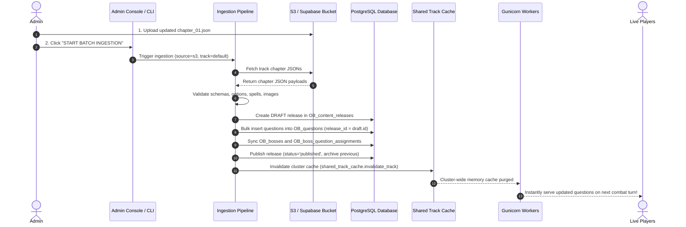

# Question & Answer Content Update Guide via S3 / Object Storage

**Date:** September 15, 2026  
**Topic:** End-to-End Workflow for Updating `chapter_xx.json` in S3 / Supabase Storage, Ingesting Content to PostgreSQL, and Delivering to Live Players Without Schema Changes  

---

## 1. Executive Answer: Does S3 Auto-Update Live Gameplay?

### The Question
> *"If I update `chapter_xx.json` in S3 in the right track with the right schema, does the application automatically load tables, update content, and deliver to players?"*

### The Answer
**No, not simply by dropping the file into S3.**

Updating content is an intentional **2-Step Process**:
1. **Step 1:** Upload your updated `chapter_xx.json` to the designated S3 bucket and track prefix.
2. **Step 2:** **Trigger Ingestion** via the Web Admin Console (one click) or via a single CLI command.

---

### Why is a Trigger Step Required? (Architectural Rationale)

| Concern | Why Passive S3 Auto-Detection is Bad | How the Ingestion Trigger Protects Production |
|---|---|---|
| **Partial Upload Protection** | If you upload 5 updated chapter files, a passive watcher could trigger mid-upload, causing players to see incomplete or broken tracks. | The trigger ensures an **Atomic Release**: all chapters are read and validated together before activating. |
| **Gameplay Latency** | Checking S3 on every player combat action adds **100–300ms network lag** to every turn. | Content is served from **PostgreSQL (`OB_questions`)** and an in-memory/Redis **`SharedTrackCacheManager`** with **<2ms response times**. |
| **API Costs** | Querying S3 on every turn generates millions of S3 `GET` request fees. | S3 is read only during the one-time ingestion process. |
| **Zero-Downtime Cache Sync** | Modifying S3 does not automatically notify running Gunicorn worker processes to clear their local RAM caches. | The ingestion trigger executes `shared_track_cache.invalidate_track()`, notifying all worker processes simultaneously. |

---

## 2. Storage Mapping: Where Do Files Live in S3?

The application resolves S3 paths dynamically via [app/infrastructure/storage/s3_reader.py](file:///Users/nkoneru/Downloads/AIApps/OrganicBattles/app/infrastructure/storage/s3_reader.py):

| Track ID | Track Name | S3 Bucket | Target S3 Key / Prefix |
|---|---|---|---|
| `default` | Standard Organic Chemistry | `DefaultBosses` (or `S3_DEFAULT_BOSSES_BUCKET`) | `tracks/default/chapter_01.json`<br/>`...`<br/>`tracks/default/chapter_27.json` |
| `advanced` | Advanced Track | `AdvancedBosses` (or `S3_ADVANCED_BOSSES_BUCKET`) | `tracks/advanced/chapter_01.json`<br/>`...`<br/>`tracks/advanced/chapter_27.json` |
| `foundational` | Foundational Track | `FoundationalBosses` (or `S3_FOUNDATIONAL_BOSSES_BUCKET`) | `tracks/foundational/chapter_01.json`<br/>`...`<br/>`tracks/foundational/chapter_27.json` |

---

## 3. Step-by-Step Instructions to Update S3 Content

### Step 1: Format & Validate `chapter_xx.json`

Ensure your JSON file adheres to the expected schema:

```json
{
  "schema_version": "2.0",
  "chapter": 1,
  "chapter_title": "Structure and Bonding",
  "assigned_boss": "Orbital Ogre",
  "question_count": 50,
  "questions": [
    {
      "id": "ch01_q001",
      "chapter": 1,
      "chapter_title": "Structure and Bonding",
      "boss": "Orbital Ogre",
      "topic": "pi bond",
      "difficulty": "easy",
      "question_type": "term_to_definition",
      "question": "Which statement most accurately describes “pi bond”?",
      "options": [
        { "label": "A", "text": "A measure of how strongly an atom attracts electrons." },
        { "label": "B", "text": "A bond produced by sideways overlap of parallel p orbitals." },
        { "label": "C", "text": "A bookkeeping formal charge." },
        { "label": "D", "text": "A covalent bond where electrons are shared unequally." }
      ],
      "correct_option": "B",
      "correct_answer": "A bond produced by sideways overlap of parallel p orbitals.",
      "explanation": "A bond produced by sideways overlap of parallel p orbitals.",
      "spells": [20, 30, 45],
      "health": [100],
      "images": ["orbital_ogre.png"]
    }
  ]
}
```

#### Validation Rules:
- **Options**: Minimum 2 options. Each option must have `"label"` (`A`, `B`, etc.) and `"text"`.
- **Answers**: `"correct_option"` must be a valid option label, and `"correct_answer"` must match that option's text verbatim.
- **Spells**: Array of integers for damage tiers (e.g. `[20, 30, 45]`).
- **Health**: Boss HP integer array (e.g. `[100]`).
- **Images**: Array of boss image filename(s) (e.g. `["orbital_ogre.png"]`).

---

### Step 2: Upload the Updated File to S3

You can upload using any of the following tools:

#### Option A: Using AWS CLI / Supabase S3 Compatible CLI
```bash
aws s3 cp chapter_01.json s3://DefaultBosses/tracks/default/chapter_01.json \
  --endpoint-url https://<YOUR-PROJECT-ID>.storage.supabase.co/storage/v1/s3
```

#### Option B: Using the Supabase Storage Dashboard (Web Browser)
1. Open your Supabase Project Dashboard.
2. Navigate to **Storage** $\rightarrow$ **Buckets**.
3. Select bucket (e.g., `DefaultBosses`).
4. Browse to folder `tracks/default/`.
5. Upload or drag-and-drop the updated `chapter_01.json` (overwriting the existing file).

---

### Step 3: Trigger Ingestion (Activate the Content)

Once the file is uploaded to S3, choose one of two methods to trigger ingestion:

#### Method 1: Via the Web Admin Console (Recommended — No Terminal Needed)
1. Navigate to the Admin Portal: `http://localhost:8000/admin` (or click the **ADMIN** button on the bottom navigation bar).
2. Authenticate with your administrator credentials.
3. Locate the **DATA LOADS // BATCH INGESTION** card.
4. From the **Target Track** dropdown, select the track you updated (e.g., `Default Track`).
5. Keep **Batch Size** at `1000`.
6. Click **START BATCH INGESTION**.
7. In a few seconds, the indicator turns green:
   ```text
   ✓ Ingested 1350 questions across 1 track(s)!
   ```

#### Method 2: Via Terminal / SSH Command
Run the ingestion script with `--source s3`:
```bash
uv run python scripts/ingest_questions_to_postgres.py --track default --source s3
```

*(If credentials are in `.env`, you can also run with `--source auto`, which automatically queries S3 first and falls back to local files if S3 is unavailable).*

---

## 4. Under the Hood: What Happens Automatically

When you trigger ingestion from S3, the system executes the following pipeline **in a single transaction**:



### Affected Database Tables (Zero Schema Changes):
1. **`OB_content_releases`**: A new release record is created and atomically set to `status = 'published'`.
2. **`OB_questions`**: Questions are inserted linked to the new `release_id` with exact sequential `order_index`.
3. **`OB_bosses` & `OB_boss_question_assignments`**: Automatically synchronized to register any new bosses and map them to chapters.
4. **`OB_tracks`**: Updated with the new total questions and chapters count.
5. **`OB_audit_log`**: An immutable audit entry `INGEST_QUESTIONS` is recorded with admin metadata.

---

## 5. Verification & Health Checks

After triggering the ingestion:

1. **Check Admin Releases Tab**:
   - Under the **Releases** tab in `/admin`, confirm that the new release version is listed with status `published`.
2. **Pre-Warm Cache (Zero Latency)**:
   - Click **WARM CACHE** in the Admin Console or run:
     ```bash
     uv run python scripts/warm_cache.py
     ```
   - This pre-loads all track bundles into worker RAM so the first player to battle encounters zero database query delay.
3. **Rollback if Needed**:
   - If an error was made in the S3 JSON (e.g. bad distractor), you do **not** need to panic. Simply go to the **Releases** tab in the Admin Console and click **Rollback** on the previous release. The server will instantly revert to the prior question set in under 1 millisecond.

---

## 6. Summary Checklist for S3 Updates

- [x] **Upload `chapter_xx.json` to S3** at `tracks/<track_id>/chapter_xx.json`.
- [x] **Trigger Ingestion**: Click **START BATCH INGESTION** in `/admin` (or run `uv run python scripts/ingest_questions_to_postgres.py --track <id> --source s3`).
- [x] **Zero Schema Migrations**: No database DDL or Alembic migrations are required.
- [x] **Zero Server Restarts**: Gunicorn workers automatically refresh cache and serve new content with zero player disruption.
