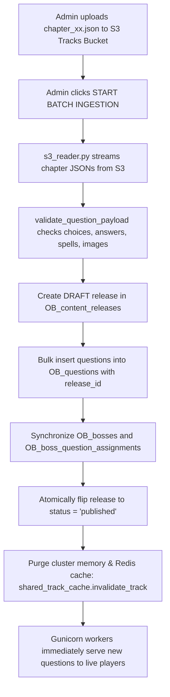

# S3 & Supabase Storage Content Update Guide

**Date:** September 15, 2026  
**Topic:** Accurate S3 Bucket Structures, Path Hierarchies, and End-to-End Workflow for Ingesting `chapter_xx.json` Questions into PostgreSQL and Delivering to Live Players  

---

## 1. Core Principle: Does S3 Auto-Update Live Gameplay?

### The Question
> *"If I update `chapter_xx.json` in S3 in the right track with the right schema, does the application automatically load tables, update content, and deliver to players?"*

### The Answer
**No, not simply by uploading the file into S3.**

Updating content is an intentional **2-Step Process**:
1. **Step 1:** Upload your updated `chapter_xx.json` to the correct **Tracks Bucket** and folder in Supabase Storage / S3.
2. **Step 2:** **Trigger Ingestion** via the Web Admin Console (one click) or via CLI command.

### Why is a Trigger Step Required?
- **Atomic Release Protection**: If you upload multiple chapter files, a passive watcher could trigger mid-upload, causing players to encounter broken or half-updated chapters. The manual trigger ensures all chapters are validated together and activated atomically.
- **Sub-2ms Gameplay Latency**: Combat turns query PostgreSQL (`OB_questions`) and the cluster RAM/Redis cache (`SharedTrackCacheManager`), avoiding 100–300ms S3 network latency on every turn.
- **S3 API Cost Elimination**: Prevents millions of redundant S3 `GET` requests during active battles.
- **Cluster Worker Cache Sync**: Ingestion purges the cache across all Gunicorn workers simultaneously (`shared_track_cache.invalidate_track()`) with zero downtime.

---

## 2. Storage Topology: Tracks Buckets vs. Bosses Buckets

Based on your Supabase Storage configuration, the application strictly separates **JSON Question Banks** from **Boss Image Assets** across **6 distinct public buckets**:

```text
Supabase S3 Storage Root
├── TRACKS BUCKETS (JSON Question Banks & Curriculum Structure)
│   ├── DefaultTracks/            <-- Root-level chapter_*.json files
│   ├── AdvancedTracks/           <-- Subfolders for each Advanced track topic
│   └── FoundationalTracks/       <-- Subfolders for each Foundational track topic
│
└── BOSSES BUCKETS (PNG Image Assets Only - Flat Root Level)
    ├── DefaultBosses/            <-- Flat PNG files (e.g., orbital_ogre.png)
    ├── AdvancedBosses/           <-- Flat PNG files (e.g., 1-3-diaxial-dreadnought.png)
    └── FoundationalBosses/       <-- Flat PNG files (e.g., resonance-reaper.png)
```

### Bucket Reference Matrix

| Bucket Name | Content Type | Public URL / CDN Base | Internal Structure |
|---|---|---|---|
| **`DefaultTracks`** | Question Bank JSON | `.../storage/v1/object/public/DefaultTracks` | Flat root: `chapter_01.json` ... `chapter_27.json` |
| **`AdvancedTracks`** | Question Bank JSON | `.../storage/v1/object/public/AdvancedTracks` | **Subfolders by topic**: `<TrackFolder>/chapter_01.json` ... |
| **`FoundationalTracks`** | Question Bank JSON | `.../storage/v1/object/public/FoundationalTracks` | **Subfolders by topic**: `<TrackFolder>/chapter_01.json` ... |
| **`DefaultBosses`** | Boss Portrait PNGs | `.../storage/v1/object/public/DefaultBosses` | Flat root: `orbital_ogre.png`, `lewis-lion.png`, etc. |
| **`AdvancedBosses`** | Boss Portrait PNGs | `.../storage/v1/object/public/AdvancedBosses` | Flat root: `1-3-diaxial-dreadnought.png`, `aldol-alchemist.png`, etc. |
| **`FoundationalBosses`** | Boss Portrait PNGs | `.../storage/v1/object/public/FoundationalBosses` | Flat root: `resonance-reaper.png`, `alkane-ape.png`, etc. |

---

## 3. Internal Folder Structure for Tracks Buckets

### 3.1 `AdvancedTracks` Internal Structure
Inside the **`AdvancedTracks`** bucket, chapter JSON files are nested inside specific track topic folders:

```text
AdvancedTracks/
├── LabTechniquesGreenExpansionData/
│   ├── chapter_01.json
│   ├── chapter_02.json
│   └── ... (chapter_01.json through chapter_27.json)
├── MechanismsIntermediatesData/
│   ├── chapter_01.json
│   └── ...
├── MedicinalBioorganicExpansionData/
│   ├── chapter_01.json
│   └── ...
├── MultiStepSynthesisData/
│   ├── chapter_01.json
│   └── ...
├── OrbitalPericyclicExpandedData/
│   ├── chapter_01.json
│   └── ...
├── ReactionOutcomeTypesData/
│   ├── chapter_01.json
│   └── ...
├── RelativePropertyRankingsData/
│   ├── chapter_01.json
│   └── ...
├── SkillBuilderMasteryExpandedData/
│   ├── chapter_01.json
│   └── ...
├── SpectroscopyElucidationData/
│   ├── chapter_01.json
│   └── ...
├── StereochemistryStructureData/
│   ├── chapter_01.json
│   └── ...
├── ThermodynamicsKineticsExpandedData/
│   ├── chapter_01.json
│   └── ...
└── VocabularyConceptsData/
    ├── chapter_01.json
    ├── chapter_02.json
    └── ... (chapter_01.json through chapter_27.json)
```

### 3.2 `FoundationalTracks` Internal Structure
Inside the **`FoundationalTracks`** bucket, chapter JSON files follow a parallel topic folder organization:
```text
FoundationalTracks/
├── VocabularyConceptsData/
│   └── chapter_01.json ...
├── ReactionOutComeTypesData/
│   └── chapter_01.json ...
├── MechanismsIntermediatesData/
│   └── chapter_01.json ...
├── StereochemistryStructureData/
│   └── chapter_01.json ...
├── RelativePropertyRankingsData/
│   └── chapter_01.json ...
├── SpectroscopyElucidationData/
│   └── chapter_01.json ...
└── MultiStepSynthesisData/
    └── chapter_01.json ...
```

### 3.3 `DefaultTracks` Internal Structure
Inside the **`DefaultTracks`** bucket, chapter files reside directly at the bucket root:
```text
DefaultTracks/
├── chapter_01.json
├── chapter_02.json
├── ...
└── chapter_27.json
```

---

## 4. Internal Structure of Bosses Buckets

Unlike Tracks buckets, **Bosses buckets do NOT have chapter subfolders**. All boss portrait images must be placed **directly at the root of the Bosses bucket**:

```text
AdvancedBosses/
├── 1-3-diaxial-dreadnought.png
├── 1-4-addition-anomaly.png
├── acetal-aegis.png
├── acetylide-assassin.png
├── acid-chloride-assassin.png
├── acyl-transfer-sovereign.png
├── aldol-alchemist.png
├── aldose-apparition.png
├── alkoxy-ape.png
└── allylic-radical-archer.png
```

> **CRITICAL RULE FOR IMAGES:**  
> In `chapter_xx.json`, the `"images"` field (e.g. `["1-3-diaxial-dreadnought.png"]`) must match the exact filename stored at the root of the corresponding Bosses bucket. Do **not** upload boss PNGs into the Tracks buckets.

---

## 5. End-to-End Content Update Walkthrough

### Step 1: Prepare and Validate `chapter_xx.json`
Verify the chapter payload adheres to the required schema:

```json
{
  "schema_version": "2.0",
  "chapter": 1,
  "chapter_title": "A Review of General Chemistry: Electrons, Bonds, and Molecular Properties",
  "assigned_boss": "1-3-Diaxial Dreadnought",
  "question_count": 50,
  "questions": [
    {
      "id": "ch01_q001",
      "chapter": 1,
      "chapter_title": "A Review of General Chemistry",
      "boss": "1-3-Diaxial Dreadnought",
      "topic": "chair conformations",
      "difficulty": "easy",
      "question_type": "term_to_definition",
      "question": "Which statement best describes 1,3-diaxial interactions?",
      "options": [
        { "label": "A", "text": "Steric strain between axial substituents on a cyclohexane ring." },
        { "label": "B", "text": "Torsional strain between adjacent equatorial bonds." },
        { "label": "C", "text": "Angle strain in a planar cyclopentane ring." },
        { "label": "D", "text": "Electrostatic repulsion in an anti-periplanar conformation." }
      ],
      "correct_option": "A",
      "correct_answer": "Steric strain between axial substituents on a cyclohexane ring.",
      "explanation": "1,3-diaxial strain occurs between axial substituents on carbons 1, 3, and 5 of cyclohexane.",
      "spells": [20, 30, 45],
      "health": [100],
      "images": ["1-3-diaxial-dreadnought.png"]
    }
  ]
}
```

---

### Step 2: Upload to S3 / Supabase Storage

#### If Updating an Advanced Track Chapter:
Target Bucket: **`AdvancedTracks`**  
Target Path: `<TrackFolder>/chapter_xx.json`

- **Via Supabase Dashboard**:
  1. Go to **Storage** $\rightarrow$ **Buckets** $\rightarrow$ **`AdvancedTracks`**.
  2. Click into the target folder (e.g., `VocabularyConceptsData` or `MechanismsIntermediatesData`).
  3. Click **Upload files** or drag-and-drop your updated `chapter_01.json`.
- **Via AWS S3 CLI**:
  ```bash
  aws s3 cp chapter_01.json s3://AdvancedTracks/VocabularyConceptsData/chapter_01.json \
    --endpoint-url https://<PROJECT_REF>.storage.supabase.co/storage/v1/s3
  ```

#### If Updating a Default Track Chapter:
Target Bucket: **`DefaultTracks`**  
Target Path: `chapter_xx.json` (root level)

- **Via Supabase Dashboard**:
  1. Go to **Storage** $\rightarrow$ **Buckets** $\rightarrow$ **`DefaultTracks`**.
  2. Upload `chapter_01.json` directly to the bucket root.
- **Via AWS S3 CLI**:
  ```bash
  aws s3 cp chapter_01.json s3://DefaultTracks/chapter_01.json \
    --endpoint-url https://<PROJECT_REF>.storage.supabase.co/storage/v1/s3
  ```

#### If You Added a New Boss in the Chapter:
Target Bucket: **`AdvancedBosses`**, **`FoundationalBosses`**, or **`DefaultBosses`**  
Target Path: Root directory of the bucket.
- Upload the companion PNG (e.g. `1-3-diaxial-dreadnought.png`) to the root of the Bosses bucket.

---

### Step 3: Trigger Ingestion to Update Database & Cache

Once the file is uploaded to S3, trigger ingestion through one of two methods:

#### Method A: One-Click Web Admin Console (Recommended)
1. Open your browser to `http://localhost:8000/admin` (or click **ADMIN** in the game UI).
2. Authenticate with admin credentials.
3. Locate the **DATA LOADS // BATCH INGESTION** card.
4. Select the target track from the dropdown (e.g., `Vocabulary & Core Concepts` or `Default Track`).
5. Click **START BATCH INGESTION**.
6. The status changes to:
   ```text
   ✓ Ingested 1350 questions across 1 track(s)!
   ```

#### Method B: Terminal / CLI Command
Execute the ingestion script targeting S3:

```bash
# Ingest specific track from S3:
uv run python scripts/ingest_questions_to_postgres.py --track adv-vocab --source s3

# Ingest default track from S3:
uv run python scripts/ingest_questions_to_postgres.py --track default --source s3

# Auto-detect all tracks from S3:
uv run python scripts/ingest_questions_to_postgres.py --source s3
```

---

## 6. What the Application Does Under the Hood

When ingestion is triggered, the system performs the following actions in a single atomic transaction:



### Database Tables Updated (Zero Schema Changes):
1. **`OB_content_releases`**: Creates a new release record and flips it to `published`. Prior releases are marked `archived`.
2. **`OB_questions`**: All questions for the track are populated with the new `release_id` and strict sequential `order_index`.
3. **`OB_bosses` & `OB_boss_question_assignments`**: Any new boss names declared in the chapter JSON are automatically inserted and mapped to chapters.
4. **`OB_tracks`**: Question and chapter counters are synchronized.
5. **`OB_audit_log`**: Logs the administrative ingestion event.

---

## 7. Verification & Troubleshooting

1. **Verify Ingestion Status**:
   - Check the **Releases** tab in `/admin` to verify that the latest release version is marked `published`.
2. **Pre-Warm Cache**:
   - In the Admin Console, click **WARM CACHE** (or run `uv run python scripts/warm_cache.py`) so worker memory is preloaded with the new bundle.
3. **Instant Rollback**:
   - If an error was present in the updated S3 file, navigate to the **Releases** tab in the Admin Console and click **Rollback** on the prior version. The system will revert in under 2ms without touching S3 or altering tables.

---

## 8. Summary Checklist

- [x] **Question JSONs go to Tracks Buckets**: `DefaultTracks/`, `AdvancedTracks/<FolderName>/`, `FoundationalTracks/<FolderName>/`.
- [x] **Boss PNGs go to Bosses Buckets**: `DefaultBosses/`, `AdvancedBosses/`, `FoundationalBosses/` (flat at the root).
- [x] **Always Trigger Ingestion**: Uploading to S3 does not auto-update live gameplay until you click **START BATCH INGESTION** or run `ingest_questions_to_postgres.py --source s3`.
- [x] **Zero Schema Migrations**: All table updates are purely relational data inserts linked to atomic releases.
- [x] **Zero Server Restarts**: All Gunicorn workers reload content dynamically via cluster cache invalidation.
