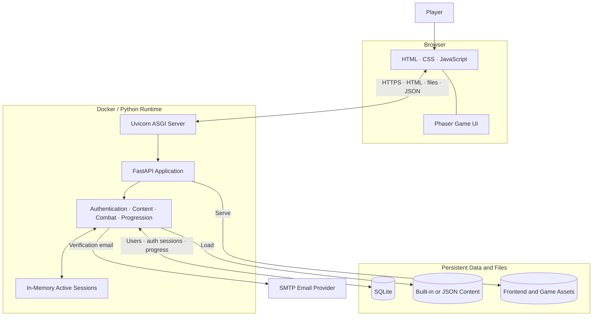

# Organic Battles V3 Paid Version

Organic Battles is a browser-based educational role-playing game in which players answer organic chemistry questions to power spells, defeat chemistry-themed bosses, and progress through chapters.

The application uses a browser game interface backed by a server-authoritative Python API. The browser renders the experience and submits player actions; the server validates authentication, selects questions, calculates damage, enforces cooldowns, controls progression, and saves player data.

> **Repository naming note:** The repository is named `OrganicBattlesV3PaidVersion`, but the current Python package metadata, FastAPI title, and some application text still identify the project as `Organic Battles V2` or `organicbattlesv2`. These internal names should be updated together when the V3 name is finalized.

## Technology stack

| Layer | Technology | Verified use |
| --- | --- | --- |
| Browser frontend | HTML, CSS, and JavaScript | Provides the user interface and communicates with the API. |
| Game rendering | Phaser | Identified by the existing project documentation as the browser game engine for the arena, avatars, animations, and combat effects. The frontend files were not included in the reviewed source snapshot, so the exact Phaser version could not be verified. |
| Backend framework | FastAPI 0.115.6 | Defines authentication, avatar, game-state, battle, progression, static-file, and index routes. |
| Request validation | Pydantic | Defines and validates signup, login, verification, avatar, spell, and answer request models through FastAPI. |
| ASGI server | Uvicorn 0.34.0 | Runs the FastAPI application and exposes it over HTTP. |
| Persistent storage | SQLite | Stores users, verification codes, authentication sessions, selected avatars, and serialized progress. |
| Runtime session storage | Process-local Python dictionary | Holds active `Session` objects and their session IDs while the server process is running. |
| Game content | Python constants or manifest-driven JSON | Supports a small built-in content set and an optional JSON content mode. |
| Configuration | Environment variables, `.env`, and `secrets.toml` | Loads database, cookie, content-source, verification, and SMTP settings. |
| Email | SMTP with STARTTLS | Sends six-digit account-verification codes; local development can print codes to the server console. |
| Tests | Pytest 8.3.4 and HTTPX 0.28.1 | Declared as dependencies for Python and API testing. Test files were not included in the reviewed snapshot, so test coverage is not confirmed. |
| Deployment | Docker on `python:3.12-slim` | Installs `requirements.txt` and starts the application with Uvicorn. |

The reviewed backend does **not** use Streamlit, Django, Flask, React, Angular, Next.js, an ORM, or a database-migration framework.

## System architecture



### Runtime responsibilities

- **Browser and Phaser:** Render the interface, arena, characters, and effects; collect player actions; call the API.
- **Uvicorn:** Listens for HTTP requests, invokes the FastAPI ASGI application, and returns files or JSON responses.
- **FastAPI:** Serves the frontend, validates input, authenticates users, enforces session ownership, and exposes the game APIs.
- **Game services in `app.py`:** Select questions, validate answers, apply spell and boss damage, enforce cooldowns, unlock rewards, and advance bosses and chapters.
- **SQLite:** Persists account and progress data across process restarts.
- **In-memory session dictionary:** Maps active game-session IDs to Python `Session` objects for the lifetime of one server process.

## Repository entry points

| File | Purpose |
| --- | --- |
| `app.py` | Actual FastAPI application, database setup, authentication, content loading, gameplay rules, and API routes. |
| `Dockerfile` | Production-style container entry point; runs `uvicorn app:app`. |
| `requirements.txt` | Current runtime and test dependencies used by the Docker build. |
| `pyproject.toml` | Project metadata, but currently incomplete and inconsistent with the Docker runtime. |
| `main.py` | Placeholder that only prints a greeting; it is not the web application entry point. |

## Application behavior

### Authentication and accounts

- Signup validates a basic email format, a 3–24 character username, and a minimum password length of eight characters.
- Passwords use PBKDF2-HMAC-SHA256 with a random 16-byte salt and 310,000 iterations.
- New accounts receive a six-digit confirmation code with a default lifetime of 15 minutes.
- Verification codes and authentication tokens are stored as hashes rather than plaintext.
- Successful verification or login creates a 30-day authentication session.
- Authentication supports an HttpOnly `session_token` cookie and a Bearer token.
- Cookies use `SameSite=Lax`; the `Secure` flag is controlled by `COOKIE_SECURE`.
- Avatar selections and serialized game progress are stored on the user record.

### Gameplay

- New games restore saved progress from SQLite when it is available.
- The player starts with 150 HP.
- Players must finalize one of seven allowed avatar IDs before selecting a spell.
- The built-in mode defines nine effective spells with basic, medium, and strong damage tiers.
- Selecting a spell creates one active question and starts a unique turn.
- A correct answer damages the boss; the boss then has a 50% chance to counterattack.
- An incorrect answer deals no boss damage and backfires on the player for the selected spell's power.
- Spell cooldowns are enforced on the server.
- Defeating a boss unlocks progression and a reward.
- Player defeat resets the current fight while preserving completed progression and previously earned rewards.
- Progress is saved after avatar finalization and battle-state changes.

### Built-in content mode

With `GAME_CONTENT_SOURCE=app`, the application uses content defined directly in `app.py`:

- 3 chapters
- 14 bosses: 4 in Chapter 1, 5 in Chapter 2, and 5 in Chapter 3
- 6 shared built-in questions
- 9 effective spell IDs
- 7 allowed player-avatar IDs

Built-in questions are reused across chapters and selected randomly. This mode is suitable for a compact demonstration but does not provide a large non-repeating question bank.

### JSON content mode

With `GAME_CONTENT_SOURCE=json`, the application reads `data/manifest.json` and the chapter files referenced by that manifest. The loader derives:

- chapter and boss metadata;
- boss health and image references;
- questions, answer choices, correct answers, and explanations;
- per-question and per-boss spell values; and
- question banks grouped by chapter and boss.

The number of JSON chapters is **manifest-driven**. The reviewed backend does not enforce or prove a fixed count of 27 chapters, so the exact count should be documented only after validating the repository's current `data/manifest.json`.

JSON mode currently maps damage ranks to only these spell IDs:

1. `fire-spark`
2. `resonance-burst`
3. `mechanism-storm`

## API endpoints

| Method | Endpoint | Purpose |
| --- | --- | --- |
| `POST` | `/api/auth/signup` | Create an unverified account and send a confirmation code. |
| `POST` | `/api/auth/verify` | Verify a six-digit code and create an authenticated session. |
| `POST` | `/api/auth/resend` | Invalidate prior unused codes and send a new code. |
| `POST` | `/api/auth/login` | Authenticate a verified user. |
| `GET` | `/api/auth/me` | Return the authenticated user's public profile. |
| `POST` | `/api/auth/logout` | Delete the current authentication session and cookie. |
| `POST` | `/api/game/new` | Create an in-memory game session and restore saved progress. |
| `GET` | `/api/game/state` | Return authoritative game state for an owned session. |
| `POST` | `/api/avatar/finalize` | Validate and persist the selected avatar. |
| `POST` | `/api/battle/select-spell` | Validate a spell and create the active question and turn. |
| `POST` | `/api/battle/answer` | Grade the answer and resolve player and boss damage. |
| `POST` | `/api/battle/retry` | Reset the current battle without removing completed progression. |
| `POST` | `/api/battle/next-turn` | Advance to the next boss or chapter after victory. |
| `GET` | `/api/progression` | Return the authenticated player's current game state. |
| `GET` | `/` | Serve `templates/index.html`. |
| `GET` | `/favicon.ico` | Serve the SVG favicon. |

FastAPI also exposes interactive API documentation at `/docs` and the OpenAPI schema at `/openapi.json` unless these defaults are changed.

## Database model

The application initializes SQLite directly when `app.py` is imported.

| Table | Stored data |
| --- | --- |
| `users` | Identity, email, username, password hash, verification status, avatar JSON, progress JSON, and creation time. |
| `verification_codes` | User reference, hashed code, expiration, used status, and creation time. |
| `auth_sessions` | Hashed token, user reference, expiration, and creation time. |

Foreign keys are enabled for each connection. There is no ORM or formal migration tool; a guarded `ALTER TABLE` statement currently handles the addition of `progress_json`.

## Configuration

Configuration precedence is:

1. Process environment variables
2. Local `.env` file
3. Matching values in `secrets.toml` where supported
4. Application defaults

| Variable | Default | Purpose |
| --- | --- | --- |
| `DATABASE_PATH` | `organic_battles.sqlite3` beside `app.py` | SQLite database location. |
| `GAME_CONTENT_SOURCE` | `app` | Select `app` or `json` content mode. |
| `VERIFICATION_CODE_TTL_SECONDS` | `900` | Verification-code lifetime. |
| `COOKIE_SECURE` | `0` | Set to `1` when the application is served over HTTPS. |
| `SMTP_HOST` | unset | SMTP host; when unset, codes are printed to the server console. |
| `SMTP_PORT` | `587` | SMTP port. |
| `SMTP_USERNAME` | unset | SMTP login and fallback sender. |
| `SMTP_PASSWORD` | unset | SMTP password or Gmail app password. |
| `SMTP_FROM` | username or fallback | From address for verification messages. |
| `PORT` | `8000` in the Docker command | HTTP port used by Uvicorn. |

Never commit `.env`, `secrets.toml`, SMTP credentials, authentication tokens, or a production database file.

## Run locally

### Windows PowerShell

```powershell
python -m venv .venv
.venv\Scripts\Activate.ps1
python -m pip install -r requirements.txt
uvicorn app:app --reload
```

### macOS or Linux

```bash
python3 -m venv .venv
source .venv/bin/activate
python -m pip install -r requirements.txt
uvicorn app:app --reload
```

Open <http://127.0.0.1:8000>. The application expects the referenced `templates`, `static`, `avatars`, `bosses`, and optional `data` files to exist in the repository.

To run JSON content mode in PowerShell:

```powershell
$env:GAME_CONTENT_SOURCE = "json"
uvicorn app:app --reload
```

To run JSON content mode in macOS or Linux:

```bash
export GAME_CONTENT_SOURCE=json
uvicorn app:app --reload
```

## Run with Docker

```bash
docker build -t organic-battles .
docker run --rm -p 8000:8000 --env-file .env organic-battles
```

For persistent SQLite data in a container, mount a writable volume and set `DATABASE_PATH` to a path inside that volume. Without a persistent volume, database changes are lost when the container is replaced.

## Testing

Pytest and HTTPX are declared in `requirements.txt`:

```bash
pytest
```

The reviewed source snapshot did not include test files. Add tests for authentication, verification expiration, session ownership, content loading, cooldown enforcement, answer grading, defeat and retry, progression, and persistence before treating the paid version as production-ready.

## Verified issues and recommended corrections

These findings are based on the reviewed `app.py`, `requirements.txt`, `pyproject.toml`, `Dockerfile`, `main.py`, and prior README.

### Configuration and metadata

1. **Python versions conflict.** The Dockerfile uses Python 3.12, while `pyproject.toml` requires Python 3.14 or newer. Align both to one supported version.
2. **Dependencies are split incorrectly.** Docker installs `requirements.txt`, but `pyproject.toml` declares only `pip`. Put runtime dependencies in one authoritative dependency definition or keep both files synchronized.
3. **Project naming is stale.** The repository says V3 Paid Version, while `pyproject.toml`, the FastAPI title, and some source text still say V2.
4. **`main.py` is not the application.** It is a placeholder; deployment correctly uses `app.py` through `uvicorn app:app`.

### Content correctness

1. **Five built-in explanation keys do not match their questions.** The explanation dictionary contains mojibake text such as `…`, while the questions contain the Unicode ellipsis `…`. Those questions therefore fall back to the generic explanation. Normalize the source file to UTF-8 and make the keys match exactly.
2. **`acid-shot` is declared twice.** Python silently keeps the second identical dictionary entry, so the effective spell count remains nine. Remove the duplicate source entry.
3. **The JSON chapter count must come from the manifest.** Do not claim 27 chapters until `data/manifest.json` is checked in the current repository version.
4. **JSON mode exposes only three rank-mapped spell IDs.** Confirm whether this is intentional before documenting all nine spells as available in JSON mode.

### Production readiness

1. **Active game sessions are process-local.** A restart removes their session IDs, and multiple workers or containers cannot share them. Saved progress remains in SQLite and can be restored by creating a new game session, but horizontal scaling requires Redis or a database-backed game-session repository.
2. **SQLite requires persistent storage in containers.** A managed relational database is preferable when concurrent writes or horizontal scaling increase.
3. **Add rate limiting and abuse controls.** Signup, login, verification, and resend endpoints currently have no application-level throttling or attempt limits.
4. **Strengthen verification binding.** Verification currently looks up a user by the submitted six-digit code alone. Bind verification to an email or pending-account identifier and limit failed attempts.
5. **Review browser security controls.** Production deployment should enforce HTTPS, `COOKIE_SECURE=1`, an explicit host policy, appropriate security headers, and CSRF protection for cookie-authenticated state-changing requests.
6. **Use formal database migrations.** Replace import-time schema changes with a controlled migration process before production releases.
7. **Add automated tests and CI.** Test dependencies are present, but test coverage was not verifiable from the reviewed files.

## Deployment guidance

The current Docker command starts a single Uvicorn process:

```text
uvicorn app:app --host 0.0.0.0 --port ${PORT:-8000}
```

This is compatible with the current process-local active-session design. Do not add multiple Uvicorn workers or horizontally scale containers until active game sessions are moved to shared storage. In production, place the application behind an HTTPS-capable load balancer or reverse proxy, persist the database, provide secrets through the hosting platform, and add health checks and centralized logs.

## Scope of this README audit

This README was validated against the source files available in the reviewed snapshot. The live private GitHub repository and the complete frontend, asset, JSON-content, and test directories were not accessible during this audit. Statements requiring those files are explicitly qualified rather than presented as verified facts.
