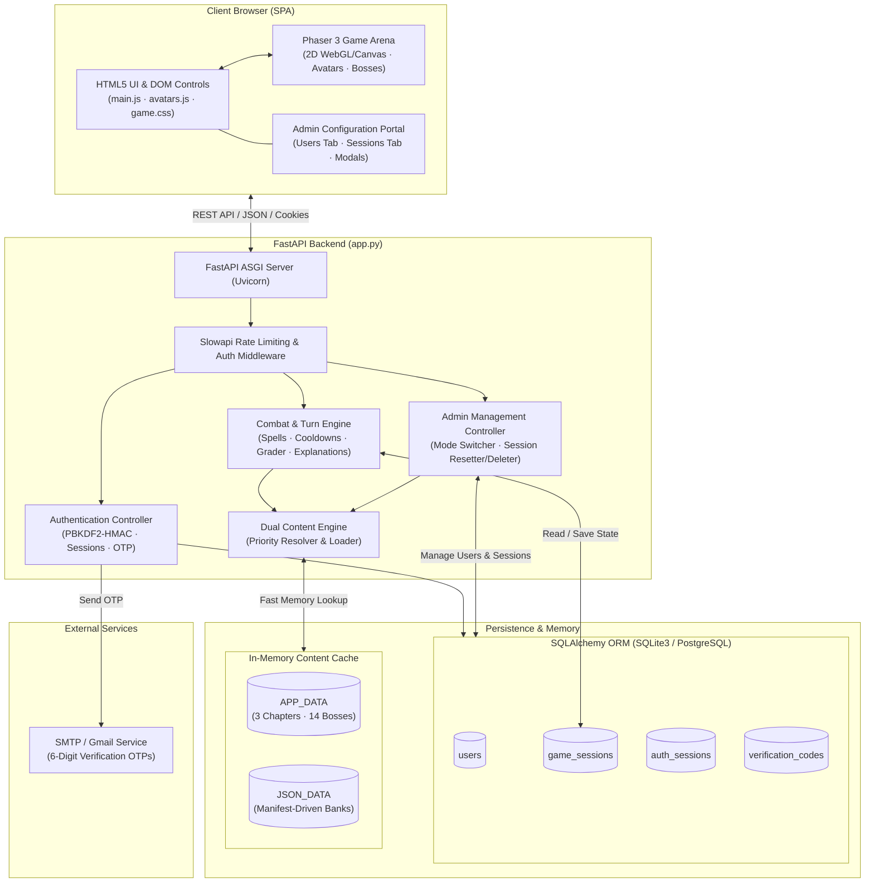
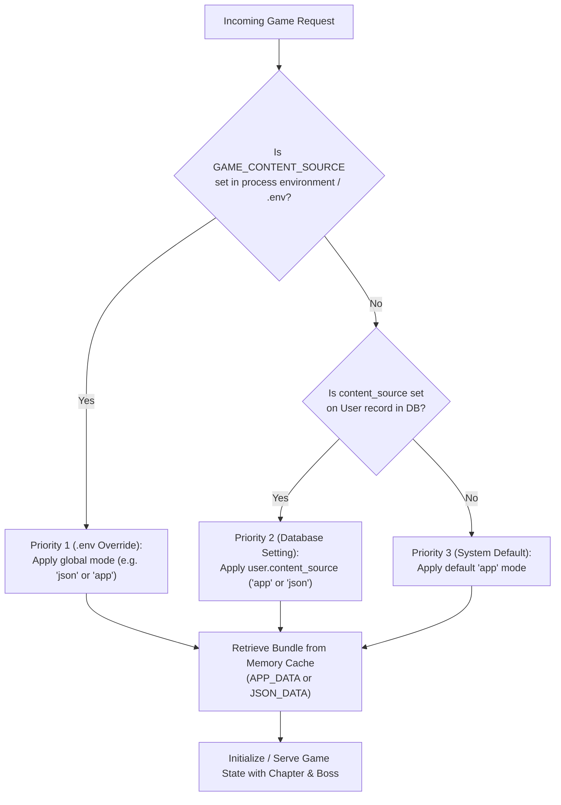
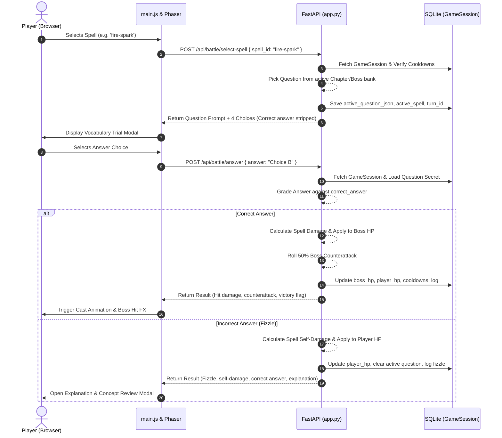
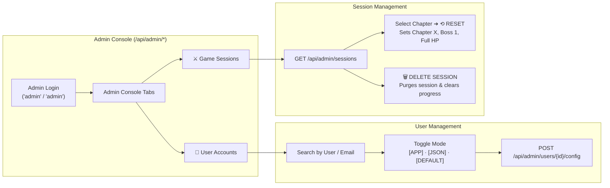
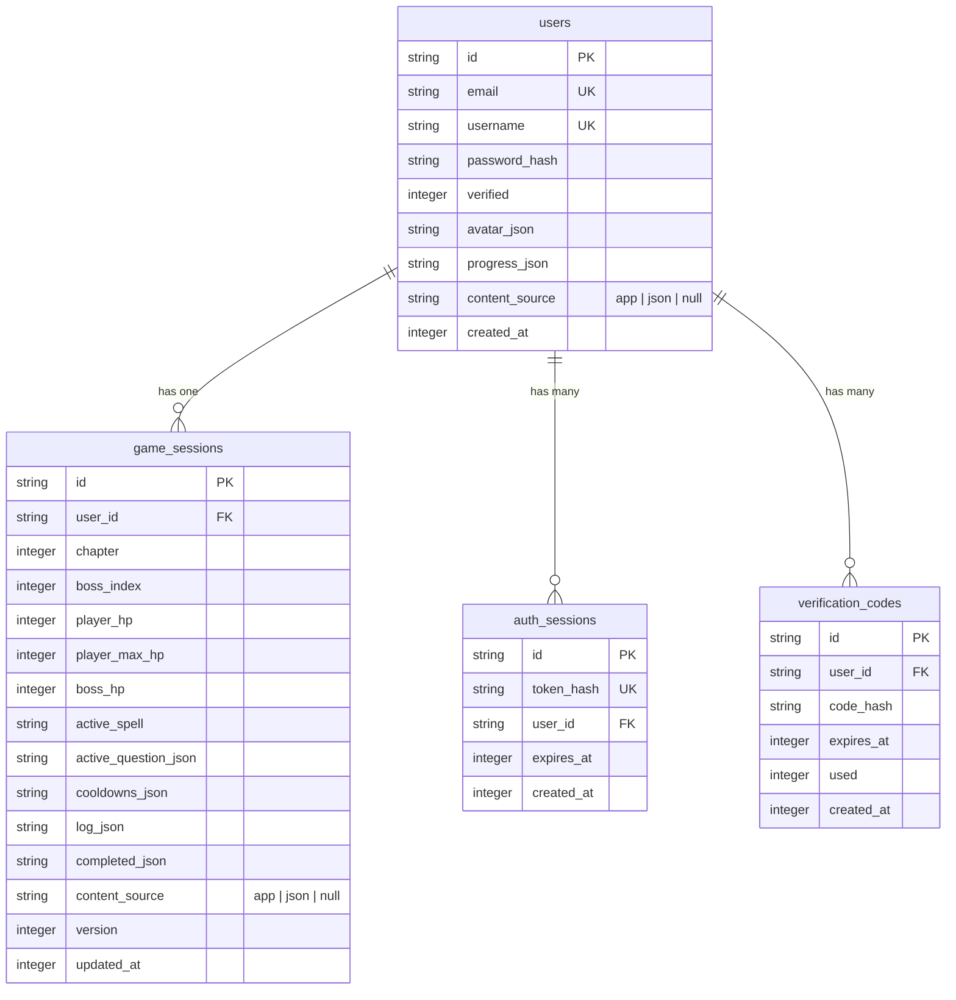

# Organic Battles — Technical Documentation & Architecture Reference

**Organic Battles** is a browser-based educational role-playing game (RPG) designed to reinforce organic chemistry concepts through boss battles. Players select custom alchemist avatars, cast chemistry spells, and answer randomized or chapter-aligned chemistry vocabulary trials to defeat bosses and progress through organic chemistry chapters.

---

## 1. System Overview & Technology Stack




### Core Technologies

| Layer | Technology | Version / Implementation | Description |
|---|---|---|---|
| **Backend Framework** | **FastAPI** | `0.115.6` | Async web API exposing authentication, combat, session, and administrative endpoints. |
| **ASGI Server** | **Uvicorn** | `0.34.0` | Production ASGI server with reloading and multiprocessing support. |
| **Database & ORM** | **SQLAlchemy** | `2.0+` | Relational ORM mapping `User`, `GameSession`, `VerificationCode`, and `AuthSession`. |
| **Database Engine** | **SQLite3 / PostgreSQL** | Native / `psycopg2` | Default local SQLite (`organic_battles.sqlite3`) with PostgreSQL readiness. |
| **Frontend Framework** | **Vanilla JS (ES6+)** | Native ES Modules | Modular JavaScript (`main.js`, `avatars.js`) without heavy frontend build frameworks. |
| **Styling** | **Vanilla CSS3** | Custom RPG Theme | Glassmorphism, cyan/amber neon glowing accents, responsive layouts, modal overlays. |
| **Game Engine** | **Phaser 3** | `3.60.0` (CDN) | 2D canvas/WebGL game arena with sprite rendering, background scaling, and battle arenas. |
| **Rate Limiting** | **Slowapi** | `0.1.9` | In-memory token bucket rate limiting on sensitive authentication endpoints. |
| **Test Suite** | **Pytest & HTTPX** | `8.3.4` / `0.28.1` | 26 automated unit and integration tests across dual content modes and admin features. |

---

## 2. System Architecture & Flow Diagrams

### 2.1 Content Mode Priority & Resolution Flow

Organic Battles supports both **Built-in App Content** (3 chapters, 14 bosses) and **Manifest-Driven JSON Content** (dynamic chapters and rich question banks). Both content bundles are loaded into memory on server boot to enable concurrent multi-mode access across different users.



---

### 2.2 Battle Turn & Damage Resolution Lifecycle



---

### 2.3 Admin Configuration & Session Management Flow



---

## 3. Directory & Codebase Structure

```text
OrganicBattles/
├── app.py                     # Main FastAPI application, routes, battle rules, content loaders
├── database.py                # SQLAlchemy engine, session maker, get_db dependency
├── models.py                  # Declarative SQLAlchemy models (User, GameSession, AuthSession, etc.)
├── session_repository.py      # CRUD repository persisting GameSession and User progress
├── Dockerfile                 # Container definition running uvicorn app:app
├── requirements.txt           # Python dependencies (FastAPI, SQLAlchemy, Slowapi, Pytest, etc.)
├── pyproject.toml             # Project metadata and test configuration
├── secrets.toml               # Local-only secrets (Gmail SMTP App Password credentials)
├── ProdUpgradeTasks.md        # Comprehensive production upgrade roadmap and task tracking
├── templates/
│   └── index.html             # Single-page application shell, auth cards, game UI, admin portal
├── static/
│   ├── css/
│   │   └── game.css           # RPG theme styling, glassmorphism, animations, admin styles
│   ├── js/
│   │   ├── main.js            # Frontend application logic, API client, DOM bindings, battle flow
│   │   └── avatars.js         # Avatar customization engine, raster art rendering, state animator
│   └── assets/
│       ├── battle-arena.png   # Phaser background battle arena texture
│       └── bosses/            # Boss artwork images (.png/.svg)
├── data/                      # Manifest-driven JSON game content
│   ├── manifest.json          # Content manifest pointing to chapter files
│   ├── chapter_01_foundations.json
│   ├── chapter_02_reaction_mechanisms.json
│   └── ...                    # Additional chapter files
└── tests/
    ├── test_game.py           # 24 dual-mode combat, session, and admin management tests
    └── test_email_config.py   # 2 SMTP / Gmail configuration validation tests
```

---

## 4. Dual Content Source Engine

The game engine separates game mechanics from content data, allowing instant switching between two distinct content representations:

### 4.1 Built-in App Mode (`app`)
- **Structure**: Pre-coded Python data structures within [`app.py`](file:///Users/nkoneru/Downloads/AI%20Apps/OrganicBattles/app.py).
- **Scope**: 3 Chapters, 14 Bosses (Chapter 1: 4 bosses; Chapter 2: 5 bosses; Chapter 3: 5 bosses).
- **Question Pool**: Built-in organic chemistry trial questions mapped to general concepts.
- **Spells**: Full 9-spell arsenal across Basic (20 DMG), Medium (30 DMG), and Strong (45 DMG) tiers.

### 4.2 JSON Manifest Mode (`json`)
- **Structure**: Manifest-driven filesystem loader reading [`data/manifest.json`](file:///Users/nkoneru/Downloads/AI%20Apps/OrganicBattles/data/manifest.json) and individual chapter JSON files.
- **Scope**: Manifest-defined chapters with chapter-specific boss health, images, and targeted vocabulary questions with detailed chemical explanations.
- **Rich Question Banks**: Grouped by chapter and boss for zero-repetition battle encounters.

### 4.3 Content Source Resolution Hierarchy
When an API request processes a game action, the effective mode is resolved in strict order:
1. **Priority 1 (`.env` / Environment Variable)**: If `GAME_CONTENT_SOURCE` is defined in the operating system environment or `.env`, it unconditionally overrides all settings.
2. **Priority 2 (`user.content_source` in Database)**: If no global override exists, the individual user's database setting (`"app"` or `"json"`) is used.
3. **Priority 3 (System Default)**: If neither is set, the application defaults to `"app"`.

---

## 5. Admin Configuration & User Management Console

The Admin Console is accessible via the **`⚙ ADMIN CONFIG`** buttons on the boot screen, authentication screen, and in-game header.

### 5.1 Admin Authentication
- **Default Credentials**: Username: `admin` | Password: `admin`
- **Environment Overrides**:
  - `ADMIN_USERNAME`: Custom admin username.
  - `ADMIN_PASSWORD`: Custom admin password.
  - `ADMIN_SESSION_TTL_HOURS`: Token lifetime (default: `24` hours).

### 5.2 User Accounts Tab (`👤 USER CONFIGURATION`)
- **Live Search**: Instant filtering by username, email, or user ID.
- **Mode Switching**: One-click toggle between `[ APP ]`, `[ JSON ]`, and `[ DEFAULT ]`.
- **Effective Mode Badge**: Visual pill indicating whether the active mode is driven by database setting or overridden by global `.env`.
- **Apply Action**: Updates the user's mode and immediately updates their active game session.

### 5.3 Game Sessions Tab (`⚔ GAME SESSIONS`)
- **Session Introspection**: Inspect active sessions with real-time Player HP, Boss HP, Chapter name, Current Boss name, and Defeated Boss count.
- **Reset to Chapter & First Boss**: Select any chapter from a dropdown and click **`⟲ RESET`** to set the player at Boss 1 of that chapter with full health and cleared active turn locks.
- **Delete Session**: Click **`🗑 DELETE`** with a confirmation modal to remove the session record and wipe serialized progress, giving the user a clean slate on their next login.

---

## 6. Combat Engine, Spells & Chemistry Mechanics

### 6.1 The 9-Spell Arsenal

| Spell ID | Spell Name | Tier | Base Damage | Cooldown |
|---|---|---|---|---|
| `fire-spark` | Fire Spark | BASIC | 20 DMG | None |
| `acid-shot` | Acid Shot | BASIC | 20 DMG | None |
| `carbon-punch` | Carbon Punch | BASIC | 20 DMG | None |
| `resonance-burst` | Resonance Burst | MEDIUM | 30 DMG | 1 Turn |
| `nucleophile-strike` | Nucleophile Strike | MEDIUM | 30 DMG | 1 Turn |
| `chiral-slash` | Chiral Slash | MEDIUM | 30 DMG | 1 Turn |
| `mechanism-storm` | Mechanism Storm | STRONG | 45 DMG | 2 Turns |
| `stereochemical-rift` | Stereochemical Rift | STRONG | 45 DMG | 2 Turns |
| `spectral-obliteration` | Spectral Obliteration | STRONG | 45 DMG | 2 Turns |

### 6.2 Battle Rules & Chemistry Feedback
1. **Selecting a Spell**: Locks the spell, triggers a random vocabulary trial from the boss/chapter question bank, and assigns a unique `turn_id`.
2. **Correct Answer**:
   - Deals the selected spell's damage directly to the boss.
   - Boss has a **50% probability** of retaliating with a counterattack (dealing 10–25 damage).
3. **Incorrect Answer (Spell Fizzle)**:
   - Deals **0 damage** to the boss.
   - Spell backfires, dealing self-damage equal to the spell's damage tier to the player.
   - Triggers the **Explanation & Concept Review Modal**, showing the correct answer and a full chemical breakdown.
4. **Victory & Progression**:
   - Defeating a boss unlocks the next boss in the chapter.
   - Defeating the final boss of a chapter transitions the player to the next chapter.
5. **Defeat & Retry**:
   - If player HP hits 0, player can retry the current boss with full HP without losing chapter progression.

---

## 7. Complete API Endpoints Reference

### 7.1 Authentication Endpoints

| Method | Endpoint | Description | Request Body |
|---|---|---|---|
| `POST` | `/api/auth/signup` | Register new account and send 6-digit confirmation code. | `{"email": "...", "username": "...", "password": "..."}` |
| `POST` | `/api/auth/verify` | Verify email OTP code and receive session token. | `{"code": "123456"}` |
| `POST` | `/api/auth/login` | Authenticate existing user with email and password. | `{"email": "...", "password": "..."}` |
| `GET` | `/api/auth/me` | Fetch public profile, active avatar, and effective mode. | Header: `Authorization: Bearer <token>` |
| `POST` | `/api/auth/resend` | Invalidate previous code and send fresh OTP code. | Query: `?email=user@example.com` |
| `POST` | `/api/auth/logout` | Terminate session and clear session cookies. | Header / Cookie |

### 7.2 User Configuration & Content Mode Endpoints

| Method | Endpoint | Description | Request Body |
|---|---|---|---|
| `POST` | `/api/user/mode` | Switch current user's mode (`app` or `json`). | `{"mode": "json"}` |
| `POST` | `/api/user/content-source` | Update user's `content_source` column in database. | `{"content_source": "app"}` |

### 7.3 Game & Avatar Endpoints

| Method | Endpoint | Description | Request Body |
|---|---|---|---|
| `POST` | `/api/game/new` | Create or restore persistent game session. | Optional: `session_id` |
| `GET` | `/api/game/state` | Fetch full authoritative battle state. | Query: `?session_id=<id>` |
| `POST` | `/api/avatar/finalize` | Save selected alchemist avatar customization. | Avatar JSON payload |

### 7.4 Battle & Combat Endpoints

| Method | Endpoint | Description | Request Body |
|---|---|---|---|
| `POST` | `/api/battle/select-spell` | Select spell and receive vocabulary question trial. | `{"spell_id": "fire-spark"}` |
| `POST` | `/api/battle/answer` | Submit answer choice, grade turn, apply damage. | `{"answer": "Nucleophile"}` |
| `POST` | `/api/battle/retry` | Restart current boss fight after defeat. | `session_id` |
| `POST` | `/api/battle/next-turn` | Advance to next boss or chapter upon victory. | `session_id` |

### 7.5 Admin Console Endpoints

| Method | Endpoint | Description | Headers / Payload |
|---|---|---|---|
| `POST` | `/api/admin/login` | Authenticate admin and receive admin token. | `{"username": "admin", "password": "admin"}` |
| `GET` | `/api/admin/status` | Get system status, user/session counts, and .env state. | `Authorization: Bearer <admin_token>` |
| `GET` | `/api/admin/users` | List all users with verified status and mode settings. | `Authorization: Bearer <admin_token>` |
| `POST` | `/api/admin/users/{user_id}/config` | Update a specific user's `content_source`. | `{"content_source": "json"}` |
| `GET` | `/api/admin/sessions` | List all active sessions with battle stats & chapters. | `Authorization: Bearer <admin_token>` |
| `POST` | `/api/admin/sessions/{session_id}/reset` | Reset session to chosen chapter and first boss. | `{"chapter": 2}` |
| `DELETE` | `/api/admin/sessions/{session_id}` | Delete session and reset user progress. | `Authorization: Bearer <admin_token>` |
| `POST` | `/api/admin/logout` | Terminate administrator session. | Header / Cookie |

---

## 8. Database Schema

The database uses SQLAlchemy with automatic table creation and schema validation on startup:



---

## 9. Configuration & Environment Variables

Configuration is resolved with the following priority:
1. **Operating System / Process Environment** (`os.getenv`)
2. **Local `.env` file**
3. **`secrets.toml` file** (for local SMTP credentials)
4. **Application Defaults**

| Variable | Default Value | Description |
|---|---|---|
| `GAME_CONTENT_SOURCE` | *Unset* (defaults to `app`) | Priority 1 global override (`app` or `json`). |
| `DATABASE_URL` | `sqlite:///./organic_battles.sqlite3` | SQLAlchemy database connection URI. |
| `ADMIN_USERNAME` | `admin` | Username for Administrator Console login. |
| `ADMIN_PASSWORD` | `admin` | Password for Administrator Console login. |
| `ADMIN_SESSION_TTL_HOURS` | `24` | Admin session token lifetime in hours. |
| `VERIFICATION_CODE_TTL_SECONDS` | `900` (15 mins) | Email verification OTP code validity duration. |
| `COOKIE_SECURE` | `0` | Set to `1` in production to enforce `Secure; HttpOnly` cookies. |
| `SMTP_HOST` | *Unset* (logs to console) | SMTP server host (e.g. `smtp.gmail.com`). |
| `SMTP_PORT` | `587` | SMTP server port (STARTTLS). |
| `SMTP_USERNAME` | *Unset* | SMTP authentication email address. |
| `SMTP_PASSWORD` | *Unset* | SMTP authentication password or Gmail App Password. |
| `SMTP_FROM` | `SMTP_USERNAME` | Sender email address. |

---

## 10. Local Setup & Execution Guide

### 10.1 Prerequisites
- **Python 3.9+** (Python 3.11 or 3.12 recommended)
- **pip** and **virtualenv**

### 10.2 Installation & Startup

#### macOS / Linux
```bash
# 1. Clone repository and navigate to root directory
cd "/path/to/OrganicBattles"

# 2. Create and activate virtual environment
python3 -m venv .venv
source .venv/bin/activate

# 3. Install dependencies
pip install -r requirements.txt

# 4. Start Uvicorn development server
uvicorn app:app --reload --host 127.0.0.1 --port 8000
```

#### Windows (PowerShell)
```powershell
# 1. Navigate to root directory
cd "C:\path\to\OrganicBattles"

# 2. Create and activate virtual environment
python -m venv .venv
.venv\Scripts\Activate.ps1

# 3. Install dependencies
pip install -r requirements.txt

# 4. Start Uvicorn development server
uvicorn app:app --reload --host 127.0.0.1 --port 8000
```

Open your browser at **<http://127.0.0.1:8000>**.

---

### 10.3 Running in Specific Content Modes

To force global **JSON Content Mode**:
```bash
# macOS / Linux
GAME_CONTENT_SOURCE=json uvicorn app:app --reload

# Windows PowerShell
$env:GAME_CONTENT_SOURCE="json"; uvicorn app:app --reload
```

To force global **App Content Mode**:
```bash
# macOS / Linux
GAME_CONTENT_SOURCE=app uvicorn app:app --reload

# Windows PowerShell
$env:GAME_CONTENT_SOURCE="app"; uvicorn app:app --reload
```

---

### 10.4 Running Automated Tests

Run the complete 26-test suite:
```bash
# Run all tests
.venv/bin/pytest

# Run tests with verbose output
.venv/bin/pytest -v

# Run tests under forced JSON mode
GAME_CONTENT_SOURCE=json .venv/bin/pytest

# Run tests under forced App mode
GAME_CONTENT_SOURCE=app .venv/bin/pytest
```

---

## 11. Containerization & Production Deployment

### 11.1 Docker Build & Run
```bash
# Build Docker image
docker build -t organic-battles .

# Run container with persistent volume
docker run --rm -p 8000:8000 \
  -v $(pwd)/organic_battles.sqlite3:/app/organic_battles.sqlite3 \
  -e COOKIE_SECURE=1 \
  -e ADMIN_PASSWORD="your-strong-admin-password" \
  organic-battles
```

### 11.2 Production Upgrade Roadmap
For enterprise-scale multi-region deployment, reference [`ProdUpgradeTasks.md`](file:///Users/nkoneru/Downloads/AI%20Apps/OrganicBattles/ProdUpgradeTasks.md), which outlines:
1. **PostgreSQL Migration**: Replacing SQLite with Aurora PostgreSQL and Alembic migrations.
2. **Distributed Redis/Valkey**: Shared session tokens, turn idempotency locks, and distributed Slowapi rate limits.
3. **Asynchronous Worker Queue**: Decoupling email delivery and content loading via Celery / ARQ / SQS.
4. **CloudFront CDN / S3**: Offloading static assets, Phaser textures, and audio files with WebP/AVIF optimization.
5. **Observability**: OpenTelemetry tracing, structured JSON logging, and Prometheus metrics.
