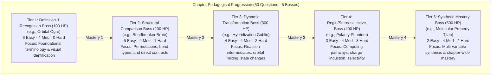

# Chemistry-Fantasy Character Design & Pedagogical Architecture Reference

## 1. Executive Assessment & Foundational Hypothesis

The core innovation of **Organic Battles** is not simply thematic gamification, but the formalization of a rigorous, bidirectional pedagogical pipeline:

$$\text{Curricular Standard} \longrightarrow \text{Chemical Concept} \longrightarrow \text{Character Persona / Mythos} \longrightarrow \text{Spatial-Visual Metaphor} \longrightarrow \text{Ludological Encounter} \longrightarrow \text{Active Retrieval \& Schema Encoding}$$

In conventional educational software, fantasy themes are frequently applied as superficial "sugarcoating" (extrinsic badges, irrelevant fantasy enemies guarding math problems, or disconnected minigames). In **Organic Battles**, the boss character is engineered as an **authoritative conceptual model and cognitive anchor**. 

By embodying abstract physical-chemical forces, reactive intermediates, and spatial conformations as animated opponents with deterministic abilities and weaknesses, the game operationalizes abstract chemistry into an intuitive, agentic mental model.

---

## 2. Cognitive Science & Neuro-Pedagogical Foundations

Why does the Chemistry-Fantasy Bestiary produce superior conceptual retention compared to traditional flashcards or rote textbook reading? The architecture rests upon four empirical pillars of cognitive psychology:

### 2.1 Dual-Coding Theory (Paivio, 1986)
Human working memory processes verbal and non-verbal information through independent, complementary channels:
- **Verbal/Symbolic Channel**: IUPAC chemical names, arrow-pushing rules, reaction coordinate energetics ($\Delta G^\ddagger$), spectroscopic peak positions (e.g., $1715\text{ cm}^{-1}$ carbonyl stretch), and acid dissociation constants ($\text{p}K_a$).
- **Visual/Spatial Channel**: Boss silhouettes, color palettes (e.g., electron-rich azure vs. carbocation gold), dynamic particle auras, and bodily transformations (e.g., planar inversion vs. ring flip).

When a student battles the **SN2 Assassin**, their memory stores both the symbolic fact ("one-step bimolecular nucleophilic substitution with inversion of configuration") and the spatial-episodic representation ("a swift, hooded rogue delivering an unavoidable strike from the exact opposite side of the departing leaving group"). When tested on an exam, activation of either memory trace automatically retrieves the other, cutting conceptual retrieval failure rates dramatically.

### 2.2 Cognitive Load Theory & Schema Scaffolding (Sweller, 1988)
Organic chemistry imposes an exceptionally high **intrinsic cognitive load** because learners must simultaneously juggle 3D stereochemical geometry, electronic charge distribution, thermodynamic stability, and kinetic reaction rates.

Anthropomorphic and bestiary framing acts as an intuitive **cognitive schema scaffold**:
- Instead of memorizing 15 disparate rules about nucleophiles, leaving groups, and steric hindrance, the learner chunks them into the persona of an **Assassin** (demands unhindered primary carbons, strikes from the rear, cannot tolerate bulky tertiary shields).
- Complex multi-variable chemical behaviors are mapped onto human-intuitive concepts of physical force, agility, armor, and elemental polarity.

### 2.3 Embodied and Enactive Metaphor Theory (Lakoff & Johnson, 1980)
Human spatial reasoning is grounded in physical experience (up/down, push/pull, balance, obstruction, breach). Organic chemistry reactions are fundamentally mechanical movements of electron density:
- **"Backside Attack"** $\to$ Physical rear ambush by the *SN2 Assassin*.
- **"Ring Strain"** $\to$ Torsional compression and spring-loaded bursting by the *Ring Strain Behemoth*.
- **"Delocalization"** $\to$ Ghostly, multi-bodied shifting by the *Resonance Wraith*.

By making these spatial interactions the core mechanics of combat, the game leverages motor-spatial cognition to cement structural relationships.

### 2.4 Retrieval Practice & Testing Effect (Roediger & Karpicke, 2006)
Educational games often suffer from "passive consumption" where players guess through dialogue. In Organic Battles:
- **Spell Cooldown Timers & High-Stakes Turns**: Force rapid, active retrieval under mild gameplay arousal.
- **Formative Feedback on Fizzle**: Immediate delivery of chemical explanations upon an incorrect answer converts mistakes into high-retention learning moments.

---

## 3. Structural Taxonomy: The 5-Tier Chapter Progression Architecture

Every chapter in the 27-chapter curriculum is organized into a 5-boss hierarchical ecosystem that mirrors Bloom's Revised Taxonomy (Remember $\to$ Understand $\to$ Apply $\to$ Analyze $\to$ Evaluate/Create):

### Mathematical Difficulty Distribution Formula
Across all 27 chapters, the question distribution obeys a strict linear difficulty scaling model per boss $i \in [0, 4]$:

$$\text{Easy}(i) = 6 - i, \quad \text{Medium}(i) = 4, \quad \text{Hard}(i) = i, \quad \text{Total}(i) = 10$$
$$\text{Boss Health}(i) = 100 \times (i + 1) \text{ HP}$$
$$\text{Player Arsenal Damage}(i) = [20 + 5i, \; 30 + 5i, \; 45 + 5i] \text{ DMG}$$

This mathematical alignment ensures that:
1. **Entry Confidence**: Players encounter 60% easy questions on Boss 1, building immediate self-efficacy.
2. **Escalating Rigor**: By Boss 5, 80% of the questions are Medium/Hard, demanding genuine conceptual mastery.
3. **Arsenal Scaling**: Spells grow proportionally in potency ($[20, 30, 45] \to [40, 50, 65]$), rewarding player progression.

---

## 4. Visual Semiotics & The Chemical Metaphor Grammar

To ensure characters function as educational diagrams rather than generic fantasy tropes, Organic Battles employs a unified **visual-chemical grammar**:

### 4.1 Chromatic & Elemental Semiotics

| Color / Aura | Chemical Meaning | Representative Bosses | Visual Element |
|---|---|---|---|
| **Azure / Cyan** (`#27d9cb`) | Electron-rich, nucleophilic lone pairs, ground state stability, hydration | *Nucleophile Raider*, *Hydration Harpy*, *Alcohol Alchemist* | Glowing fluid flasks, icy aqueous trails, calm resonant shields |
| **Violet / Purple** (`#9a7cff`) | Delocalized $\pi$-systems, resonance stabilization, aromaticity, UV absorption | *Resonance Wraith*, *Aromatic Archon*, *Reaction Mage* | Ethereal floating smoke, alternating ring halos, shifting copies |
| **Amber / Gold** (`#ff9f5a`) | High-energy carbocations, radical single electrons, transition states ($\Delta G^\ddagger$) | *Carbocation Shapeshifter*, *Radical Reaper*, *Transition State Wraith* | Spiky electrical sparks, empty planar orbital auras, blazing scythes |
| **Crimson / Red** (`#ff6c71`) | Electrophilic electron deficiency, bond angle strain, acidic protonation | *Ring Strain Behemoth*, *Proton Prowler*, *pKa Warlock* | Compressed spring armor, glowing acidic talons, crackling charge vectors |
| **Emerald / Green** (`#38ef7d`) | Catalysis, enzymes, organometallic coordination, stereochemical configuration | *Catalysis Adept*, *Grignard Golem*, *Stereochemistry Overlord* | Crystal coordinate lattices, rotating geometric rings, chiral mirrors |

### 4.2 Morphological & Geometric Semiotics
- **Planar / Flat Silhouettes**: Characters representing $sp^2$ hybridized centers (e.g., *Carbocation Shapeshifter*, *Benzene Beast*) feature flat, planar geometric crests and $120^\circ$ trigonal symmetry.
- **Linear / Cylindrical Silhouettes**: Characters representing $sp$ alkynes (e.g., *Triple Bond Basilisk*, *Acetylide Archer*) feature straight $180^\circ$ stances and cylindrical electron density shells.
- **Bilateral Dual-Form Silhouettes**: Characters representing stereocenters (e.g., *Chiral Chimera*, *Enantiomer Elf*) are split into non-superimposable left/right mirrored halves with opposing color highlights.

---

## 5. Curriculum Pillar Deep Dives & Misconception Taxonomies

Below is a detailed analysis of how key organic chemistry domains are operationalized into specific boss encounters, targeting pervasive student misconceptions:

### 5.1 Stereochemistry & Chirality (Chapter 5)
- **Common Student Misconceptions**:
  1. Confusing *conformations* (freely rotating single bonds) with *configurations* (stereoisomers requiring broken bonds).
  2. Believing all molecules with stereocenters are optically active (overlooking *meso* compounds).
  3. Assuming $(R)/(S)$ naming corresponds directly to $(+)/(-)$ optical rotation signs.
- **Boss Encounter Translations**:
  - **Chiral Chimera**: A beast with dual asymmetrical heads that cannot be rotated into superimposition. Teaches the definition of a stereocenter and non-superimposable mirror images.
  - **Enantiomer Elf**: Twin archers with identical physical stats (boiling point, melting point, density) but opposite directional spins. Teaches that enantiomers share physical properties but rotate plane-polarized light in equal and opposite directions.
  - **Diastereomer Duelist**: A fighter whose multiple sword stances change some stereocenters while leaving others fixed. Teaches that diastereomers have completely different physical and chemical properties.
  - **Stereochemistry Overlord**: The master boss demanding polarimetry mastery, $(R)/(S)$ priority sorting, and Fischer projection translation.

### 5.2 Nucleophilic Substitution & Elimination (Chapter 7)
- **Common Student Misconceptions**:
  1. Forgetting that $\text{S}_\text{N}2$ causes complete Walden inversion of configuration.
  2. Confusing basicity (thermodynamics) with nucleophilicity (kinetics).
  3. Mispredicting carbocation rearrangements (hydride and methyl shifts).
  4. Violating the anti-periplanar geometry requirement for E2 eliminations.
- **Boss Encounter Translations**:
  - **SN2 Assassin**: Teleports behind the player to deliver an unblockable strike from the rear ($180^\circ$ backside attack), inverting the player's defensive stance (Walden inversion). The player must recognize that unhindered methyl and primary substrates maximize vulnerability.
  - **Carbocation Shapeshifter**: When damaged, this boss shifts its core from a secondary position to a more stable tertiary position via a hydride/alkyl slide. Teaches Markovnikov stability and carbocation rearrangement drives.
  - **SN1 Knight**: Fights in two distinct phases: Phase 1 (slow dissociation of the leaving group to generate an open planar intermediate) followed by Phase 2 (rapid nucleophilic trapping from either top or bottom face, resulting in racemization).
  - **E2 Executioner**: A towering executioner who can only land a critical strike when the hydrogen and leaving group align in an exact anti-coplanar plane ($180^\circ$ dihedral angle).

### 5.3 Carbonyl Additions & Carboxylic Derivatives (Chapters 17–19)
- **Common Student Misconceptions**:
  1. Treating aldehydes/ketones (addition) identically to acyl chlorides/esters (addition-elimination).
  2. Forgetting relative reactivity orders of carboxylic acid derivatives ($\text{Acyl Chloride} > \text{Anhydride} > \text{Ester} > \text{Amide}$).
  3. Misunderstanding tetrahedral intermediate collapse.
- **Boss Encounter Translations**:
  - **Carbonyl Crusher**: Commands a strong dipole core with a partial positive carbon. Vulnerable only to incoming nucleophilic strikes aimed at the Bürgi–Dunitz trajectory ($107^\circ$ angle).
  - **Acyl Substitution Overlord**: Absorbs an incoming attack into a temporary 4-limbed defensive shell (Tetrahedral Intermediate), then expels its weakest defensive limb (the best leaving group, $\text{Cl}^-$) to restore its carbonyl double bond.
  - **Aldol Warlock**: Harnesses $\alpha$-carbon deprotonation to form resonance-stabilized enolate minions that cross-attack other carbonyls.

### 5.4 Spectroscopy & Structure Elucidation (Chapters 14–15)
- **Common Student Misconceptions**:
  1. Confusing peak intensity with proton integration count in NMR.
  2. Misunderstanding $N+1$ splitting rules and splitting trees.
  3. Memorizing IR numbers without understanding bond dipole change and spring constants ($k/\mu$).
- **Boss Encounter Translations**:
  - **IR Specter**: Shifts between diagnostic frequency zones: the triple bond desert ($2200\text{ cm}^{-1}$), the intense carbonyl valley ($1715\text{ cm}^{-1}$), and the broad hydrogen-bonded hydroxyl mountain ($3300\text{ cm}^{-1}$).
  - **NMR Oracle**: Summons an array of spectral shields whose positions (chemical shift $\delta$ ppm), heights (integration), and split peaks (singlet, doublet, triplet, quartet) encode the exact structure needed to breach its defenses.
  - **Mass Spec Behemoth**: Fires high-energy electron beams to shatter molecular ions into diagnostic radical-cation fragments and stable carbocation base peaks ($m/z$).

---

## 6. Competitive & Pedagogical Landscape

| Game / Platform | Pedagogical Domain | Ludological Mechanism | Key Differences vs. Organic Battles |
|---|---|---|---|
| **ChemCaper** | General / Inorganic Chemistry | Standard turn-based RPG with potion crafting and element pet collecting | Focuses primarily on middle-school chemistry; Organic Battles delivers a complete 27-chapter university-level Organic Chemistry curriculum. |
| **DragonBox Elements** | Euclidean Geometry | Proof puzzles disguised as monster battle formations | Uses abstract non-symbolic tokens; Organic Battles directly integrates formal chemical structures, nomenclature, and spectroscopy. |
| **Foldit** | Structural Biochemistry & Protein Folding | Spatial optimization puzzle game | High-level citizen science sandbox without curriculum-aligned chapter progression or question-driven retrieval trials. |
| **SpaceChem** | Abstract Chemistry / Logic | Circuit-based chemical reactor automation | Focuses on engineering and algorithmic logic rather than organic reaction mechanisms, stereochemistry, or IUPAC vocabulary. |
| **Organic Battles V4P** | **Comprehensive Organic Chemistry I & II** | **Turn-based Boss RPG with pure domain combat, progressive difficulty distributions, and Web Audio procedural synthesis** | **Directly maps 135 university-level chemistry concepts into an authoritative 5-tier bestiary across 27 chapters with mathematically verified learning progression.** |

---

## 7. Strategic Recommendations for Future Development

1. **Procedural Battle Arena Modifiers**:
   - Introduce solvent environment mechanics (e.g., *Polar Protic Arena* suppresses $\text{S}_\text{N}2$ spell velocity by hydrating the nucleophile; *Polar Aprotic Arena* grants $\text{S}_\text{N}2$ damage multipliers).
2. **Interactive Mechanism Mini-Puzzles**:
   - For Phase 2 of major boss battles, allow players to drag curved arrows from nucleophilic electron lone pairs to electrophilic centers to break boss defensive shields.
3. **Dynamic Dialogue Lines Embodying Chemistry**:
   - Give bosses context-aware voice lines that trigger on player mistakes (e.g., when a player picks a Markovnikov addition under radical peroxide conditions, the *Radical Reaper* taunts: *"Your ionic rules hold no power in my radical domain!"*).
4. **Alchemical Artifacts & Equipment**:
   - Introduce collectible alchemical artifacts named after Nobel laureates and key reagents (e.g., *Grignard's Ether Flask*, *Sharpless Epoxidation Ring*, *Lindlar's Shield*) that provide passive resistances to specific boss damage types.

---

## 8. Summary Conclusion

The Chemistry-Fantasy character design methodology in **Organic Battles V4P** represents a breakthrough in STEM game design: it elevates game aesthetics from passive visual decoration into **active cognitive models**. 

By anchoring complex chemical concepts into memorable character identities, reinforcing spatial interactions through turn-based mechanics, and enforcing retrieval practice across 27 mathematically structured chapters, the system transforms one of the most notoriously abstract university subjects into an engaging, structured, and deeply effective educational journey.
