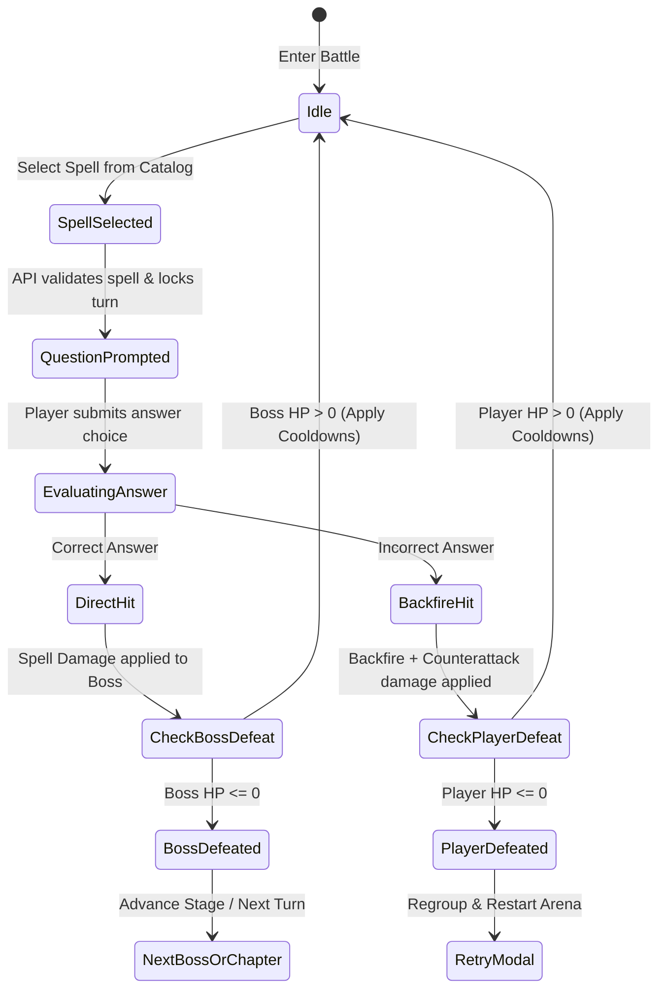
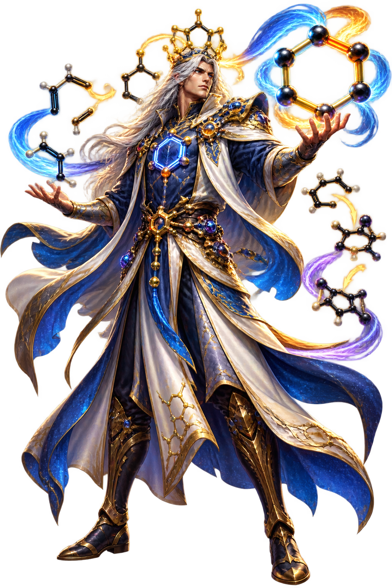
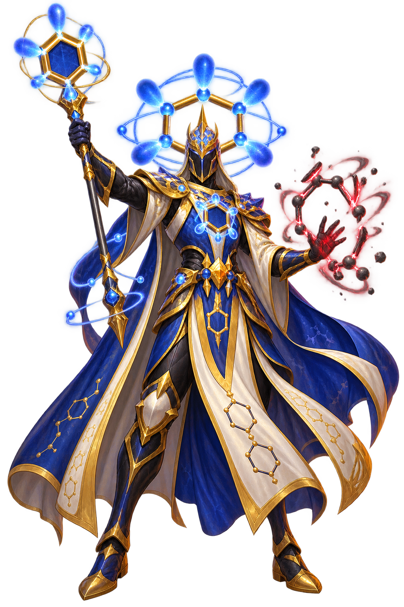
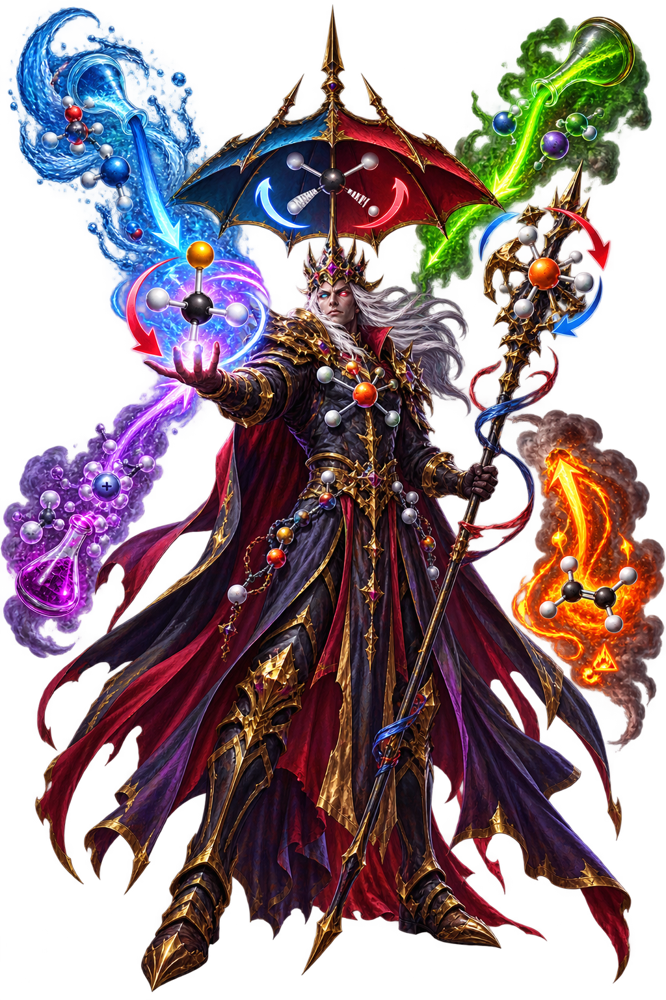
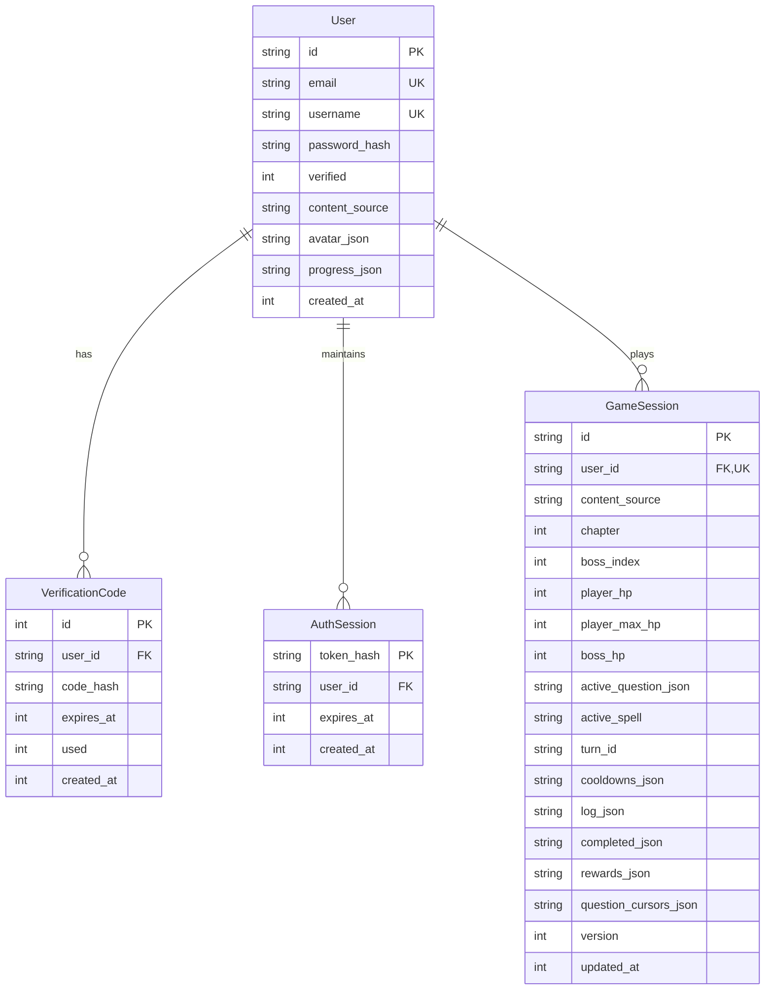
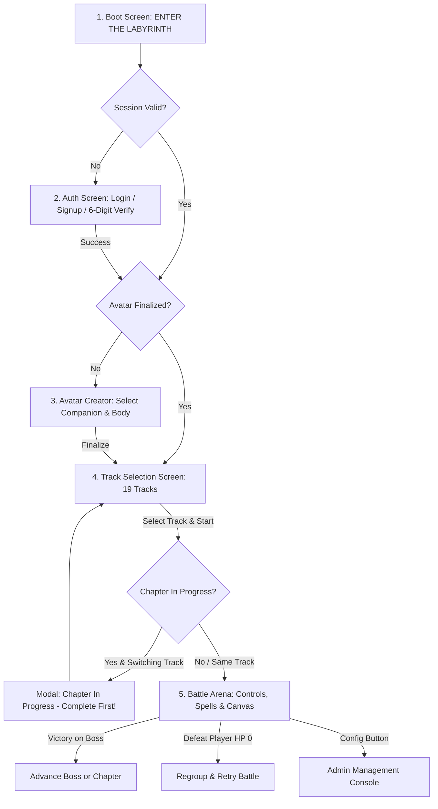

# Organic Battles: The Definitive Gaming Application Cookbook

**Organic Battles (V4P)** is a production-grade educational fantasy RPG where organic chemistry concepts, reaction mechanisms, stereochemistry, and spectroscopy are reimagined as arcane turn-based duels against alchemical creatures and Titans.

This cookbook serves as the comprehensive architectural reference, design blueprint, engineering specification, error catalog, and production-readiness roadmap for developers, educators, and systems architects.

---

## Table of Contents
1. [Executive Overview & Pedagogical Game Concept](#1-executive-overview--pedagogical-game-concept)
2. [Technology Stack & System Architecture](#2-technology-stack--system-architecture)
3. [Core Gameplay & Combat Systems Design](#3-core-gameplay--combat-systems-design)
4. [Track Architecture, Content Ingestion & Bundle Lifecycle](#4-track-architecture-content-ingestion--bundle-lifecycle)
   - [4.4 Advanced Track Bestiary Gallery & Chemistry Interpretations](#44-advanced-track-bestiary-gallery--chemistry-interpretations)
5. [Database Design & Per-Track State Persistence](#5-database-design--per-track-state-persistence)
6. [User Journey, Selections & UI Navigation Flows](#6-user-journey-selections--ui-navigation-flows)
   - [6.4 Comprehensive Administrator Configuration Portal & System Controls](#64-comprehensive-administrator-configuration-portal--system-controls)
7. [Comprehensive Error Catalog & Status Codes](#7-comprehensive-error-catalog--status-codes)
8. [Multi-User Production Readiness Roadmap](#8-multi-user-production-readiness-roadmap)

---

## 1. Executive Overview & Pedagogical Game Concept

### 1.1 The Alchemical Fantasy Pitch
Organic chemistry is traditionally considered one of the most intellectually demanding undergraduate subjects due to its dense 3D spatial relationships, abstract electron-pushing mechanisms, and immense nomenclature lexicon.

**Organic Battles** bridges cognitive psychology with video game engagement:
- **Dual-Coding Theory**: Visualizing molecular shapes, orbital overlap, and reagents as mythical fantasy creatures (e.g., *Hybridization Goblin*, *SN2 Assassin*, *Stereochemistry Overlord*).
- **Active Recall & Consequence**: Casting spells in battle requires answering rigorous multiple-choice chemistry trials. Correct answers deal massive elemental damage; incorrect answers trigger spell backfires and provoke ferocious boss counterattacks.
- **Micro-Progression & Flow**: Chapters are divided into stages (Mini-Bosses leading to a Major Boss), creating tight challenge-reward loops that prevent cognitive fatigue.

```
+-------------------------------------------------------------------------+
|                           ORGANIC BATTLES (V4P)                         |
|   "Enter the Labyrinth. Master the Electron. Vanquish the Reaction."    |
+-------------------------------------------------------------------------+
|  27 Chapters           19 Distinct Tracks         27,050 Chemistry MCQs |
|  155 Boss Creatures    Dynamic Spell Ranks        Dual-Storage Engines  |
+-------------------------------------------------------------------------+
```

---

## 2. Technology Stack & System Architecture

### 2.1 Technology Stack Matrix

| Layer | Technology | Rationale & Characteristics |
| :--- | :--- | :--- |
| **Backend API** | **FastAPI (Python 3.12)** | Asynchronous high-throughput ASGI framework, native OpenAPI documentation, strict Pydantic v2 schemas. |
| **Domain Logic** | **Pure Python Functional Core** | Zero-dependency combat mathematics (`evaluate_combat_turn`), isolated from database and HTTP layers for deterministic testing. |
| **ORM / Storage** | **SQLAlchemy 2.0 / SQLite (Target: PostgreSQL)** | Declarative models, relational foreign keys with cascading deletes, JSON blob persistence, transaction isolation. |
| **Rate Limiting** | **SlowAPI / Limiter** | IP and user-based throttling on sensitive authentication and combat endpoints (disabled dynamically in test suites). |
| **Frontend Framework** | **Vanilla HTML5 & CSS3** | Zero build-step overhead, zero node_modules in production frontend, custom glassmorphism design system, retro-cyberpunk alchemical typography. |
| **Client Logic** | **Modular ES6+ JavaScript** | Event-driven UI controller, native DOM routing, dynamic track searching and filtering, asynchronous `fetch` wrappers. |
| **Game Canvas / VFX** | **Phaser 3 (v3.80.1)** | High-performance WebGL/Canvas rendering, sprite scaling, particle emitters, camera shake, and reactive boss damage tweens. |
| **Procedural Audio** | **Web Audio API** | Real-time procedural harmonic synthesis (fanfares, strike bursts, backfire hums, click responses) requiring zero external sound assets. |
| **Tooling & Test** | **`uv`, `pytest`, `pytest-anyio`** | Blazing-fast dependency management (`uv.lock`), 198+ automated unit, integration, and contract tests. |

---

### 2.2 System Architecture Diagram

```
+-----------------------------------------------------------------------------------+
|                                  BROWSER CLIENT                                   |
|                                                                                   |
|  +---------------------+   +---------------------+   +--------------------------+ |
|  |   DOM Controller    |   |     Phaser 3.80     |   |   Web Audio Synthesizer  | |
|  |  (static/js/main.js)|   | (Canvas / Particle) |   |  (Harmonic procedural)   | |
|  +----------+----------+   +----------+----------+   +------------+-------------+ |
+-------------|-------------------------|---------------------------|---------------+
              | HTTP / JSON             |                           |
              v                         v                           v
+-----------------------------------------------------------------------------------+
|                            FASTAPI APPLICATION CORE                               |
|                                                                                   |
|  +-----------------------------------------------------------------------------+  |
|  | API Routing Layer (app/api/v1/)                                             |  |
|  |   - auth.py: Signup, Login, Email Verification, Session Management          |  |
|  |   - game.py: Avatar Finalization, Track Switching, Progression State        |  |
|  |   - battle.py: Spell Selection, Turn Resolution, Boss Defeat, Retries       |  |
|  |   - admin.py: User Config, Credential Resets, Session Jump & Wipes          |  |
|  +-------------------------------------+---------------------------------------+  |
|                                        |                                          |
|         +------------------------------+-------------------------------+          |
|         v                                                              v          |
|  +------------------------------+             +--------------------------------+  |
|  | Pure Domain Combat Engine    |             | Content Ingestion Engine       |  |
|  | (app/domain/combat/)         |             | (app/domain/content/)          |  |
|  |  - rules.py: evaluate turn   |             |  - loader.py: JSON bundle scan |  |
|  |  - spells.py: spell catalog  |             |  - resolver.py: source cascade |  |
|  +--------------+---------------+             |  - entities.py: ContentBundle  |  |
|                 |                             +----------------+---------------+  |
|                 |                                              |                  |
+-----------------|----------------------------------------------|------------------+
                  |                                              |
                  v                                              v
+---------------------------------+            +------------------------------------+
|      DATABASE / REPOSITORY      |            |         FILESYSTEM CONTENT         |
|  (app/infrastructure/database/) |            |         (data/ & bosses/)          |
|                                 |            |                                    |
|  - SQLite (organic_battles.db)  |            |  - data/tracks_config.json         |
|  - Users & AuthSessions         |            |  - data/tracks/default/ (Ch 1-27)  |
|  - GameSessions (Active state)  |            |  - data/tracks/{track_id}/         |
|  - Per-Track JSON Progress      |            |  - bosses/ & track-specific images |
+---------------------------------+            +------------------------------------+
```

---

## 3. Core Gameplay & Combat Systems Design

### 3.1 Combat Turn State Machine
Combat is turn-based and deterministic. Each turn follows an uncompromising cyclic progression:



---

### 3.2 Spell Catalog & Rank Architecture
Spells are divided into three distinct operational tiers:

| Spell ID | Display Name | Tier | Base Damage | Cooldown (Turns) | Elemental Arcana Description |
| :--- | :--- | :--- | :---: | :---: | :--- |
| `fire-spark` | Fire Spark | Basic | 20 | 0 | Reliable elemental heat; no cooldown. |
| `acid-shot` | Acid Shot | Basic | 20 | 0 | Focused proton donor spray; basic strike. |
| `carbon-punch` | Carbon Punch | Basic | 20 | 0 | Ring-dense physical impact; basic strike. |
| `resonance-burst`| Resonance Burst| Medium| 35 | 1 | Delocalized electron surge; strikes high impact. |
| `nucleophile-strike`| Nucleophile Strike| Medium| 35 | 1 | Concentrated electron pair attack on target. |
| `chiral-slash` | Chiral Slash | Medium| 35 | 1 | Non-superimposable mirror edge slice. |
| `mechanism-storm`| Mechanism Storm| Heavy | 50 | 2 | Cascade of curved-arrow fury; maximum havoc. |
| `stereochemical-rift`| Stereochemical Rift| Heavy| 50 | 2 | Opposing enantiomeric field tear. |
| `spectral-obliteration`| Spectral Obliteration| Heavy| 50 | 2 | Focused IR and NMR resonance beam. |

#### Dynamic Damage Overrides per Question & Boss
When playing JSON-based tracks, spell damage is dynamically loaded from the chapter data:
- The JSON contains a `spells: [BasicDmg, MediumDmg, HeavyDmg]` tuple per question.
- The engine maps these values to `JSON_SPELL_IDS_BY_RANK = ("fire-spark", "resonance-burst", "mechanism-storm")`.
- If custom damage values are present, the UI dynamically renders the exact damage integers inside the spell action buttons.

---

### 3.3 Combat Mathematical Model (`evaluate_combat_turn`)
Located in [app/domain/combat/rules.py](file:///Users/nkoneru/Downloads/AIApps/OrganicBattles/app/domain/combat/rules.py):

1. **Player Success (Correct Answer)**:
   $$\text{Damage Dealt} = \text{Spell Base Damage (or JSON override)}$$
   $$\text{New Boss HP} = \max(0, \text{Boss HP} - \text{Damage Dealt})$$
   $$\text{Self Damage} = 0$$
   - Boss Counterattack Trigger: If Boss HP remains $> 0$ and Boss is in rage mode ($\le 25\%$ HP), there is a chance of an immediate counterattack.

2. **Player Failure (Incorrect Answer)**:
   $$\text{Damage Dealt to Boss} = 0$$
   $$\text{Self Damage (Backfire)} = 15 \text{ (or } 20\% \text{ of spell damage)}$$
   $$\text{Boss Counterattack Damage} = 15 \text{ to } 30 \text{ (scaled by chapter)}$$
   $$\text{New Player HP} = \max(0, \text{Player HP} - (\text{Self Damage} + \text{Boss Counterattack}))$$

---

## 4. Track Architecture, Content Ingestion & Bundle Lifecycle

### 4.1 Track Hierarchy & Configuration Schema
All tracks are defined in [data/tracks_config.json](file:///Users/nkoneru/Downloads/AIApps/OrganicBattles/data/tracks_config.json). The curriculum contains 19 tracks organized into two primary curricula:

```json
{
  "curricula": [
    {
      "id": "advanced",
      "name": "Advanced Mechanistic Mastery",
      "subtitle": "High-yield organic reaction mechanisms, synthesis, and spectroscopy",
      "badge": "ADVANCED",
      "color": "#9a7cff",
      "track_count": 12
    },
    {
      "id": "foundational",
      "name": "Foundational Open Curriculum",
      "subtitle": "Comprehensive introduction to structure, bonding, and reactivity",
      "badge": "FOUNDATIONAL",
      "color": "#27d9cb",
      "track_count": 7
    }
  ],
  "tracks": [
    {
      "id": "default",
      "title": "Default Track",
      "curriculum_id": "foundational",
      "description": "Standard 27-chapter curriculum with all core bosses and question pools.",
      "data_folder": "data/tracks/default",
      "boss_folder": "data/tracks/default/bosses",
      "badge": "DEFAULT",
      "question_count": 2700,
      "chapter_count": 27,
      "boss_count": 135
    }
  ]
}
```

---

### 4.2 Ingestion Engine & Chapter Structure
Each track points to a directory containing `chapter_01.json` through `chapter_27.json` (or a `manifest.json`).

#### Chapter JSON Schema
```json
{
  "chapter": 1,
  "chapter_title": "Structure and Bonding",
  "assigned_boss": "Hybridization Goblin",
  "questions": [
    {
      "question": "What is the hybridization of a carbon with 4 single bonds?",
      "options": [
        {"text": "sp3", "correct": true},
        {"text": "sp2", "correct": false},
        {"text": "sp", "correct": false},
        {"text": "dsp3", "correct": false}
      ],
      "correct_answer": "sp3",
      "explanation": "Four single bonds indicate four electron domains, requiring sp3 hybridization with tetrahedral geometry (109.5°).",
      "spells": [25, 45, 70],
      "health": [120],
      "boss": "Hybridization Goblin",
      "images": ["hybridization-goblin.png"]
    }
  ]
}
```

---

### 4.3 In-Memory Bundle Lifecycle: Loading, Caching, and Unloading

```
+--------------------------------------------------------------------+
|                         CONTENT BUNDLE ENGINE                      |
|                                                                    |
|  [Incoming Request: mode="track:adv-vocab"]                        |
|                         |                                          |
|                         v                                          |
|            Is track in TRACK_BUNDLES cache?                        |
|                 /               \                                  |
|               YES                NO                                |
|               /                   \                                |
|    Return cached instance       Read data/tracks_config.json       |
|                                    |                               |
|                                    v                               |
|                            Resolve directories:                    |
|                            - data_folder                           |
|                            - boss_folder                           |
|                                    |                               |
|                                    v                               |
|                            Load 27 Chapter JSONs                   |
|                            Build:                                  |
|                            - question_bank                         |
|                            - question_boss_bank                    |
|                            - explanations                          |
|                            - boss_spell_values                     |
|                                    |                               |
|                                    v                               |
|                            Store in TRACK_BUNDLES[track_id]        |
+--------------------------------------------------------------------+
```

#### Hot-Swapping & Unloading Logic
- Bundles are stored in `app.api.deps.TRACK_BUNDLES` (`Dict[str, ContentBundle]`).
- When a user changes track or overrides folders via the `/api/game/track` endpoint, the bundle is compiled on demand and immediately cached.
- **Graceful Fallback**: If a track points to a missing custom folder or incomplete chapters, the loader seamlessly falls back to `data/tracks/default/` and default bosses, preventing runtime crashes.

---

### 4.4 Advanced Track Bestiary Gallery & Chemistry Interpretations

The Advanced Mechanistic Track transforms graduate-level organic principles into imposing alchemical adversaries. Below are three iconic Major Bosses from [data/tracks/advanced/bosses/](file:///Users/nkoneru/Downloads/AIApps/OrganicBattles/data/tracks/advanced/bosses/) with detailed chemical and orbital analyses:

#### 1. Diels-Alder Overlord
*Arena Assignment: Chapter 17 (Conjugated Systems & Pericyclic Reactions)*  
*Asset Path: [diels-alder-overlord.png](file:///Users/nkoneru/Downloads/AIApps/OrganicBattles/data/tracks/advanced/bosses/diels-alder-overlord.png)*



- **Pedagogical Chemical Concept**: The $[4\pi_s + 2\pi_s]$ concerted pericyclic cycloaddition between an electron-rich conjugated diene ($4\pi$ electrons) and an electron-poor dienophile ($2\pi$ electrons).
- **Orbital Symmetry & FMO Interpretation**: Under thermal conditions, the reaction is symmetry-allowed through the suprafacial-suprafacial overlap of the diene's Highest Occupied Molecular Orbital (HOMO, $\Psi_2$) with the dienophile's Lowest Unoccupied Molecular Orbital (LUMO, $\pi^*$). The phase symmetry at the terminal carbon termini matches constructively, yielding a single, concerted six-membered transition state.
- **Visual Design Manifestation**: The Overlord's exoskeleton forms an uncompromising *s-cis* locked conformation—a strict geometric requirement for the diene to bridge the C1–C4 gap. Its glowing curved horns exhibit *endo-selectivity*, visually modeling the favorable secondary orbital interactions between the carbonyl $\pi$-system of electron-withdrawing groups and the developing cyclohexene $\pi$-system, minimizing the kinetic barrier.

---

#### 2. Hückel Herald
*Arena Assignment: Chapter 18 (Aromaticity & Electrophilic Aromatic Substitution)*  
*Asset Path: [huckel-herald.png](file:///Users/nkoneru/Downloads/AIApps/OrganicBattles/data/tracks/advanced/bosses/huckel-herald.png)*



- **Pedagogical Chemical Concept**: Hückel's Rule of Aromaticity ($4n + 2$ $\pi$ electrons in a planar, uninterrupted, cyclic conjugated system) versus antiaromatic destabilization ($4n$ $\pi$ electrons).
- **Orbital Symmetry & Energy Stabilization**: Planar delocalization of $6, 10,$ or $14$ $\pi$ electrons completely fills all bonding molecular orbitals in Frost circle diagrams, providing exceptional resonance stabilization energy (approx. $36\text{ kcal/mol}$ for benzene). In an external magnetic field, this continuous $\pi$-cloud generates a diatropic ring current, strongly deshielding aromatic protons into the $\delta\ 7.0 - 8.5\text{ ppm}$ NMR chemical shift window.
- **Visual Design Manifestation**: The Herald floats above the arena enveloped in twin luminous toroidal halos (representing the uninterrupted top-and-bottom $\pi$-electron clouds above and below the molecular plane). Its armor incorporates hexagonal symmetry with identical $\text{C}-\text{C}$ bond lengths ($1.39\text{ \AA}$, intermediate between single and double bonds). When enraged, the Herald summons planar distortion waves, punishing players who mistake an antiaromatic $4n$ system (such as cyclobutadiene) for an aromatic titan.

---

#### 3. Walden Inversion Warlord
*Arena Assignment: Chapter 7 (Alkyl Halides & Nucleophilic Substitution Mechanics)*  
*Asset Path: [walden-inversion-warlord.png](file:///Users/nkoneru/Downloads/AIApps/OrganicBattles/data/tracks/advanced/bosses/walden-inversion-warlord.png)*



- **Pedagogical Chemical Concept**: Bimolecular Nucleophilic Substitution ($S_N2$) with strict stereochemical inversion (Walden Inversion) via a concerted, single-step pathway.
- **Orbital Symmetry & Reaction Trajectory**: The attacking nucleophile must approach the electrophilic carbon strictly at $180^\circ$ relative to the leaving group, directing electron density into the low-lying $\sigma^*_{\text{C}-\text{X}}$ antibonding orbital. As nucleophilic bond formation progresses, electron repulsion pushes the three non-reacting substituents into a planar, pentacoordinated trigonal bipyramidal transition state with partial negative charges on both nucleophile and leaving group.
- **Visual Design Manifestation**: The Warlord carries a massive inverted umbrella shield and a backside-strike spear aligned at a rigid $180^\circ$ vector. When attacked from any angle other than the backside, its shield reflects damage (teaching players that frontside attack is symmetry-forbidden due to electrostatic and orbital phase clashes). Its chestplate flips dynamically between $(R)$ and $(S)$ enantiomeric configurations, reinforcing the stereospecific nature of second-order alchemical substitution.

---

## 5. Database Design & Per-Track State Persistence

### 5.1 Relational Schema Diagram (SQLAlchemy)



---

### 5.2 Per-Track Progress Isolation Architecture (`user.progress_json`)
To enable players to play different tracks without losing progress, user progress is partitioned per track in the `User.progress_json` column.

#### JSON Storage Format
```json
{
  "tracks": {
    "default": {
      "chapter": 3,
      "boss_index": 2,
      "completed": ["hybridization-goblin", "functional-group-golem", "sn1-knight"],
      "updated_at": 1788350000
    },
    "adv-vocab": {
      "chapter": 1,
      "boss_index": 0,
      "completed": [],
      "updated_at": 1788355000
    }
  }
}
```

#### Mid-Game Track Archival & Restoration Flow
When `POST /api/game/track` is invoked:
1. **Archive Active State**: The current `chapter`, `boss_index`, and `completed` list are written into `user.progress_json["tracks"][current_track_id]`.
2. **Retrieve Incoming State**: The engine looks for `user.progress_json["tracks"][incoming_track_id]`.
   - If found: Restores the saved chapter, boss index, and completed boss list.
   - If not found (first time entering track): Initializes clean state at Chapter 1, Boss 0.
3. **Commit Transaction**: The active `GameSession` and `User` records are committed atomically.

---

## 6. User Journey, Selections & UI Navigation Flows

### 6.1 End-to-End Navigation State Machine



---

### 6.2 The Chapter-In-Progress Gate
To prevent players from abandoning an active chapter mid-way and corrupting stage progression, a strict gate is enforced at both API and UI layers:

#### Gate Conditions (Chapter considered "In Progress"):
1. Boss has taken damage ($0 < \text{boss\_hp} < \text{boss\_max\_hp}$).
2. An active question is currently pending an answer (`active_question_json` is not null).
3. A spell has been cast and is unresolved (`active_spell` is not null).
4. Player has defeated one or more mini-bosses in the current chapter ($\text{boss\_index} > 0$ and $\text{boss\_hp} > 0$).

#### System Behavior upon Gate Violation:
- **API Response**: Returns `HTTP 409 Conflict`.
- **UI Action**: Displays the `#track-blocked-modal` showing:
  - The active track title.
  - The current chapter name and number.
  - The current boss being fought (e.g., *Boss 2 of 5*).
  - A primary **RESUME CHAPTER** button that routes the player directly back to the arena.

---

### 6.3 Avatar Selection & Customization
Players pick from a gallery of high-concept chemical companions:
- `organic-apprentice`: Aspiring alchemist wielding carbon-chain staves.
- `resonance-mage`: Master of conjugated systems and curved-arrow sorcery.
- `stereochemist`: Spatial specialist manipulating chiral centers and Fischer projections.
- `spectro-seer`: Seer of electromagnetic spectra (IR frequencies and NMR chemical shifts).

Avatar preferences are stored in `user.avatar_json` and rendered as the companion portrait alongside the battle log and status panels.

---

### 6.4 Comprehensive Administrator Configuration Portal & System Controls

The Administrator Configuration Portal (implemented in [app/api/v1/admin.py](file:///Users/nkoneru/Downloads/AIApps/OrganicBattles/app/api/v1/admin.py) and accessible via the `⚙ ADMIN CONFIG` triggers on the boot, auth, and game screens) provides course instructors, game directors, and DevOps engineers with direct control over player state, content sources, and battle sessions.

#### 1. Administrative Authentication & Security
- **Access Endpoint**: `POST /api/admin/login` (rate-limited via SlowAPI to 10 requests/minute).
- **Credentials Validation**: Validates submitted credentials against `settings.admin_username` and `settings.admin_password` (defaults: `admin`/`admin` in development, injected via environment variables in production).
- **Session Tokens**: Generates an alchemical 40-byte cryptographically secure session token (`secrets.token_urlsafe(40)`). The hash of the token is stored in memory with an expiration TTL (`settings.admin_session_ttl_hours * 3600`).
- **Cookie Security**: Emits an `admin_token` cookie with flags `HttpOnly; SameSite=Lax; Secure` (in production).
- **Logout Endpoint**: `POST /api/admin/logout` immediately invalidates the in-memory token hash and clears the browser cookie.

#### 2. System Status & Global Telemetry (`GET /api/admin/status`)
Returns real-time operational metrics:
- Total registered player count in SQLite/PostgreSQL.
- Total active game sessions.
- Process environment override status (`settings.game_content_source`).
- Active default content mode (`app` or `json`).

#### 3. Player Identity & Content Source Configuration (`GET /api/admin/users`, `POST /api/admin/users/{user_id}/config`)
- **Player Registry**: Displays a searchable list of all registered users, including user ID, username, email, email verification status, database content source, and effective runtime mode.
- **Dynamic Content Switching**: Administrators can toggle any player's content source between:
  - `"app"`: Legacy hardcoded 3-chapter alchemical campaign.
  - `"json"`: Standard 27-chapter comprehensive curriculum.
  - `"track:{track_id}"`: Direct override to any of the 19 specialized tracks.
- **Automatic Battle Session Synchronization**: When an administrator modifies a player's content mode, the engine automatically checks their active `GameSession`:
  - If the player was in Chapter 14 of a 27-chapter track and is switched to a 3-chapter bundle, the engine automatically resets the session to Chapter 1, Boss 0, and restores initial HP to prevent out-of-bounds crashes.
  - Clears any pending questions, active spells, and stale turn IDs to prevent state desynchronization.

#### 4. Player Credentials Override Subsystem (`POST /api/admin/users/{user_id}/credentials`)
Allows administrators to manage account recovery without requiring direct database access:
- **Username Modification**: Allows updating a player's username (validated for 3–24 characters and uniqueness across all users).
- **Password Override**: Re-hashes and updates a player's password (minimum 8 characters, hashed with PBKDF2/bcrypt) without needing the previous password.
- **Read-Only Email Integrity**: Email addresses are immutable in the credential modal to preserve audit trails.

#### 5. Live Game Session Telemetry & Chapter Jump Controls (`GET /api/admin/sessions`, `POST /api/admin/sessions/{session_id}/reset`)
- **Live Arena Monitoring**: Displays real-time status for every active duel:
  - Current Player HP vs Max HP.
  - Current Boss Name, Boss HP, and Max HP.
  - Chapter number, Chapter title, and Boss stage index.
  - Completed bosses count in the active session.
- **Chapter Teleportation & Stage Reset (`SessionResetRequest`)**:
  - Administrators can select any chapter from 1 to 27 and trigger an immediate session reset.
  - **Reset Actions**:
    1. Sets `game_session.chapter = target_chapter` and `game_session.boss_index = 0`.
    2. Instantly restores `player_hp` to `player_max_hp` (150).
    3. Loads the target chapter's first boss and sets `boss_hp` to that boss's max HP.
    4. Clears `active_question_json`, `active_spell`, `turn_id`, and resets `cooldowns_json` to `{}`.
    5. Appends an administrative audit message to the battle log: `"Battle reset by Administrator to Chapter {X} ({Boss Name})."`
    6. Synchronizes `user.progress_json` with the new chapter and boss indices.
- **Session Purge / Wipe (`DELETE /api/admin/sessions/{session_id}`)**:
  - Permanently removes a corrupted or stalled battle session.
  - Nullifies `user.progress_json` so the player begins fresh on their next login.

#### 6. Admin Portal UI Components & Modal Interfaces
- **Sub-View 1: `#admin-login-view`**: Sleek glassmorphic login card with dark cyber-alchemical borders and shake animations on failed credentials.
- **Sub-View 2: `#admin-dashboard-view`**:
  - Tabbed interface switching between **👤 USER CONFIGURATION** and **⚔ GAME SESSIONS**.
  - Real-time client-side search filtering across both tabs.
  - Environmental warning banner indicating if `GAME_CONTENT_SOURCE` is overriding database selections.
  - Action buttons: "Edit Credentials", "Switch Mode", "Reset Battle", and "Delete Session".
- **Sub-View 3: `#admin-cred-modal`**: Dedicated modal dialog for editing player username and entering a replacement password.
- **Feedback Toast (`#admin-feedback-toast`)**: Displays dynamic success and error notifications with timed auto-dismissal.

---

## 7. Comprehensive Error Catalog & Status Codes

### 7.1 HTTP Status Codes & Error Detail Registry

| HTTP Code | Error Condition | Exact API Response Payload (`detail`) | Frontend UI Action / Modal |
| :---: | :--- | :--- | :--- |
| **`400`** | Answer with no active spell | `"No active question. Select a spell first."` | Toast / Button shake |
| **`400`** | Selecting spell while dead | `"Your aura has faded. Please retry the battle to regroup."` | Defeat Retry Modal |
| **`400`** | Selecting spell on dead boss | `"The boss is already defeated. Proceed to the next arena."` | Auto-triggers Next Turn |
| **`400`** | Unknown spell identifier | `"Invalid spell '{spell_id}'"` | Action button disabled |
| **`400`** | Invalid confirmation code | `"Confirmation code must be a 6-digit number"` | Form validation alert |
| **`400`** | Expired/used verify code | `"Invalid confirmation code"` | Error highlight under input |
| **`401`** | Bad login credentials | `"Incorrect username or password"` | `#auth-status` error message |
| **`401`** | Bad admin credentials | `"Incorrect admin username or password"` | Admin login shake effect |
| **`401`** | Missing auth token | `"Not authenticated"` | Redirect to `#auth-screen` |
| **`403`** | Unverified user login | `"Account not verified. Please verify your email first."` | Auto-switch to verify form |
| **`403`** | Session hijacking attempt | `"Not authorized to access this session"` | Session revoked, logout |
| **`404`** | Session not found | `"Session not found"` | Clears session, restarts boot |
| **`404`** | User not found | `"User not found"` | Auth reset |
| **`409`** | Email already registered | `"An account with that email already exists"` | Highlights email field |
| **`409`** | Username taken | `"Username taken, choose a different one"` | Highlights username field |
| **`409`** | Spell cooling down | `"Spell is cooling down"` | Renders turn cooldown badge |
| **`409`** | Spell unallowed for boss | `"This spell is not available for the current boss"` | Grayed-out spell card |
| **`409`** | Unanswered active question | `"Answer the active question before selecting another spell."` | Pulses active question panel |
| **`409`** | **Mid-chapter track switch** | `"Please complete Chapter {X}: {Title} in the '{Track}' track before switching tracks! You are currently fighting {Boss}."` | **Displays `#track-blocked-modal`** |
| **`422`** | Short password | `"Password must be at least 8 characters"` | Inline form warning |
| **`422`** | Invalid email format | `"Please enter a valid email address."` | Inline form warning |
| **`429`** | Too many login attempts | `"Too Many Requests"` | Throttles submission button |
| **`500`** | Unreadable chapter JSON | `"Error reading chapter JSON: {exc}"` | Falls back to default track |

---

## 8. Multi-User Production Readiness Roadmap

To transition Organic Battles from a high-performance single-node deployment to an enterprise-grade, multi-user, globally scalable platform, the following architectural enhancements are planned:

### 8.1 Database Migration & Concurrency (PostgreSQL & Async Engine)
- **Current**: SQLite with write-lock constraints during high concurrent writes.
- **Production Target**: PostgreSQL 16+ running with connection pooling via **pgbouncer** and **SQLAlchemy async engine (`asyncpg`)**.
- **Schema Migrations**: Integrate **Alembic** migration scripts for zero-downtime schema evolution.
- **Optimistic Concurrency**: Leverage `GameSession.version` to prevent race conditions during rapid duel turns.

```python
# Target Production Async Repository Pattern
async def update_battle_turn_atomic(session_id: str, current_version: int, updates: dict):
    stmt = (
        update(GameSession)
        .where(GameSession.id == session_id, GameSession.version == current_version)
        .values(**updates, version=current_version + 1)
        .returning(GameSession)
    )
    result = await db.execute(stmt)
    if not result.scalar_one_or_none():
        raise StaleSessionStateException("Concurrent turn conflict detected.")
```

---

### 8.2 Distributed In-Memory State & Caching (Redis)
- **Shared Session Cache**: Migrate `TRACK_BUNDLES` and active combat turns into a Redis cluster:
  - Cache compiled chapter question banks with RedisJSON.
  - Store player combat cooldowns and active turn timers with Redis TTLs.
- **Distributed Rate Limiting**: Migrate SlowAPI's local memory limiter to **Redis-backed token bucket limiting** across all application instances.

---

### 8.3 Real-Time Multiplayer PvP & Co-Op Arenas (WebSockets)
- **Synchronized Dueling Engine**:
  - Connect two players over FastAPI WebSockets (`/ws/pvp/duel/{match_id}`).
  - Both players receive identical chemistry trials simultaneously.
  - Faster accurate answers deal amplified damage; wrong answers inflict reciprocal damage.
- **Co-Op Raid Bosses**:
  - Parties of 2–4 players combine spell types (e.g., *Resonance Burst* + *Nucleophile Strike*) to exploit multi-step reaction vulnerabilities in Major Bosses.

---

### 8.4 Asset Distribution & Edge CDN
- **Decoupled Asset Storage**: Offload 155+ high-definition boss PNGs and avatar textures to an S3-compatible object store (e.g., AWS S3 or Cloudflare R2).
- **Edge Caching (CloudFront / Cloudflare)**: Serve all static bundles, audio clips, and boss art with immutable cache headers (`Cache-Control: public, max-age=31536000, immutable`).

---

### 8.5 Production Security, Compliance & Authentication
- **OAuth2 & LMS Integration**: Support Single Sign-On (SSO) via **Google Classroom**, **Clever**, and **Canvas LMS (LTI 1.3 standard)** for seamless school deployment.
- **Cookie & Token Hardening**:
  - Rotate auth tokens using asymmetric JWTs (RS256) or hashed server-side sessions.
  - Enforce `Secure; HttpOnly; SameSite=Strict` flags.
- **Content Security Policy (CSP)**: Strict CSP denying unauthorized inline script execution.

---

### 8.6 Observability, Telemetry & SRE
- **Distributed Tracing**: OpenTelemetry instrumentation measuring database query times, combat turn evaluation latencies, and question bank retrieval times.
- **Pedagogical Analytics**: Telemetry pipeline logging question accuracy rates by topic (e.g., identifying when 80% of players fail *SN1 vs SN2 solvent questions* to provide targeted review trials).
- **Alerting & Sentry**: Real-time error ingestion and alerting for rapid triage.

---

### 8.7 Containerization & Cloud Deployment Architecture

```
+-------------------------------------------------------------------------+
|                    KUBERNETES / CLOUD RUN DEPLOYMENT                    |
|                                                                         |
|                [ Cloudflare Global CDN / DDoS Shield ]                  |
|                                   |                                     |
|                                   v                                     |
|                       [ NGINX / AWS ALB Ingress ]                       |
|                                   |                                     |
|                +------------------+------------------+                  |
|                |                                     |                  |
|                v                                     v                  |
|     [ Pod 1: FastAPI Core ]               [ Pod 2: FastAPI Core ]       |
|     (Python 3.12 + Uvicorn)               (Python 3.12 + Uvicorn)       |
|                |                                     |                  |
|                +------------------+------------------+                  |
|                                   |                                     |
|                     +-------------+-------------+                       |
|                     v                           v                       |
|           [ AWS RDS PostgreSQL ]         [ Redis Cluster ]              |
|           (Multi-AZ, Read Replicas)     (Sessions, Queues, PubSub)      |
+-------------------------------------------------------------------------+
```

---

*Authored for the Organic Battles Engineering & Pedagogical Production Team.*
