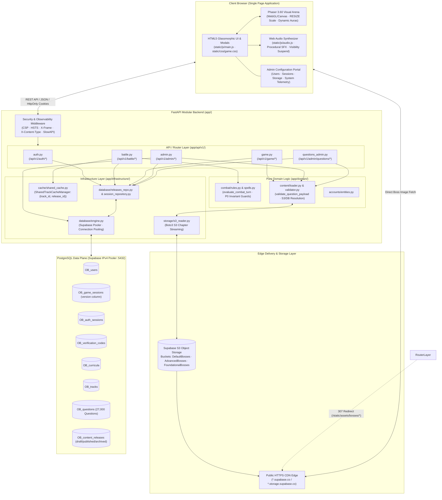
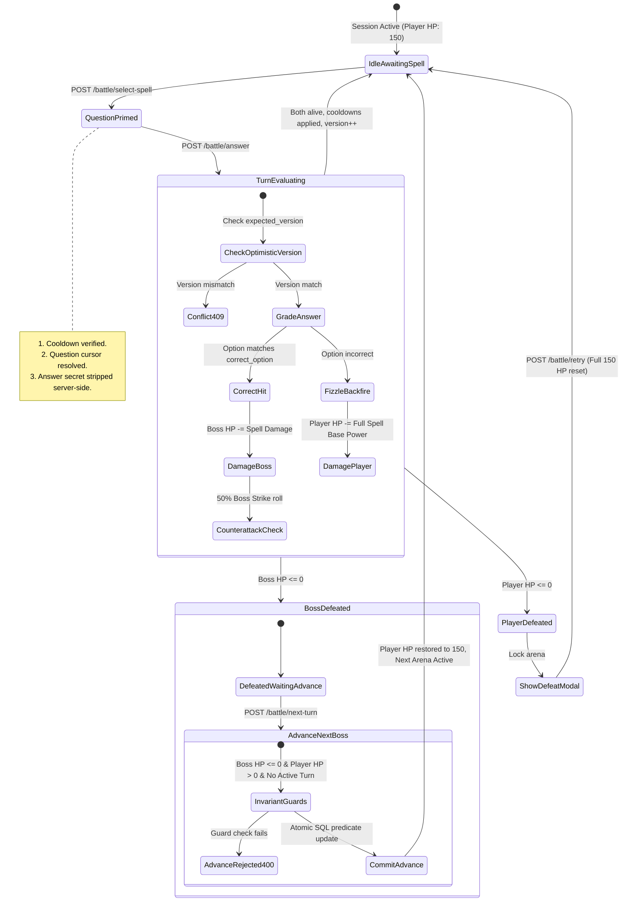
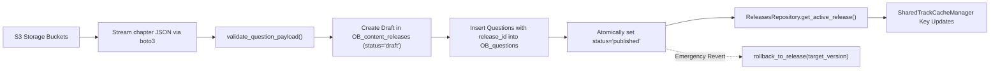
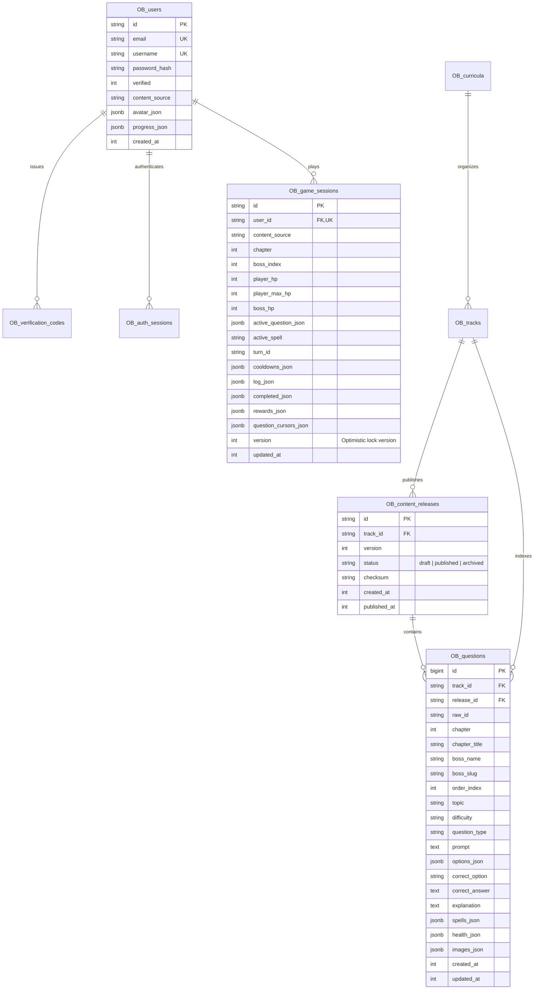

# Organic Battles: The Definitive Gaming Application Cookbook

**Organic Battles (V4P)** is a production-grade educational fantasy RPG where organic chemistry concepts, reaction mechanisms, stereochemistry, and spectroscopy are reimagined as arcane turn-based duels against alchemical creatures and Titans.

This cookbook serves as the comprehensive architectural reference, design blueprint, engineering specification, error catalog, operational runbook, and production constraints manual for developers, educators, and systems architects.

---

## Table of Contents
1. [Executive Overview & Pedagogical Game Concept](#1-executive-overview--pedagogical-game-concept)
2. [Technology Stack & System Architecture](#2-technology-stack--system-architecture)
   - [2.1 Technology Stack Matrix](#21-technology-stack-matrix)
   - [2.2 Modernized System Architecture Diagram](#22-modernized-system-architecture-diagram)
   - [2.3 Modular Clean Architecture Layout](#23-modular-clean-architecture-layout)
3. [Core Gameplay & Combat Systems Design](#3-core-gameplay--combat-systems-design)
   - [3.1 Combat Turn State Machine & Invariant Transitions](#31-combat-turn-state-machine--invariant-transitions)
   - [3.2 Spell Catalog, Elemental Tiers & Dynamic Overrides](#32-spell-catalog-elemental-tiers--dynamic-overrides)
   - [3.3 Mathematical Combat Resolution Model](#33-mathematical-combat-resolution-model)
   - [3.4 The P0 Invariant Guard: Advance Without Victory Prevention](#34-the-p0-invariant-guard-advance-without-victory-prevention)
   - [3.5 Optimistic Concurrency Control (`version` Column)](#35-optimistic-concurrency-control-version-column)
4. [Track Architecture, Content Ingestion & Bundle Lifecycle](#4-track-architecture-content-ingestion--bundle-lifecycle)
   - [4.1 Track Hierarchy & Multi-Curriculum Schema](#41-track-hierarchy--multi-curriculum-schema)
   - [4.2 Comprehensive Question Payload Validation Engine](#42-comprehensive-question-payload-validation-engine)
   - [4.3 Atomic Content Release Pipeline (`OB_content_releases`)](#43-atomic-content-release-pipeline-ob_content_releases)
   - [4.4 Shared Track Cache Manager (`SharedTrackCacheManager`)](#44-shared-track-cache-manager-sharedtrackcachemanager)
   - [4.5 Cloud Object Storage & Decoupled Asset Pipelines](#45-cloud-object-storage--decoupled-asset-pipelines)
   - [4.6 Advanced Track Bestiary Gallery & Chemical Orbital Analyses](#46-advanced-track-bestiary-gallery--chemical-orbital-analyses)
5. [Database Architecture & Least-Privilege Security](#5-database-architecture--least-privilege-security)
   - [5.1 Comprehensive Relational Schema Diagram (SQLAlchemy 2.x)](#51-comprehensive-relational-schema-diagram-sqlalchemy-2x)
   - [5.2 Production Connection Pooling & Supabase IPv4 Pooler](#52-production-connection-pooling--supabase-ipv4-pooler)
   - [5.3 Least-Privilege Database Role Matrix (`SUPABASE_LEAST_PRIVILEGE_SETUP`)](#53-least-privilege-database-role-matrix-supabase_least_privilege_setup)
   - [5.4 Alembic Migration Framework (Revisions 0001–0009)](#54-alembic-migration-framework-revisions-00010009)
   - [5.5 Per-Track Progress Isolation Architecture (`user.progress_json`)](#55-per-track-progress-isolation-architecture-userprogress_json)
6. [User Journey, UI State & Administrative Subsystems](#6-user-journey-ui-state--administrative-subsystems)
   - [6.1 End-to-End User Navigation State Machine](#61-end-to-end-user-navigation-state-machine)
   - [6.2 The Mid-Chapter Abandonment Gate](#62-the-mid-chapter-abandonment-gate)
   - [6.3 Procedural Web Audio Harmonic Synthesizer](#63-procedural-web-audio-harmonic-synthesizer)
   - [6.4 Four-Tab Administrator Configuration Portal](#64-four-tab-administrator-configuration-portal)
   - [6.5 Browser Security: Content Security Policy (CSP) & CDN Whitelisting](#65-browser-security-content-security-policy-csp--cdn-whitelisting)
7. [Comprehensive Error Catalog & Status Codes](#7-comprehensive-error-catalog--status-codes)
8. [Design Trade-offs, Architectural Pros & Cons](#8-design-trade-offs-architectural-pros--cons)
9. [Operational Constraints, Caveats & Points to Remember](#9-operational-constraints-caveats--points-to-remember)
10. [Production Readiness & Execution Roadmap](#10-production-readiness--execution-roadmap)

---

## 1. Executive Overview & Pedagogical Game Concept

### 1.1 The Alchemical Fantasy Pitch
Organic chemistry is traditionally considered one of the most intellectually demanding undergraduate subjects due to its dense 3D spatial relationships, abstract electron-pushing mechanisms, and immense nomenclature lexicon.

**Organic Battles** bridges cognitive psychology with video game engagement:
- **Dual-Coding Theory**: Visualizing molecular shapes, orbital overlap, and reagents as mythical fantasy creatures (e.g., *Hybridization Goblin*, *SN2 Assassin*, *Stereochemistry Overlord*).
- **Active Recall & Consequence**: Casting spells in battle requires answering rigorous multiple-choice chemistry trials. Correct answers deal massive elemental damage; incorrect answers trigger spell backfires and provoke ferocious boss counterattacks.
- **Micro-Progression & Flow**: Chapters are divided into stages (Mini-Bosses leading to a Major Boss), creating tight challenge-reward loops that prevent cognitive fatigue.

```
+-------------------------------------------------------------------------+
|                           ORGANIC BATTLES (V4P)                         |
|   "Enter the Labyrinth. Master the Electron. Vanquish the Reaction."    |
+-------------------------------------------------------------------------+
|  27 Chapters           20 Distinct Tracks         27,000 Chemistry MCQs |
|  155 Boss Creatures    Dynamic Spell Ranks        PostgreSQL / S3 CDN   |
+-------------------------------------------------------------------------+
```

---

## 2. Technology Stack & System Architecture

### 2.1 Technology Stack Matrix

| Layer | Technology | Version | Rationale & Characteristics |
| :--- | :--- | :--- | :--- |
| **Backend Framework** | **FastAPI** | `0.115.6` | Asynchronous high-throughput ASGI framework, native OpenAPI documentation, strict Pydantic V2 schemas. |
| **Production Web Server** | **Gunicorn + Uvicorn Workers** | `gunicorn 26.2.0` / `uvicorn 0.34.0` | Multi-worker process manager supervising `uvicorn.workers.UvicornWorker` processes with self-healing, `max_requests` memory mitigation, and zero-downtime rolling reload. |
| **Domain Logic** | **Pure Python Functional Core** | Native | Zero-dependency combat mathematics ([app/domain/combat/rules.py](file:///Users/nkoneru/Downloads/AIApps/OrganicBattles/app/domain/combat/rules.py)), isolated from database and HTTP layers for deterministic testing. |
| **Database & ORM** | **SQLAlchemy 2.x & PostgreSQL** | `2.0.36` | Production PostgreSQL via Supabase IPv4 Pooler (`aws-0-us-west-2.pooler.supabase.com:5432`), QueuePool (`pool_size=10`, `max_overflow=20`, `pool_pre_ping=True`), unified `OB_` table prefixing, and native `JSONB` column variants. |
| **Database Migrations** | **Alembic** | `1.14.1` | Programmatic migration engine ([app/infrastructure/database/alembic_runner.py](file:///Users/nkoneru/Downloads/AIApps/OrganicBattles/app/infrastructure/database/alembic_runner.py)) with revisions `0001` through `0009`. |
| **Object Storage & CDN** | **AWS S3 / Supabase Storage** | `boto3` `1.36.3` | Direct streaming reader ([app/infrastructure/storage/s3_reader.py](file:///Users/nkoneru/Downloads/AIApps/OrganicBattles/app/infrastructure/storage/s3_reader.py)) for track chapters and public CDN buckets for boss PNGs (`DefaultBosses`, `AdvancedBosses`, `FoundationalBosses`). |
| **Distributed Caching** | **SharedTrackCacheManager** | Custom | Versioned caching keyed by `(track_id, release_id)` with zlib serialization, thread-safe thundering-herd locks, and Redis fallback. |
| **Rate Limiting** | **SlowAPI / Limiter** | `0.1.9` | Token-bucket rate limiting protecting authentication and combat routes with Redis / memory distributed backend. |
| **Frontend UI** | **Vanilla HTML5 & CSS3** | Custom | Zero build-step overhead, zero node_modules in production frontend, custom glassmorphism design system, retro-cyberpunk alchemical typography. |
| **Client Controller** | **Modular ES6+ JavaScript** | ES2022+ | Event-driven UI controller ([static/js/main.js](file:///Users/nkoneru/Downloads/AIApps/OrganicBattles/static/js/main.js)), companion avatar engine ([static/js/avatars.js](file:///Users/nkoneru/Downloads/AIApps/OrganicBattles/static/js/avatars.js)). |
| **Arena Canvas / VFX** | **Phaser 3** | `3.60.0` (CDN) | WebGL/Canvas rendering, dynamic chapter auras, responsive canvas scaling (`Phaser.AUTO`, `Phaser.Scale.RESIZE`). |
| **Procedural Audio** | **Web Audio API** | Native Browser | Real-time procedural harmonic synthesis ([static/js/audio.js](file:///Users/nkoneru/Downloads/AIApps/OrganicBattles/static/js/audio.js)) requiring zero external sound assets. |
| **Testing Suite** | **Pytest & Playwright** | `8.3.4` / `0.9.0` | 391 automated unit, domain, combat, question parity, multi-worker Gunicorn lifecycle, and UI tests. |

---

### 2.2 Modernized System Architecture Diagram



---

### 2.3 Modular Clean Architecture Layout

The application adheres strictly to **Clean Architecture** boundaries:
1. **`app/api/v1/`**: HTTP controllers, request/response models, cookie setting, routing.
2. **`app/domain/`**: Pure functional core business rules (combat formulas, question validation, spell scaling). Zero imports from FastAPI, Starlette, or SQLAlchemy.
3. **`app/infrastructure/`**: External boundaries (database engines, Alembic migrations, Redis caching, S3 object storage, SMTP email delivery).
4. **`app/observability/`**: Logging formatters, Prometheus metrics registry, security middleware.

---

## 3. Core Gameplay & Combat Systems Design

### 3.1 Combat Turn State Machine & Invariant Transitions



---

### 3.2 Spell Catalog, Elemental Tiers & Dynamic Overrides

Spells are organized into three distinct operational tiers:

| Spell ID | Display Name | Tier | Base Damage | Cooldown | Arcana Lore Description |
| :--- | :--- | :--- | :---: | :---: | :--- |
| `fire-spark` | Fire Spark | Basic | 20 | 0 | Reliable elemental heat; no cooldown. |
| `acid-shot` | Acid Shot | Basic | 20 | 0 | Focused proton donor spray; basic strike. |
| `carbon-punch` | Carbon Punch | Basic | 20 | 0 | Ring-dense physical impact; basic strike. |
| `resonance-burst`| Resonance Burst| Medium| 35 | 1 | Delocalized electron surge; strikes high impact. |
| `nucleophile-strike`| Nucleophile Strike| Medium| 35 | 1 | Concentrated electron pair attack on target. |
| `chiral-slash` | Chiral Slash | Medium| 35 | 1 | Non-superimposable mirror edge slice. |
| `mechanism-storm`| Mechanism Storm| Heavy | 50 | 2 | Cascade of curved-arrow fury; maximum havoc. |
| `stereochemical-rift`| Stereochemical Rift| Heavy| 50 | 2 | Opposing enantiomeric field tear. |
| `spectral-obliteration`| Spectral Obliteration| Heavy| 50 | 2 | Focused IR and NMR resonance beam. |

#### Dynamic Spell Damage Overrides
When questions specify custom spell tiers via `Question.spells_json` (e.g. `[25, 45, 70]`), the engine dynamically overrides base damages:
- Tier 1 (`Basic`): maps to `fire-spark` (25 DMG)
- Tier 2 (`Medium`): maps to `resonance-burst` (45 DMG)
- Tier 3 (`Heavy`): maps to `mechanism-storm` (70 DMG)
The UI updates the button labels dynamically to reflect exact damage numbers.

---

### 3.3 Mathematical Combat Resolution Model

Implemented in [app/domain/combat/rules.py](file:///Users/nkoneru/Downloads/AIApps/OrganicBattles/app/domain/combat/rules.py):

1. **Player Success (Correct Answer)**:
   $$\text{Damage Dealt} = \text{Spell Base Damage (or dynamic override)}$$
   $$\text{New Boss HP} = \max(0, \text{Boss HP} - \text{Damage Dealt})$$
   $$\text{Self Damage} = 0$$
   - **Counterattack Roll**: If $\text{Boss HP} > 0$, the boss has a 50% probability to counterattack for $10 - 25$ damage (scaled by chapter).

2. **Player Failure (Incorrect Answer / Spell Fizzle)**:
   $$\text{Damage Dealt to Boss} = 0$$
   $$\text{Self Damage (Backfire)} = \text{Spell Base Damage (100\% backfire)}$$
   $$\text{New Player HP} = \max(0, \text{Player HP} - \text{Self Damage})$$

3. **Victory Health Restoration**:
   - Defeating a boss and advancing to the next arena automatically restores player health to full **150 / 150 HP**.

---

### 3.4 The P0 Invariant Guard: Advance Without Victory Prevention

#### The Problem
In legacy versions, `POST /api/v1/battle/next-turn` recorded a boss defeat and incremented the chapter/boss index without verifying if the boss was defeated or if the player was alive, allowing players to skip all 27 chapters by spamming next-turn on 100-HP bosses.

#### The Architectural Solution
1. **Pre-condition Invariant Validation**:
   - In [app/api/v1/battle.py](file:///Users/nkoneru/Downloads/AIApps/OrganicBattles/app/api/v1/battle.py), `next-turn` rejects the call with `HTTP 400 Bad Request` if:
     - `game_session.boss_hp > 0`: *"Cannot advance: Current boss is still alive ({boss_hp} HP remaining). Defeat the boss before advancing."*
     - `game_session.player_hp <= 0`: *"Cannot advance: Player has been defeated. Please retry or restart the battle."*
     - `game_session.active_spell is not None or turn_id is not None`: *"Cannot advance while a question turn is in progress. Complete the turn first."*
2. **Atomic SQL Predicate Update**:
   ```python
   stmt = (
       update(GameSession)
       .where(
           GameSession.id == session_id,
           GameSession.boss_hp <= 0,
           GameSession.player_hp > 0,
           GameSession.version == expected_version,
       )
       .values(
           boss_index=next_boss_index,
           chapter=next_chapter,
           player_hp=150,
           version=GameSession.version + 1,
       )
   )
   ```
   If another request attempts to advance concurrently or the invariant condition fails at database commit time, zero rows are updated and the request safely aborts.

---

### 3.5 Optimistic Concurrency Control (`version` Column)

To eliminate race conditions, double-clicks, and tab desynchronization without holding blocking database locks:
- Every `OB_game_sessions` row carries an integer `version` column (indexed via `ix_ob_game_sessions_user_version`).
- Mutation endpoints accept `expected_version`:
  - `POST /api/v1/battle/select-spell`
  - `POST /api/v1/battle/answer`
  - `POST /api/v1/battle/next-turn`
- If `expected_version` does not match the database state, the API aborts with:
  ```json
  {
    "detail": "Session state modified by another request. Please refresh.",
    "code": "CONCURRENCY_CONFLICT"
  }
  ```
  HTTP Status: `409 Conflict`.

---

## 4. Track Architecture, Content Ingestion & Bundle Lifecycle

### 4.1 Track Hierarchy & Multi-Curriculum Schema

Tracks are configured in [data/tracks_config.json](file:///Users/nkoneru/Downloads/AIApps/OrganicBattles/data/tracks_config.json) and stored authoritatively in `OB_curricula` and `OB_tracks`:
- **`foundational`**: 7 tracks (Vocabulary, Reaction Outcomes, Mechanisms, Stereochemistry, Property Rankings, Spectroscopy, Multi-Step Synthesis).
- **`advanced`**: 12 tracks covering graduate-level mechanistic depth.
- **`default`**: Core 27-chapter curriculum (135 bosses, 2,700 questions).

```
Total Scope: 20 Distinct Tracks · 27 Chapters Each · 27,000 Questions Ingested
```

---

### 4.2 Comprehensive Question Payload Validation Engine

Located in [app/domain/content/validator.py](file:///Users/nkoneru/Downloads/AIApps/OrganicBattles/app/domain/content/validator.py), `validate_question_payload()` validates all questions prior to database insertion:

1. **Option Cardinality**: At least 2 options required.
2. **Label Uniqueness**: Option labels (`A`, `B`, `C`, `D`) must be unique and non-empty.
3. **Correct Answer Consistency**: Exactly one option must be marked correct, matching `correct_option` and `correct_answer`.
4. **Numeric Integrity**: Health and spell damage values must be strictly positive integers.
5. **Path Traversal Security**: Image filenames are validated against path traversal (`../`) and restricted to recognized extensions (`.png`, `.jpg`, `.jpeg`, `.svg`, `.webp`), while permitting Unicode characters for chemist names (e.g. `Hückel`, `Diels–Alder`).

---

### 4.3 Atomic Content Release Pipeline (`OB_content_releases`)

To eliminate partial imports and cache desynchronization across multi-worker deployments:



- **Draft Isolation**: Questions inserted into a draft release are invisible to players.
- **Atomic Activation**: `ReleasesRepository.publish_release(release_id)` activates the new version and archives the previous version in a single database transaction.
- **Instant Rollback**: `ReleasesRepository.rollback_to_release(track_id, target_version)` instantly reverts live play to any previous release version without redeploying code.

---

### 4.4 Shared Track Cache Manager (`SharedTrackCacheManager`)

Located in [app/infrastructure/cache/shared_cache.py](file:///Users/nkoneru/Downloads/AIApps/OrganicBattles/app/infrastructure/cache/shared_cache.py):
- **Versioned Keys**: Tracks are cached by `(track_id, release_id)`. When a release is published or rolled back, the cache key advances cluster-wide.
- **Thundering-Herd Lock**: Thread-safe per-track locks ensure only one thread builds a given track bundle on cache miss. Concurrent requests wait and read the cached bundle.
- **Zero-Vulnerability Serialization**: Custom `serialize_bundle()` uses schema-validated JSON with `zlib` compression instead of dangerous `pickle` serialization.
- **Cache Telemetry**:
  - `hit_ratio`: Calculated dynamically.
  - `bundle_sizes_bytes`: In-memory footprint of cached tracks.
  - `load_durations_ms`: Duration of database extraction and bundle assembly.

---

### 4.5 Cloud Object Storage & Decoupled Asset Pipelines

To decouple runtime web containers from multi-gigabyte disk folders:
1. **Boss Image CDN**:
   - Boss illustrations are hosted in public Supabase S3 buckets:
     - `DefaultBosses`: Core 76 boss images.
     - `AdvancedBosses`: 138 advanced bestiary images.
     - `FoundationalBosses`: Foundational catalog images.
   - [app/main.py](file:///Users/nkoneru/Downloads/AIApps/OrganicBattles/app/main.py) intercepts `/static/assets/bosses/{filename}.png` and returns `307 Temporary Redirect` to the Supabase CDN URL.
   - Fallback: Missing boss images resolve to `static/assets/bosses/boss-placeholder.svg`.
2. **Untracked Binary Assets**:
   - Excluded `data/tracks/` in `.gitignore` and `.dockerignore`.
   - Untracked 216 boss PNGs and 568 `chapter_*.json` files from Git index, shrinking repository and Docker build sizes to under 100 MB.
3. **S3 Chapter Streaming**:
   - [app/infrastructure/storage/s3_reader.py](file:///Users/nkoneru/Downloads/AIApps/OrganicBattles/app/infrastructure/storage/s3_reader.py) streams chapter JSON files directly from S3 buckets during batch ingestion.

---

### 4.6 Advanced Track Bestiary Gallery & Chemical Orbital Analyses

Below are three Major Bosses from `AdvancedBosses` with their chemical mechanisms and orbital interpretations:

#### 1. Diels-Alder Overlord
*Arena Assignment: Chapter 17 (Conjugated Systems & Pericyclic Reactions)*  
*Bucket: `AdvancedBosses` | Asset: `diels-alder-overlord.png`*

- **Pedagogical Chemical Concept**: The $[4\pi_s + 2\pi_s]$ concerted pericyclic cycloaddition between an electron-rich conjugated diene ($4\pi$ electrons) and an electron-poor dienophile ($2\pi$ electrons).
- **Orbital Symmetry & FMO Interpretation**: Under thermal conditions, the reaction is symmetry-allowed through the suprafacial-suprafacial overlap of the diene's Highest Occupied Molecular Orbital (HOMO, $\Psi_2$) with the dienophile's Lowest Unoccupied Molecular Orbital (LUMO, $\pi^*$).
- **Visual Design Manifestation**: The Overlord's exoskeleton forms an uncompromising *s-cis* locked conformation. Its curved horns exhibit *endo-selectivity*, visually modeling secondary orbital interactions between the carbonyl $\pi$-system of electron-withdrawing groups and the developing cyclohexene $\pi$-system.

---

#### 2. Hückel Herald
*Arena Assignment: Chapter 18 (Aromaticity & Electrophilic Aromatic Substitution)*  
*Bucket: `AdvancedBosses` | Asset: `huckel-herald.png`*

- **Pedagogical Chemical Concept**: Hückel's Rule of Aromaticity ($4n + 2$ $\pi$ electrons in a planar, uninterrupted, cyclic conjugated system) versus antiaromatic destabilization ($4n$ $\pi$ electrons).
- **Orbital Symmetry & Energy Stabilization**: Planar delocalization of $6, 10,$ or $14$ $\pi$ electrons completely fills all bonding molecular orbitals in Frost circle diagrams, providing exceptional resonance stabilization energy (approx. $36\text{ kcal/mol}$ for benzene).
- **Visual Design Manifestation**: Floats enveloped in twin luminous toroidal halos (representing the uninterrupted top-and-bottom $\pi$-electron clouds above and below the molecular plane), with hexagonal symmetry matching carbon-carbon bond lengths of $1.39\text{ \AA}$.

---

#### 3. Walden Inversion Warlord
*Arena Assignment: Chapter 7 (Alkyl Halides & Nucleophilic Substitution Mechanics)*  
*Bucket: `AdvancedBosses` | Asset: `walden-inversion-warlord.png`*

- **Pedagogical Chemical Concept**: Bimolecular Nucleophilic Substitution ($S_N2$) with strict stereochemical inversion (Walden Inversion) via a concerted, single-step pathway.
- **Orbital Symmetry & Reaction Trajectory**: The attacking nucleophile approaches the electrophilic carbon strictly at $180^\circ$ relative to the leaving group, directing electron density into the low-lying $\sigma^*_{\text{C}-\text{X}}$ antibonding orbital through a trigonal bipyramidal transition state.
- **Visual Design Manifestation**: Carries an inverted umbrella shield and a backside-strike spear aligned at a rigid $180^\circ$ vector, flipping dynamically between $(R)$ and $(S)$ enantiomeric chestplate configurations.

---

## 5. Database Architecture & Least-Privilege Security

### 5.1 Comprehensive Relational Schema Diagram (SQLAlchemy 2.x)



---

### 5.2 Production Connection Pooling & Supabase IPv4 Pooler

Configured in [app/infrastructure/database/engine.py](file:///Users/nkoneru/Downloads/AIApps/OrganicBattles/app/infrastructure/database/engine.py):
- **Pooler Target**: Supabase IPv4 Pooler (`aws-0-us-west-2.pooler.supabase.com:5432`)
- **QueuePool Sizing**:
  - `pool_size`: 10 persistent connections
  - `max_overflow`: 20 burst connections
  - `pool_timeout`: 30 seconds
  - `pool_recycle`: 1800 seconds (30 minutes; eliminates stale firewall drops)
  - `pool_pre_ping`: `True` (emits a lightweight `SELECT 1` ping upon checkout, discarding dead connections)
- **NullPool Execution**: Standalone CLI ingestion and Alembic migration runners bypass connection pooling via `NullPool` to avoid consuming pooler slots.

---

### 5.3 Least-Privilege Database Role Matrix (`SUPABASE_LEAST_PRIVILEGE_SETUP`)

Documented in [SUPABASE_LEAST_PRIVILEGE_SETUP.md](file:///Users/nkoneru/Downloads/AIApps/OrganicBattles/SUPABASE_LEAST_PRIVILEGE_SETUP.md):

| Role | Type | Primary Service Target | Granted Permissions | Forbidden Operations |
|---|---|---|---|---|
| **`ob_player`** | `LOGIN` | Web runtime (`DATABASE_URL_PLAYER`) | `SELECT`, `INSERT`, `UPDATE`, `DELETE` on player sessions; `SELECT` on content catalogs. | DDL (`CREATE`, `DROP`, `ALTER`), DML on admin credentials. |
| **`ob_admin`** | `LOGIN` | Admin portal (`DATABASE_URL_ADMIN`) | Administrative DML on users, sessions, and content catalogs. | DDL migrations. |
| **`ob_content_ingest`**| `LOGIN` | Ingestion script (`DATABASE_URL_INGEST`) | `INSERT`, `UPDATE` on `OB_questions`, `OB_tracks`, `OB_content_releases`. | Access to user passwords, sessions, or OTPs. |
| **`ob_migrator`** | `LOGIN` | Migration runner (`DATABASE_URL_MIGRATION`) | Full DDL on public schema (member of `ob_owner`). | Used strictly in deployment pipelines; zero web access. |
| **`ob_owner`** | `NOLOGIN`| Schema Owner | Table ownership and default privilege grants. | Direct login forbidden. |

---

### 5.4 Alembic Migration Framework (Revisions 0001–0009)

Automated via [app/infrastructure/database/alembic_runner.py](file:///Users/nkoneru/Downloads/AIApps/OrganicBattles/app/infrastructure/database/alembic_runner.py):
- `0001_initial_schema`: Baseline tables with unified `OB_` prefixes.
- `0002_jsonb_conversion`: Converts text JSON fields to native PostgreSQL `JSONB`.
- `0003_content_releases`: Adds `OB_content_releases` and foreign keys.
- `0004_stable_question_identity_constraints`: Enforces unique question order constraints.
- `0005_game_session_active_question_identity`: Links active session questions to releases.
- `0006_optimistic_locking`: Adds `version` index on `OB_game_sessions`.
- `0007_search_indexes`: High-performance indexes for admin lookups.
- `0008_least_privilege_roles_and_rls`: Grants least-privilege roles across tables.
- `0009_query_performance_indexes`: Composite indexes optimizing battle turn lookups.

---

### 5.5 Per-Track Progress Isolation Architecture (`user.progress_json`)

User progress is isolated per track inside `User.progress_json`:
```json
{
  "tracks": {
    "default": {
      "chapter": 3,
      "boss_index": 2,
      "completed": ["orbital-ogre", "bondbreaker-brute"],
      "updated_at": 1788350000
    },
    "adv-vocab": {
      "chapter": 1,
      "boss_index": 0,
      "completed": [],
      "updated_at": 1788355000
    }
  }
}
```
Switching tracks archives the active session into `progress_json` and restores the target track's saved state without progression corruption.

---

## 6. User Journey, UI State & Administrative Subsystems

### 6.1 End-to-End User Navigation State Machine


---

### 6.2 The Mid-Chapter Abandonment Gate

To prevent players from abandoning an active chapter midway and corrupting stage progression, a strict gate is enforced at both API and UI layers:
1. **Trigger Conditions**: A chapter is considered "In Progress" if:
   - Boss HP has been damaged ($0 < \text{boss\_hp} < \text{boss\_max\_hp}$).
   - A question turn is active (`active_spell` or `turn_id` is present).
   - Player is on boss index $> 0$ in the current chapter.
2. **Enforcement**:
   - `POST /api/v1/game/track` returns `HTTP 409 Conflict`.
   - UI displays `#track-blocked-modal` with active chapter details and a primary **RESUME CHAPTER** button.

---

### 6.3 Procedural Web Audio Harmonic Synthesizer

Located in [static/js/audio.js](file:///Users/nkoneru/Downloads/AIApps/OrganicBattles/static/js/audio.js):
- **Zero Asset Downloads**: Generates 100% of sound effects dynamically via oscillators and gain envelopes.
- **Auto-Suspend on Tab Visibility**: Automatically suspends `AudioContext` on `visibilitychange` to conserve device battery.
- **Sound Roster**:
  - `playClick()`: High-frequency UI tap ($800\text{ Hz}$).
  - `playSpellCast(tier)`: Exponential frequency sweep ($180\text{ Hz} \to 720\text{ Hz}$).
  - `playBossHit()`: Low-frequency impact punch ($140\text{ Hz} \to 40\text{ Hz}$).
  - `playPlayerHit()`: Damage pulse ($120\text{ Hz} \to 60\text{ Hz}$).
  - `playSpellFizzle()`: Sawtooth backfire buzz ($320\text{ Hz} \to 90\text{ Hz}$).
  - `playVictory()`: Major chord fanfare ($C_5 \to E_5 \to G_5 \to C_6$).
  - `playDefeat()`: Descending minor sequence ($F_4 \to D_4 \to B\flat_3 \to A_3$).

---

### 6.4 Four-Tab Administrator Configuration Portal

Accessible via the `⚙ ADMIN CONFIG` triggers on boot, auth, and game screens:

1. **👤 User Management (`#admin-tab-users`)**:
   - Searchable registry of registered players.
   - Credential overrides: Username updates and password resets (minimum 8 characters, hashed with PBKDF2).
   - Automated test user cleanup (`POST /api/v1/admin/users/clean-test`).
2. **⚔ Game Sessions (`#admin-tab-sessions`)**:
   - Live inspection of active duels across all connected players.
   - Chapter teleportation: Jump any session to Chapter 1–27 with full health restoration.
   - Session purge: Permanently reset stalled sessions.
3. **💾 Storage (`#admin-tab-storage`)**:
   - Connection pool telemetry: Active pool size, overflow count, and host target.
   - Real-time row counts across all `OB_` tables.
   - Live bidirectional SQLite $\leftrightarrow$ PostgreSQL migrator.
4. **⚡ System (`#admin-tab-system`)**:
   - Host metrics: Server uptime, memory RSS/VMS usage, CPU load.
   - Security audit: Cookie flags, TTL durations, and environment mode.

---

### 6.5 Browser Security: Content Security Policy (CSP) & CDN Whitelisting

Configured in [app/observability/middleware.py](file:///Users/nkoneru/Downloads/AIApps/OrganicBattles/app/observability/middleware.py):
- **CSP Directive**:
  ```python
  "img-src 'self' data: https://*.supabase.co https://*.storage.supabase.co;"
  ```
- **Strict Headers**:
  - `X-Frame-Options: DENY` (prevents clickjacking).
  - `X-Content-Type-Options: nosniff` (prevents MIME sniffing).
  - `Strict-Transport-Security: max-age=31536000; includeSubDomains` (enforces HTTPS).

---

## 7. Comprehensive Error Catalog & Status Codes

| HTTP Code | Error Condition | Exact API Response Payload (`detail`) | Frontend UI Action / Modal |
| :---: | :--- | :--- | :--- |
| **`400`** | Advance on living boss | `"Cannot advance: Current boss is still alive ({boss_hp} HP remaining). Defeat the boss before advancing."` | Button shake / Warning toast |
| **`400`** | Advance while defeated | `"Cannot advance: Player has been defeated. Please retry or restart the battle."` | Opens Defeat Modal |
| **`400`** | Advance during turn | `"Cannot advance while a question turn is in progress. Complete the turn first."` | Highlights active question |
| **`400`** | Answer with no active spell | `"No active question. Select a spell first."` | Toast / Action disabled |
| **`400`** | Selecting spell while dead | `"Your aura has faded. Please retry the battle to regroup."` | Defeat Retry Modal |
| **`400`** | Selecting spell on dead boss | `"The boss is already defeated. Proceed to the next arena."` | Triggers Next Turn |
| **`400`** | Unknown spell identifier | `"Invalid spell '{spell_id}'"` | Action button disabled |
| **`400`** | Invalid confirmation code | `"Confirmation code must be a 6-digit number"` | Form validation highlight |
| **`401`** | Bad user credentials | `"Incorrect username or password"` | `#auth-status` error message |
| **`401`** | Bad admin credentials | `"Incorrect admin username or password"` | Admin login shake effect |
| **`401`** | Missing auth session | `"Not authenticated"` | Redirect to `#auth-screen` |
| **`403`** | Unverified account login | `"Account not verified. Please verify your email first."` | Switches to verify form |
| **`404`** | Session not found | `"Session not found"` | Resets to boot screen |
| **`409`** | **Combat Concurrency Conflict** | `"Session state modified by another request. Please refresh."` | Prompts player retry |
| **`409`** | Email already registered | `"An account with that email already exists"` | Highlights email input |
| **`409`** | Username taken | `"Username taken, choose a different one"` | Highlights username input |
| **`409`** | Spell on cooldown | `"Spell is cooling down"` | Renders turn cooldown badge |
| **`409`** | Unanswered active question | `"Answer the active question before selecting another spell."` | Pulses question card |
| **`409`** | **Mid-chapter track switch** | `"Please complete Chapter {X}: {Title} in the '{Track}' track before switching tracks!"` | **Displays `#track-blocked-modal`** |
| **`422`** | Raw string fields in updates | `"Extra inputs are not permitted"` (`ConfigDict(extra="forbid")`) | Admin error toast |
| **`429`** | Rate limit exceeded | `"Too Many Requests"` | Throttles submit button |

---

## 8. Design Trade-offs, Architectural Pros & Cons

### 1. Stateless Modular Monolith vs Microservices
* **Pros**: Rapid deployment, zero network serialization latency, single test suite (384 tests in ~90s), unified transactions.
* **Cons**: Scaling background workloads scales the API web processes; single deployment pipeline.

### 2. S3 Object Storage & Cloud CDN vs Local Filesystem Assets
* **Pros**: Docker container footprint is under 100 MB; browser directly fetches assets from edge CDN; zero egress bandwidth on Python processes.
* **Cons**: Requires initial 307 temporary redirect for local paths; content ingestion depends on S3 network connectivity.

### 3. Optimistic Concurrency (`version`) vs Pessimistic Database Locks
* **Pros**: Zero database deadlocks; high throughput; non-blocking turn execution.
* **Cons**: Concurrent actions from multiple tabs abort the secondary request with `HTTP 409 Conflict`.

### 4. Versioned Releases (`OB_content_releases`) vs In-Place Table Mutations
* **Pros**: Eliminates partial imports; cluster-wide cache invalidation; instant rollback capability.
* **Cons**: Requires additional release metadata rows; archived releases require periodic pruning.

### 5. Least-Privilege Database Roles vs Single Superuser
* **Pros**: Web container compromise cannot drop tables or alter schemas; compartmentalized blast radius.
* **Cons**: Requires configuring multiple database connection strings.

---

## 9. Operational Constraints, Caveats & Points to Remember

> [!IMPORTANT]
> **1. P0 Advance Guard**: Never call `POST /api/v1/battle/next-turn` when `boss_hp > 0`, `player_hp <= 0`, or a question turn is in flight. The call will be rejected with `HTTP 400 Bad Request`.

> [!WARNING]
> **2. Content Security Policy (CSP)**: Any newly introduced image storage bucket or CDN domain **must** be added to the `img-src` header in [app/observability/middleware.py](file:///Users/nkoneru/Downloads/AIApps/OrganicBattles/app/observability/middleware.py). Failing to do so will cause Safari and Chrome to block boss images with `net::ERR_BLOCKED_BY_CSP`.

> [!NOTE]
> **3. Storage Bucket Case Sensitivity**: Supabase Storage bucket names are strictly case-sensitive:
> - `DefaultBosses`
> - `AdvancedBosses`
> - `FoundationalBosses`

> [!TIP]
> **4. Decoupled Data Folder**: Never commit `data/tracks/` files back to Git. Both `.gitignore` and `.dockerignore` intentionally exclude this directory. Ingest question releases using `scripts/ingest_questions_to_postgres.py`.

> [!CAUTION]
> **5. Database Migrations**: Run Alembic migrations exclusively via `app.infrastructure.database.alembic_runner` using `DATABASE_URL_MIGRATION` (`ob_migrator` role). Running under `ob_player` will fail with permission denied on `alembic_version`.

---

## 10. Production Readiness & Execution Roadmap

Audited against [ProdUpgradeTasks.md](file:///Users/nkoneru/Downloads/AIApps/OrganicBattles/ProdUpgradeTasks.md):

### Completed & Verified Milestones (✅ `[FIXED]`)
- [x] **Modular Clean Architecture**: Pure domain combat rules in `app/domain/combat/rules.py`.
- [x] **PostgreSQL & Supabase Connection Pooling**: IPv4 Pooler configuration with QueuePool pre-ping and recycling.
- [x] **P0 Advance Invariant Guard**: Strict pre-condition validation and atomic SQL predicate update.
- [x] **Optimistic Concurrency Control**: `GameSession.version` conflict detection on all turn mutations.
- [x] **Alembic Database Migrations**: Programmatic runner with 9 baseline revisions.
- [x] **Least-Privilege Database Roles**: `ob_player`, `ob_admin`, `ob_content_ingest`, `ob_migrator`, `ob_owner`.
- [x] **Atomic Content Releases**: `OB_content_releases` staging, atomic publication, and instant rollback.
- [x] **S3 Storage & CDN Delivery**: Boss images hosted in Supabase S3 buckets; 307 redirect resolution; CSP whitelisting.
- [x] **Decoupled Data Folder**: `data/tracks/` excluded from Git and Docker build contexts.
- [x] **Procedural Audio Synthesizer**: Web Audio engine with tab visibility suspension.
- [x] **Four-Tab Admin Portal**: User management, game session telemetry, storage, and system metrics.

### Pending Production Roadmap Items (⏳ `[TODO]`)
- [ ] **Distributed Redis Locks**: Externalize `ADMIN_TOKENS` and rate limits to Redis cluster.
- [ ] **Asynchronous Worker Queue**: Celery / ARQ / SQS pipeline for transactional emails and heavy imports.
- [ ] **Managed Identity (Cognito / OIDC)**: Optional enterprise SSO and OAuth2 login.
- [ ] **AWS Cloud Infrastructure**: Terraform / CDK definitions for Multi-AZ ECS Fargate, ALB, and Aurora PostgreSQL.
- [ ] **CI/CD Automation**: GitHub Actions pipeline for automated linting, testing, and canary deployments.

---

*Authored for the Organic Battles Engineering, Security & Pedagogical Production Team.*
