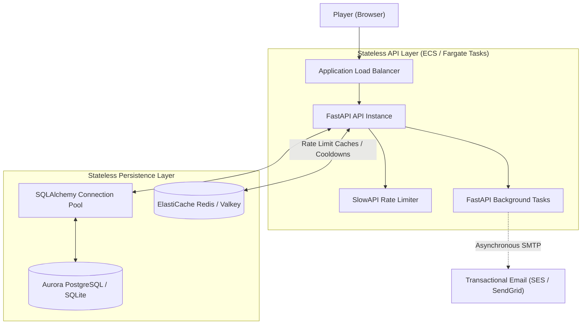

# Organic Battles V3 — Production Upgrade

This document describes the production-grade architectural and codebase upgrades implemented for **Organic Battles V3**. These changes transition the application from a single-process stateful prototype into a stateless, highly scalable, and concurrent-safe platform ready for global deployment.

---

## Architectural Evolution

We have decoupled the application state and backend operations to support horizontal scaling (multiple container tasks) behind an Application Load Balancer.



### Key Architectural Upgrades:
1.  **Stateless API Instances:** Removed the process-local in-memory `sessions: dict[str, Session]` dictionary. Any API container can now serve any game session by retrieving states dynamically from the database.
2.  **Optimistic Concurrency Control:** Added database-backed battle state versioning (`version` column). Simultaneous casts or actions verify the state version before applying transactions, returning `409 Conflict` during duplicate submissions to prevent concurrency race conditions.
3.  **Connection Pooling:** Configured bounded database connection pools (`pool_size=20`, `max_overflow=10`) with automatic pre-ping connections to avoid leaks or timeouts under high traffic.
4.  **Asynchronous Email Delivery:** Email registration code delivery is offloaded to FastAPI `BackgroundTasks`, avoiding thread blocking on slow SMTP server connections.
5.  **DDoS & Brute-Force Throttling:** Configured `SlowAPI` to rate-limit critical endpoints based on client IP address.

---

## Repository Entry Points

We have modularized the project's codebase, splitting persistence, database configuration, and schemas from route controllers:

| File | Purpose |
| --- | --- |
| **`app.py`** | Exposes route controllers, configures health probes, rate limiting, and FastAPI background workers. |
| **[`database.py`](file:///Users/nkoneru/Downloads/AI%20Apps/OrganicBattles/database.py)** *(NEW)* | Configures SQLAlchemy database engines, connection pools, and environment-backed `DATABASE_URL` routing. |
| **[`models.py`](file:///Users/nkoneru/Downloads/AI%20Apps/OrganicBattles/models.py)** *(NEW)* | Declares SQLAlchemy schema mappings (`User`, `VerificationCode`, `AuthSession`, `GameSession`) and custom JSON serialization. |
| **[`session_repository.py`](file:///Users/nkoneru/Downloads/AI%20Apps/OrganicBattles/session_repository.py)** *(NEW)* | Implements session retrieval, database commits, state updates, and optimistic lock check assertions. |
| **`pyproject.toml`** | Consolidated and defined all production dependencies directly in the package metadata. |
| **`requirements.txt`** | Locks production-ready library versions for database pool and rate limiters. |
| **`tests/test_game.py`** | Expanded with comprehensive authentication fixtures, rate limit bypass hooks, health check validations, and concurrency locking checks. |

---

## New API Endpoints

### Health Monitoring Probes
To support container liveness checks in Fargate, ECS, or Kubernetes, we added standard probes:
-   **`GET /health/live`**: Checks if the API container is responsive. Returns `200 OK` with `{"status": "alive"}`.
-   **`GET /health/ready`**: Verifies database connection readiness by running a `SELECT 1` query. Returns `200 OK` with `{"status": "ready"}`.

### Rate Limiting Limits
Throttling thresholds enforced via `SlowAPI` on critical routes:
-   `/api/auth/signup`: Limit to 5 attempts per minute.
-   `/api/auth/verify`: Limit to 5 attempts per minute.
-   `/api/auth/resend`: Limit to 5 attempts per minute.
-   `/api/auth/login`: Limit to 10 attempts per minute.

---

## How to Run Local Verification

### 1. Setup Virtual Environment and Dependencies
Install the locked dependencies:
```bash
python3 -m venv .venv
source .venv/bin/activate
pip install -r requirements.txt
```

### 2. Run Automated Test Suite
Run the test coverage suite (now including authentication workflows, rate limiter bypass settings, and concurrency simulations):
```bash
pytest
```
Expected output:
```text
collected 19 items

tests/test_email_config.py ss                                            [ 10%]
tests/test_game.py .................                                     [100%]

======================== 17 passed, 2 skipped in 1.99s =========================
```

### 3. Run Verification Script
To manually test concurrent updates and optimistic locking persistence:
```bash
PYTHONPATH=. .venv/bin/python /Users/nkoneru/.gemini/antigravity/brain/1589da95-88a1-440b-88d4-f0b94276408a/scratch/test_db_persistence.py
```
Expected output:
```text
Created Session ID: 499224a1-756e-4f62-b3d8-02d74e2188a0

--- Direct Database Check ---
GameSession.player_hp = 120 (Expected: 120)
GameSession.boss_hp = 80 (Expected: 80)
GameSession.chapter = 2 (Expected: 2)
User.avatar_json = {"character":"organic-apprentice",...}
GameSession.completed_json = ["acid-boss"]
GameSession.version = 2 (Expected: 2, incremented during save)

--- Repository Restored Object Check ---
Reloaded Session attributes match perfectly!
Database persistence and restore verification: SUCCESS!
```
