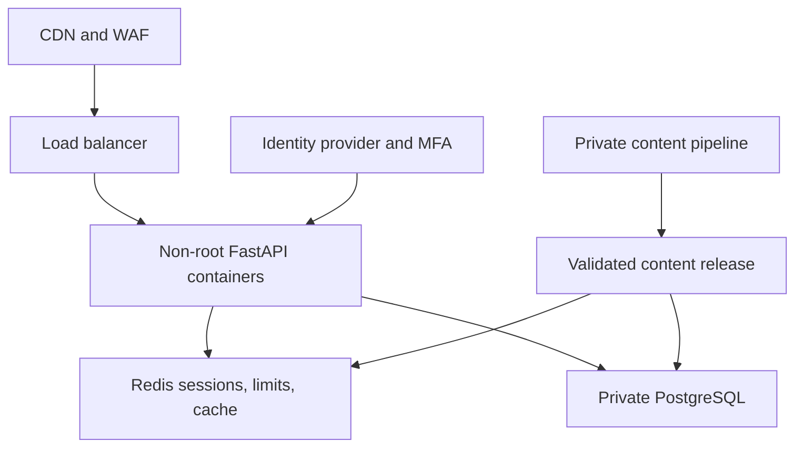

# Organic Battles Security and Vulnerability Assessment

**Repository:** [DKxi/OrganicBattlesProductionUpgrade](https://github.com/DKxi/OrganicBattlesProductionUpgrade)  
**Reviewed commit:** `0ea6a1291041735f411ad5e8be603e4d8ae8a4fb`  
**Assessment date:** September 11, 2026  
**Scope:** Repository structure, Python/FastAPI source, browser JavaScript, authentication, authorization, PostgreSQL integration, content files, dependencies, container configuration, and automated tests.

## Executive Summary

The repository is **not ready for public production deployment** in its present form. The assessment found exploitable authorization and browser-side injection weaknesses, exposed database credentials, unsafe administrative capabilities, vulnerable dependencies, and a major gap between the intended PostgreSQL content protection and the files actually published in GitHub.

The most urgent findings are:

1. A live-looking Supabase PostgreSQL credential is committed in application code, admin code, documentation, and Git history.
2. User-controlled values are rendered with `innerHTML`; a malicious username can execute JavaScript in the admin dashboard. The CSP explicitly permits inline script, and the admin bearer token is stored in `localStorage`.
3. Multiple game endpoints accept a `session_id` without verifying that it belongs to the authenticated user. A controlled test confirmed that one user can mutate another user's game session when the session ID is known.
4. All 28,400 questions and answers remain in 568 public JSON files. Moving runtime loading to PostgreSQL has not protected the content while the repository remains public.
5. An authenticated user can supply custom content and boss folder paths during track selection and place the resulting bundle into a global process cache. This creates local file probing and shared-cache poisoning risks.
6. The browser-accessible database-switch endpoint accepts an arbitrary connection URL and can migrate user accounts, password hashes, session hashes, progress, and questions to another database. Combined with stored XSS or stolen admin credentials, this becomes a direct data-exfiltration path.
7. The dependency scan found 18 reported vulnerability entries across three packages, representing eight distinct advisories. The deployed Starlette version includes an unauthenticated `FileResponse`/`StaticFiles` denial-of-service issue that is relevant to this application.

Deployment should be paused until the Priority 0 and Priority 1 fixes in this report are completed.

## Assessment Method

The following checks were performed against a fresh repository checkout:

- Manual architecture and trust-boundary review
- Endpoint and authorization mapping
- Secret-pattern scan with Detect Secrets plus targeted repository and Git-history searches
- Python static analysis with Bandit
- OWASP/Python static analysis with Semgrep
- Python dependency audit with `pip-audit`
- Phaser/npm dependency audit
- Structured inspection of all chapter JSON content
- File, symlink, SVG active-content, bidirectional-Unicode, and permission checks
- Test execution against an isolated SQLite database
- A controlled authorization test demonstrating cross-user game-session mutation

This was a source and repository assessment, not a live penetration test. Cloud configuration, Supabase row-level security, TLS termination, DNS, deployed reverse-proxy behavior, runtime IAM, backup security, and external attack-surface behavior were not tested because no deployed target or cloud-console access was supplied.

## Scan Results at a Glance

| Scan | Result |
|---|---|
| Repository files inspected | 1,005 working-tree files |
| Approximate working-tree size | 913.5 MB |
| Chapter JSON files | 568 |
| Questions inspected | 28,400 |
| JSON parse errors | 0 |
| Invalid option/correct-answer structures | 0 found |
| HTML/script-like content in questions | 0 found |
| External URLs in question records | 0 found |
| Suspicious bidirectional Unicode in source/content | 0 found |
| Detect Secrets | Findings in 13 files; confirmed database credential in application and documentation files |
| Bandit | 28 findings: 17 medium and 11 low; no Bandit high-severity finding |
| Semgrep | 19 findings, mostly dynamic SQL warnings in maintenance scripts; no confirmed runtime SQL injection was established |
| Python dependency audit | 18 entries across 3 packages; 8 distinct advisories |
| Phaser 3.80.1 npm audit | 0 known npm vulnerabilities |
| Automated tests | 227 passed, 7 failed, 11 skipped, 1 deselected in isolated mode |
| Authorization proof | Confirmed: attacker received HTTP 200 while mutating a victim's known session ID |

The seven test failures were primarily caused by tests that assume the insecure default `admin/admin` credentials and one test that attempted to switch to the committed PostgreSQL endpoint. These failures do not invalidate the confirmed security findings.

## Severity Summary

| Severity | Count | Main themes |
|---|---:|---|
| Critical | 3 | Exposed database secret; stored-XSS/admin compromise chain; browser-accessible database migration/exfiltration path |
| High | 7 | Cross-user session mutation; public question banks; cache poisoning/path control; unsafe admin defaults/cookies; OTP leakage/weak binding; vulnerable Starlette; combat/progression integrity |
| Medium | 9 | CSRF/session design, rate limiting, account enumeration, error leakage, Docker hardening, dependency reproducibility, CDN integrity, public diagnostics, content-key collisions |
| Low/Informational | Several | Maintenance-script SQL construction, repository duplication, schema and operational hardening |

---

# Critical Findings

## C-01: PostgreSQL credential committed to a public repository

**Affected files:**

- [`app/settings.py`](https://github.com/DKxi/OrganicBattlesProductionUpgrade/blob/main/app/settings.py)
- [`app/api/v1/admin.py`](https://github.com/DKxi/OrganicBattlesProductionUpgrade/blob/main/app/api/v1/admin.py)
- [`README.md`](https://github.com/DKxi/OrganicBattlesProductionUpgrade/blob/main/README.md)

The same credential literal exists in at least three Git commits. Removing it only from the latest file will not remove it from Git history, clones, forks, caches, or prior downloads.

**Impact:** Unauthorized database access, modification or deletion of users and questions, password-hash theft, authentication-session theft, and service disruption. The actual impact depends on whether the password remains active and the database user's privileges.

**Required response:**

1. Rotate the database password immediately. Revocation comes before Git cleanup.
2. Review Supabase authentication, connection, and audit logs from the credential's first commit date onward.
3. Create a least-privilege runtime database role. It should not own the database, create extensions, manage roles, or access unrelated schemas.
4. Remove every hardcoded production DSN. Require `DATABASE_URL` from a deployment secret.
5. Purge the secret from Git history with `git filter-repo` or BFG, then force-push with coordination for collaborators and open pull requests.
6. Enable GitHub secret scanning and push protection.
7. Redact database URLs before logging.

Production configuration should fail closed:

```python
database_url: str | None = Field(default_factory=lambda: os.getenv("DATABASE_URL"))

@model_validator(mode="after")
def validate_production_secrets(self):
    if self.environment == "production" and not self.database_url:
        raise ValueError("DATABASE_URL is required in production")
    if self.environment == "production" and self.admin_password in {None, "admin"}:
        raise ValueError("A strong ADMIN_PASSWORD is required in production")
    return self
```

Never log a raw DSN. Use SQLAlchemy's URL rendering:

```python
safe_url = make_url(normalized_url).render_as_string(hide_password=True)
logger.info("Switching database to %s", safe_url)
```

## C-02: Stored cross-site scripting can compromise the admin account

**Affected browser code:** [`static/js/main.js`](https://github.com/DKxi/OrganicBattlesProductionUpgrade/blob/main/static/js/main.js)  
**Affected security policy:** [`app/observability/middleware.py`](https://github.com/DKxi/OrganicBattlesProductionUpgrade/blob/main/app/observability/middleware.py)

The signup API accepts arbitrary username characters. The admin dashboard later inserts usernames, emails, track names, chapter names, boss names, logs, filter text, question text, and answer choices into HTML template strings assigned through `innerHTML`.

A short username such as an SVG element with an inline event handler fits within the 24-character username limit. When an administrator opens the user or session dashboard, the stored value can execute in the application's origin.

The impact is amplified because:

- The CSP contains `script-src 'unsafe-inline'`.
- The admin bearer token is stored in `localStorage`.
- Same-origin injected script can call privileged admin endpoints even if the credential is moved to an HttpOnly cookie.

**Impact:** Admin-session theft, user credential resets, session deletion, question modification, database switching, data migration, log access, and content poisoning.

**Required technical fix:**

- Stop placing untrusted values into `innerHTML`.
- Build DOM nodes and assign untrusted strings with `textContent`.
- If formatted HTML is genuinely required, sanitize with a reviewed allowlist such as DOMPurify.
- Add a strict username pattern, for example `^[A-Za-z0-9_.-]{3,24}$`.
- Remove the admin token from `localStorage` and do not return it in browser login responses.
- Remove `'unsafe-inline'` from `script-src`; use external scripts or CSP nonces.
- Add automated XSS tests for username, question, answer, topic, boss, chapter, track, filter, and log rendering.

Safe DOM example:

```javascript
const nameNode = document.createElement('div');
nameNode.className = 'user-cell-name';
nameNode.textContent = user.username;
cell.append(nameNode);
```

## C-03: Runtime database switching and migration creates an exfiltration primitive

**Affected code:** [`app/api/v1/admin.py`](https://github.com/DKxi/OrganicBattlesProductionUpgrade/blob/main/app/api/v1/admin.py)

The admin API accepts a PostgreSQL connection URL supplied by the browser. With `migrate_data=true`, the application can connect to that database and copy:

- Users
- Password hashes
- Verification-code hashes
- Authentication-session hashes
- Game sessions and progress
- Curricula and tracks
- All questions and correct answers

This endpoint also allows the server to initiate database connections to attacker-selected hosts, creating an SSRF/internal-network probing surface for anyone who obtains admin access.

**Recommendation:** Remove database switching and migration from the web application. Make migration an offline, audited deployment command executed through CI/CD or a restricted operations environment. If a runtime control is unavoidable, permit only preconfigured destination identifiers—not arbitrary URLs—and require step-up authentication, MFA, an approval record, an allowlisted host, and immutable audit logging.

---

# High-Severity Findings

## H-01: Broken object-level authorization on game sessions

**Affected files:**

- [`app/api/v1/battle.py`](https://github.com/DKxi/OrganicBattlesProductionUpgrade/blob/main/app/api/v1/battle.py)
- [`app/api/v1/game.py`](https://github.com/DKxi/OrganicBattlesProductionUpgrade/blob/main/app/api/v1/game.py)

The following endpoints load a session by caller-supplied `session_id` without consistently filtering by the authenticated user's ID:

- `/battle/select-spell`
- `/battle/answer`
- `/battle/next-turn`
- `/battle/retry`
- `/avatar/finalize`
- `/game/track`

`/game/state` performs an ownership check, but the mutation endpoints do not.

A controlled test created a victim and attacker and sent the victim's session ID with the attacker's token. `/battle/select-spell` returned HTTP 200 and changed the victim's session.

Session IDs have strong entropy, which reduces blind guessing, but authorization must not depend on identifier secrecy. IDs can leak through logs, browser history, support screenshots, analytics, or an admin compromise.

**Fix:** Never query a user endpoint by session ID alone.

```python
def get_owned_session(db: Session, session_id: str, user_id: str) -> GameSession:
    session = (
        db.query(GameSession)
        .filter(GameSession.id == session_id, GameSession.user_id == user_id)
        .one_or_none()
    )
    if session is None:
        raise HTTPException(status_code=404, detail="Session not found")
    return session
```

Prefer removing `session_id` from normal player requests because the model permits only one game session per user. Resolve it from `current_user.id` server-side.

## H-02: The complete question bank remains public

The repository contains 568 chapter JSON files with 28,400 question records, including options, correct answers, explanations, boss assignments, health, and spell values.

PostgreSQL protects content only when the original source is private. Because the repository is public, anyone can download the entire bank directly from GitHub. Removing JSON from the deployed web routes does not solve this exposure.

**Required action:**

- Move question-source files to a private content repository or private object store.
- Remove them from the public repository and its history.
- Exclude them from Docker build context.
- Seed PostgreSQL through a protected release pipeline.
- Keep only schemas and synthetic sample questions in the public code repository.
- Assume the existing 28,400 questions have already been copied; replace commercially sensitive banks over time if exclusivity matters.

## H-03: User-controlled filesystem paths and shared-cache poisoning

`SetTrackRequest` accepts `data_folder` and `boss_folder` from an authenticated player. `load_track_bundle()` accepts absolute paths, reads matching JSON files, and the result is stored in the global `TRACK_BUNDLES[track_id]` cache.

**Impact:**

- Probe readable server directories containing `chapter_*.json` files.
- Load unintended local JSON content.
- Poison the process-wide track bundle used by other players.
- Force expensive parsing and memory allocation.
- Create cross-user content inconsistency.

**Fix:**

- Remove both folder fields from the player API.
- Accept only a validated track ID.
- Resolve folders from trusted database configuration.
- Validate resolved paths against an immutable content root:

```python
candidate = (CONTENT_ROOT / configured_relative_path).resolve()
if not candidate.is_relative_to(CONTENT_ROOT.resolve()):
    raise ValueError("Invalid content path")
```

- Never cache caller-provided content in a global cache.
- Restrict folder changes to an offline deployment workflow.

## H-04: Unsafe administrator defaults and cookies

The application defaults to username `admin` and password `admin`. The HTML admin form is prefilled with the same values. The admin cookie always uses `secure=False`, even when the application's secure-cookie setting is enabled.

**Fix:**

- Delete all administrator credential defaults and fail production startup when credentials are absent or weak.
- Store an Argon2id hash, not the administrator's plaintext password configuration.
- Require MFA or an external identity provider for administrative access.
- Set an HttpOnly, Secure, host-only cookie such as `__Host-ob_admin_session` with `Path=/` and appropriate SameSite behavior.
- Add session rotation, idle timeout, absolute timeout, and server-side revocation.
- Never prefill credentials in HTML.

## H-05: Verification codes can leak and are insufficiently bound

When SMTP is missing or fails, the full verification email—including the six-digit code—is logged. The code is also placed in the email subject. Logs are available through an admin endpoint.

Verification looks up only the SHA-256 hash of the six-digit code. The verify request contains no email, user ID, or challenge ID, so a code is not explicitly bound in the request to the account being verified. Six-digit codes also have low entropy and should not be stored using an unkeyed, fast hash.

**Fix:**

- Never log OTP values or include them in email subjects.
- Fail safely when transactional email is unavailable; do not expose the code through console fallback in production.
- Return an opaque `verification_challenge_id` at signup.
- Require `challenge_id + code` at verification.
- Query by challenge/user plus a keyed HMAC of the code.
- Track attempt count, lock the challenge after a small number of failures, and invalidate it atomically.
- Add a unique challenge nonce and delete expired records.
- Use generic resend responses to prevent email enumeration.

## H-06: Known vulnerable Starlette dependency

`fastapi==0.115.6` resolves to `starlette==0.41.3` in the audited environment. The dependency audit reported several Starlette advisories. The most directly relevant is a crafted HTTP `Range` header that can cause quadratic processing in `FileResponse` and `StaticFiles`. Organic Battles exposes multiple unauthenticated static and file-response routes.

Other reported Starlette issues concern Host-header/path reconstruction, form parsing, and Windows `StaticFiles` UNC behavior. The Windows issue is not applicable to the current Linux Docker image but matters if the server is run directly on Windows.

**Fix:** Upgrade the framework set together, then regression-test:

```text
fastapi==0.141.1
starlette==1.6.0
python-dotenv>=1.2.2
pytest>=9.0.3  # development only
```

These were the current releases resolved during this assessment. Confirm compatibility in a branch before deployment. Also enforce maximum header and request sizes at the reverse proxy.

## H-07: Combat and progression requests are replayable/racy

`GameSession.version` is incremented but never used as an optimistic-lock condition. `turn_id` is created but the answer API does not require or validate it. `/battle/next-turn` does not verify that the current boss has actually been defeated.

Concurrent requests, retries, or direct API calls can overwrite health/cursor state, answer a stale turn, or advance without winning.

**Fix:**

- Require `turn_id` on the answer request and consume it exactly once.
- Update with `WHERE id=:id AND user_id=:user_id AND version=:expected_version`.
- Return `409 Conflict` when the version no longer matches.
- Use `SELECT ... FOR UPDATE` where serialized mutation is preferable.
- Require `boss_hp <= 0` before advancing.
- Add idempotency keys for mutation requests.

---

# Medium-Severity Findings

## M-01: Browser session model needs CSRF and token hardening

Player and admin browser sessions use cookies, but state-changing routes have no explicit CSRF token. SameSite=Lax and JSON requests reduce common cross-site form attacks, but they do not replace deliberate CSRF protection, especially with same-site subdomains or future CORS changes.

Do not return browser session tokens in JSON. Use only HttpOnly cookies for the web client, add an origin check and synchronizer/double-submit CSRF token, and separate API bearer-token flows from browser-cookie flows.

## M-02: Rate limiting is narrow and process-local

Only selected authentication endpoints are limited. The limiter uses client IP and process memory, so limits are inconsistent across workers and replicas. Proxy configuration can also cause every user to share one IP or make the address unreliable.

Use Redis-backed distributed limits and trusted-proxy configuration. Apply limits to login, signup, resend, verify, track loading, question submission, administrative ingestion, search, database operations, and expensive static-range behavior. Add per-account and per-challenge limits, not only IP limits.

## M-03: Account enumeration

Signup reveals whether an email or username exists, and resend returns `404 User not found`. This permits account discovery.

Return a generic response such as: `If an eligible account exists, a code has been sent.` Keep detailed reasons only in protected audit telemetry.

## M-04: Internal exception details are returned to clients

The generic exception handler returns `str(exc)`. The database-switch handler also returns raw connection errors. These messages can disclose hosts, drivers, SQL details, filesystem paths, and implementation information.

Return a stable public error code and request ID. Log the detailed exception only on the server after redacting secrets.

## M-05: Container is oversized and runs as root

The Dockerfile:

- Uses a mutable base-image tag without a digest.
- Copies the entire repository before installing dependencies.
- Has no `.dockerignore`.
- Runs as root.
- Includes tests, docs, Git metadata, all question banks, and approximately 868 MB of PNG assets.
- Installs from an incompletely pinned `requirements.txt` rather than a hashed lock.

Use a multi-stage build, a pinned digest, a non-root user, a `.dockerignore`, and a curated `COPY` list. Serve large assets from private/versioned object storage plus a CDN. Install from a reviewed lock with hashes.

## M-06: Dependency resolution is not reproducible

Several requirements use lower bounds only, while the Dockerfile uses `pip install -r requirements.txt`. A build on a later date can install materially different SQLAlchemy, Psycopg, Alembic, Redis, or transitive packages.

Generate a lock for production, retain hashes, separate runtime from test dependencies, and run `pip-audit` against the lock in CI.

## M-07: Third-party JavaScript is loaded without integrity pinning

Phaser is loaded from jsDelivr without a Subresource Integrity hash. The npm audit found no known vulnerability for Phaser 3.80.1, but a CDN or supply-chain compromise could execute code in the application's origin.

Self-host a reviewed Phaser build or add `integrity` and `crossorigin="anonymous"`. Restrict CSP to the exact required origin and remove inline-script permission.

## M-08: Public operational surface and duplicate route registration

The API is mounted at both `/api` and `/api/v1`, doubling the externally reachable paths that must be logged, limited, tested, and protected. Swagger/OpenAPI documentation is enabled by default.

Expose one versioned API prefix. Disable `/docs` and `/openapi.json` in production or restrict them to administrators. Keep liveness minimal and ensure readiness does not disclose exceptions.

## M-09: Duplicate prompts cause content-integrity collisions

Thirteen tracks contain repeated prompt text; several have more than 1,000 duplicate prompt occurrences. The runtime uses prompt text as a key for explanations, images, and spell values, which allows later records to overwrite earlier metadata.

Use stable `question_id` keys everywhere. Store `active_question_id` and content release/version in the game session. Do not key security- or correctness-sensitive state by mutable display text.

---

# Low-Severity and Operational Findings

## Static SQL warnings in maintenance scripts

Bandit and Semgrep flagged string-built SQL in cleanup, migration, and sanitization scripts. Most table identifiers are chosen from fixed internal lists, so no confirmed remotely exploitable SQL injection was established. However, the SQLite cleanup script builds `IN (...)` clauses using `repr()`.

Use expanding bind parameters or SQLAlchemy ORM deletes consistently. Keep these scripts out of the runtime image and require explicit environment confirmation before destructive execution.

## Database and content migrations are not atomic

The question ingester deletes a track and commits before inserting replacement batches. The general database migrator commits table by table and copies authentication artifacts. Failure can leave partial data.

Use staging tables/releases, validation, a final atomic activation transaction, and rollback. Never migrate active session hashes unless explicitly required.

## Process-local caches and admin sessions are incompatible with scaling

Track bundles and admin tokens are stored in process memory. Multiple workers can serve stale content or reject a token created by another worker.

Move cache coordination and admin sessions to Redis or PostgreSQL. Cache by immutable content release ID and invalidate through a shared event/channel.

## Security headers are incomplete

Existing `X-Frame-Options`, `X-Content-Type-Options`, CSP, and conditional HSTS are positive. Add `Referrer-Policy`, `Permissions-Policy`, and appropriate COOP/CORP headers. Configure `TrustedHostMiddleware`, HTTPS redirects at the edge, and HSTS consistently in production.

## Content scan observations

Positive results:

- All 568 chapter files parsed successfully.
- No malformed choice/correct-answer structures were found.
- No HTML/script-like payloads or external URLs were found in question records.
- No suspicious bidirectional Unicode was found.
- SVG assets contained no detected script, event-handler, external URL, or `foreignObject` content.
- Three relative PNG symlinks were found; all point to nearby asset names and did not indicate traversal.

Review item:

- No current question record contained the names Klein, McMurry, McCurry, Wiley, or Pearson in the targeted scan. However, `SkillBuilder` appeared in 440 records and `textbook` language appeared in 130 records. This is primarily an IP/provenance issue rather than a software vulnerability, but it should remain part of the content-review process.

---

# Secure Target Architecture



Key principles:

- Public code and private educational content are separate.
- PostgreSQL is private and uses a least-privilege runtime role with TLS.
- Redis coordinates sessions, rate limits, idempotency, and content caches.
- Content releases are immutable and versioned.
- Admin operations use strong identity and MFA.
- Database migration is an offline operational workflow, not a browser feature.
- Every player-state mutation enforces ownership and concurrency control.

# Remediation Roadmap

## Priority 0: Same day

- Rotate the exposed Supabase credential.
- Review database logs and current roles.
- Disable or firewall the browser database-switch/migration endpoint.
- Replace `admin/admin`; require a strong production administrator credential.
- Disable console logging of verification emails and codes.
- If already deployed publicly, place the app behind an access restriction until C-02 and H-01 are fixed.

## Priority 1: Before the next public deployment

- Fix every game-session ownership check.
- Remove custom folder inputs from the player track API.
- Replace unsafe `innerHTML` rendering and tighten CSP.
- Remove admin bearer tokens from `localStorage` and browser JSON responses.
- Upgrade FastAPI/Starlette and `python-dotenv`.
- Add turn-ID validation, boss-defeat gating, and optimistic locking.
- Remove question JSON files from the public repository and Docker image.
- Stop returning raw exceptions.
- Enforce Secure cookies and production secret validation.

## Priority 2: Production hardening

- Add Redis-backed sessions, rate limiting, cache versioning, and idempotency.
- Add challenge-bound OTP verification with attempt limits.
- Add CSRF and Trusted Host protection.
- Introduce Alembic migrations and atomic content releases.
- Harden the Docker image and pin dependencies/base image.
- Put static media behind object storage/CDN and header/body limits.
- Disable public API documentation.

## Priority 3: Continuous assurance

Add CI gates for:

```text
detect-secrets scan
gitleaks detect
bandit -r app scripts
semgrep --config p/owasp-top-ten
pip-audit against the production lock
npm audit for vendored browser dependencies
pytest tests/security
container image scan with Trivy or Grype
SBOM generation with Syft
```

Create regression tests for:

- Cross-user session access on every endpoint
- Stored and reflected XSS
- CSRF
- OTP replay, collision, and brute-force limits
- Admin default rejection
- Secret redaction in logs and errors
- Unauthorized track/path overrides
- Database migration endpoint absence
- Concurrent answer requests
- Replayed `turn_id`
- Advance-before-victory attempts
- Cache invalidation across two application workers

# Recommended Security Acceptance Gate

Do not approve production release until all statements below are true:

- The exposed database credential has been rotated and removed from current source.
- Public Git history no longer contains active credentials.
- No browser endpoint accepts arbitrary database URLs or filesystem paths.
- Every player mutation filters by both resource ID and authenticated user ID.
- All untrusted browser content is rendered safely without raw HTML insertion.
- CSP no longer permits inline script.
- Admin authentication has no default password and uses Secure server-side sessions.
- OTPs are never logged and are bound to a challenge/account.
- The full question bank is absent from the public repository and runtime image.
- Framework dependencies pass the vulnerability policy.
- Combat mutations are replay-safe and concurrency-safe.
- Automated security tests and secret/dependency/container scans pass in CI.

## Final Assessment

The codebase has several solid foundations: parameterized ORM queries in the main API, salted PBKDF2 password hashing, high-entropy session tokens stored as hashes, HttpOnly player cookies, explicit question ordering, basic security headers, and generally valid structured content. Those controls are not sufficient to offset the current critical and high-risk paths.

The strongest immediate attack chain is:

```text
malicious username -> stored XSS in admin dashboard -> admin-session compromise
-> arbitrary database migration or user/session/content administration
```

The strongest player-to-player defect is the confirmed missing ownership check on session mutation endpoints. The largest content-protection issue is straightforward: the entire protected asset—the question bank and answer key—remains downloadable from the public repository.

Complete Priority 0 and Priority 1 before public launch. After that, the system can move into ordinary production hardening rather than emergency risk reduction.
