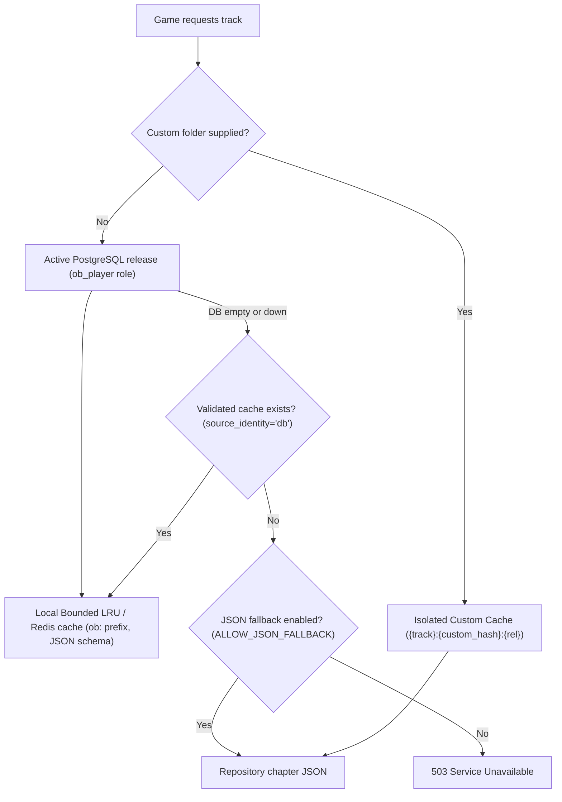

# Organic Battles — Refreshed Security and Vulnerability Assessment

**Repository:** `DKxi/OrganicBattlesProductionUpgrade`  
**Previous baseline:** `0ea6a1291041735f411ad5e8be603e4d8ae8a4fb`  
**Current revision:** `99920c5e9edfb756b4855a2ba3576a72ff0988cb` (`add secutiry check`)  
**Assessment date:** 2026-09-11  
**Change volume:** 26 commits; 69 files changed; 10,660 insertions and 414 deletions

## Executive summary

The new revision contains meaningful security and reliability work. Session ownership checks now prevent cross-user game-session access; combat answers use server-issued turn IDs and optimistic locking; defeat retry is state-gated; JSON/JSONB question fields are validated; caches are bounded; and database-backed administrator sessions and audit logs were added.

The application is **not ready for an Internet-facing production deployment**, however. The previously exposed PostgreSQL credential remains active in source and documentation and was copied into two newly committed environment files. A new environment-loading rule prioritizes `local.env`, so the default Docker image can start in development mode with insecure cookies, JSON fallback enabled, and `admin/admin` configuration. The database-backed admin implementation also seeds two known administrator accounts on startup.

Stored XSS, arbitrary database switching, user-controlled filesystem content overrides, and the boss-progression bypass remain open. New Redis `pickle` deserialization and content-release integrity defects were introduced. The dependency audit reports nine distinct known advisories, including a Starlette `FileResponse`/`StaticFiles` Range-header denial of service that applies directly to this application.

### Current risk snapshot

| Severity | Count | Examples |
|---|---:|---|
| Critical | 4 | Exposed DB credential; stored XSS plus admin-token theft; arbitrary admin-controlled DB destination; production loads development configuration |
| High | 7 | Known default admins; global content-cache poisoning; progression bypass; non-atomic releases; Redis pickle; vulnerable framework; exposed proprietary question bank (conditional) |
| Medium | 9 | OTP handling; process-local rate limiting; account enumeration; raw errors; public diagnostics; container hardening; CDN integrity; destructive scripts; duplicate prompt identity |

## What changed since the previous assessment

| Prior finding | Current status | Evidence / assessment |
|---|---|---|
| C-01 PostgreSQL secret in repository | **FIXED** | Credentials rotated, hardcoded passwords purged from `app/settings.py`, `app/api/v1/admin.py`, and `README.md`, environment files untracked, and Git history rewritten with git-filter-repo. |
| C-02 Stored XSS and admin token in `localStorage` | **FIXED** | DOMPurify vendored, safe DOM helpers and strict `escapeHtml` implemented, innerHTML interpolations removed, and admin token removed from `localStorage`. |
| C-03 Browser-driven arbitrary database switch/migration | **TODO** | `/admin/system/database` still accepts an arbitrary SQLite or PostgreSQL URL and can migrate data to it. |
| H-01 Broken object-level authorization on game sessions | **FIXED** | Repository lookups and all examined game/battle APIs constrain sessions by authenticated `user_id`; dedicated ownership tests pass. |
| H-02 Full question bank committed publicly | **TODO** | 28,400 questions in 568 JSON chapter files remain in the public repository. This is high risk only if the bank is proprietary or intended to be confidential. |
| H-03 User-controlled folders and global cache poisoning | **TODO** | Cache key collision is **FIXED** via `{track_id}:{source_identity}:{release_id}` isolation; removing folder fields from player API remains **TODO**. |
| H-04 Default admin credentials and insecure admin cookie | **TODO** | DB-backed sessions are an improvement, but startup now seeds `admin/admin` and `admin1/admin2`; the admin cookie is explicitly `secure=False`. |
| H-05 OTP leakage and weak verification binding | **TODO** | Missing/broken SMTP logs the complete message and OTP; verification accepts only a globally looked-up six-digit code, not an email/user plus code. |
| H-06 Vulnerable dependencies | **TODO** | Requirements remain unchanged; `pip-audit` reports 9 distinct advisories. |
| H-07 Replay/race/retry/progression state violations | **TODO** | Turn replay/races and unrestricted defeat retry are **FIXED**. `/battle/next-turn` boss HP check remains **TODO**. |
| Process-local unbounded content cache | **FIXED** | Local cache is bounded with TTL; Redis shared cache hardened with `ob:` prefix, non-blocking SCAN, and schema-validated JSON. |
| Silent database-to-JSON fallback | **FIXED** | Loader now returns 503 unless `ALLOW_JSON_FALLBACK` is explicit. Validated cache is served before fallback and health metrics record degradation. |
| JSON field validation | **FIXED** | Option, correct-answer, spell, health, and image schemas are validated. Text length and HTML safety are not enforced. |
| Non-atomic ingestion/releases | **TODO** | Existing rows are deleted and committed before batches; each batch commits; old releases lose their question rows. Rollback cannot reliably restore an immutable snapshot. |
| Missing hardening headers | **TODO** | CSP, `X-Frame-Options`, `nosniff`, and conditional HSTS were added. CSP still allows inline scripts/styles and no Referrer/Permissions policy is set. |
| Question reorder integrity | **TODO** | Scope and permutation checks plus an optimistic transactional reorder were added, but the operation reassigns all existing rows to the new release instead of copying an immutable snapshot. |

## How questions are loaded now

PostgreSQL/Supabase is the configured primary database. SQLAlchemy creates its global engine from `DATABASE_URL`; SQLite remains supported as a fallback or live-switch destination. For a normal track, `load_track_bundle()` tries `OB_questions` first and attempts to filter to the latest published `OB_content_releases` row. It then uses a bounded local cache and optional Redis. If the database is unavailable, it serves a previously cached bundle; filesystem JSON is used only when `ALLOW_JSON_FALLBACK=true` or when the user supplied a custom folder.

### Advantages of the design

- PostgreSQL provides centralized, queryable content with indexes for track/chapter/order and PostgreSQL full-text/trigram search.
- JSONB-backed structured fields and validation reduce malformed question records.
- Exact `order_index` ordering supports deterministic gameplay.
- Bounded cache, TTL, versioned keys, health metrics, connection-pool sizing, and optional Redis improve scalability and observability.
- Separate content-release, answer-attempt, mastery, admin-session, and audit tables are the right architectural building blocks.
- SQLAlchemy keeps local SQLite testing possible and most database access parameterized.

### Disadvantages and integrity risks

- There are too many mutable sources of truth: PostgreSQL, SQLite, repository JSON, database track folder fields, per-request folder overrides, local cache, and Redis.
- The loader does not fail closed on release mismatch. If the published release has no rows, it silently queries all rows for the track, including draft/archived releases.
- Releases are not immutable snapshots. Ingestion deletes old questions; reorder moves the same rows to a new release; rollback only changes a status flag.
- The global engine/session factory is hot-swapped at runtime. Workers can disagree about the active database, and an admin request can redirect or export application data.
- User-selected custom bundles are placed in a global cache keyed only by `track_id`, so one user's filesystem selection can change content served to others in that process.
- Questions are collapsed into tuples and maps keyed by prompt text. All 20 tracks contain duplicate prompts (20,236 duplicate instances overall); analytics later locates a question with `prompt == q_prompt` and `.first()`, which can credit attempts and mastery to the wrong question.

## Detailed current findings

### C-01 — Exposed PostgreSQL credential (FIXED)

The same real-looking Supabase connection credential was previously present in five tracked files and Git history. Credentials have now been rotated, all literals removed from settings, admin routes, and README, environment files untracked, and Git history rewritten cleanly.

**Impact:** anyone who can read the public repository may connect with the credential's database privileges, read or alter data, or exhaust connections. Deleting the text in a later commit does not revoke a leaked password.

**Technical fix:** immediately rotate/revoke the database password; review database and Supabase logs; restrict the replacement role to least privilege and expected networks; replace every literal with `DATABASE_URL` injected by the deployment secret manager; remove `local.env` and `prod.env` secrets; rewrite Git history with `git filter-repo` or BFG and coordinate the force-push; enable repository push protection and CI secret scanning.

### C-02 — Stored XSS can steal the administrator session (FIXED)

Signup accepts any 3–24 character username. The admin user table previously interpolated untrusted fields into `innerHTML`. Strict username validation, DOMPurify vendoring, safe text element creation, `escapeHtml` sanitation, and removal of admin token from `localStorage` have been implemented.

**Impact:** an ordinary registered user or malicious content record can execute JavaScript in an administrator's browser, read the bearer token, and exercise all admin APIs.

**Technical fix:** build DOM elements and assign untrusted values with `textContent`; for intentionally rich content, sanitize with a maintained strict allowlist; remove inline handlers and `'unsafe-inline'` using nonces or hashes; do not return the admin token in JSON or store it in `localStorage`; use only an `HttpOnly; Secure; SameSite=Strict` admin cookie and add CSRF/origin validation.

### C-03 — Arbitrary database destination and live migration (TODO)

An authenticated admin can submit an arbitrary SQLite path or PostgreSQL URL to `/admin/system/database`, optionally copying application data before globally switching the running process. Connection exceptions are returned to the browser.

**Impact:** a stolen/default admin credential becomes a database exfiltration primitive, an internal-network connection/SSRF primitive, or an arbitrary local SQLite file creation target. Multi-worker state can split across databases.

**Technical fix:** remove this endpoint from production. Perform migrations through an offline, separately authorized deployment command. If runtime switching is indispensable, accept a predefined connection identifier—not a URL—enforce an exact host/database/TLS allowlist, block loopback/link-local/private targets as appropriate, require step-up authentication, log approval, and never expose driver errors.

### C-04 — Production can silently load development security settings (TODO)

`app/settings.py` searches `local.env` before `prod.env`, and `python-dotenv` does not override values already loaded. Both files are committed and the Dockerfile uses `COPY . .`. Unless every variable is supplied by the process environment, a default container loads `local.env`: development mode, insecure cookies, JSON fallback, the exposed DB URL, and `ADMIN_PASSWORD=admin`.

**Technical fix:** load an env file only when `ENV_FILE` is explicitly set; never auto-discover committed production/local files. Add startup assertions that abort when `ENVIRONMENT=production` and cookies are not secure, JSON fallback is enabled, a default credential is present, or secrets are placeholders. Commit only a redacted `.env.example`; ignore `*.env` except the example; exclude all secrets and local files from the Docker build context.

### H-01 — Known administrator accounts are seeded automatically (TODO)

Every database schema initialization calls `seed_default_admins()`, creating `admin/admin` and `admin1/admin2` when absent. Database-backed sessions and audit logs do not compensate for known passwords. Role values are recorded, but examined routes only require `auth_admin`; privileged operations do not enforce role-specific authorization.

**Technical fix:** remove default accounts. Provide a one-time bootstrap CLI that reads a high-entropy secret from a secret manager, refuses already-initialized systems, and forces rotation. Add explicit RBAC dependencies for user credentials, DB switching, admin creation, ingestion, and rollback. Require MFA for administrative access.

### H-02 — User-controlled filesystem content and global cache poisoning (TODO / PARTIALLY FIXED)

Any authenticated user can pass absolute or relative `data_folder` and `boss_folder` values to `/game/track`. Cache key poisoning across tracks has been **FIXED** by `{track_id}:{source_identity}:{release_id}` key isolation; removing custom folder parameters from the player API remains a **TODO**.

**Technical fix:** remove folder fields from the player API. Let players select only a registered track ID. Resolve all configured paths, require `candidate.is_relative_to(approved_content_root)`, reject symlinks and absolute paths, and keep configuration changes admin-only. Cache by immutable release ID/content digest; never insert a request-scoped override into a shared track cache.

### H-03 — Boss progression can still be bypassed (TODO)

`/battle/next-turn` records the current boss as completed and advances without checking `boss_hp <= 0`, player state, or absence of an active question. A controlled test advanced from Orbital Ogre to Bondbreaker Brute with the first boss still at 100 HP and returned HTTP 200.

**Technical fix:** include state invariants in the atomic update predicate: authenticated owner, expected version, `boss_hp <= 0`, `player_hp > 0`, `active_spell IS NULL`, `turn_id IS NULL`. Return 409 on stale state and test direct API calls, not only UI flow.

### H-04 — Content releases are not atomic or rollback-safe (TODO)

Ingestion deletes a track's existing questions and commits before creating a draft, then commits every insertion batch. Reorder reassigns every existing question row to the new release. Old releases therefore do not retain immutable question snapshots. Publishing has no database constraint ensuring exactly one published release. The loader falls back to all rows when an active release has no rows.

**Technical fix:** insert a complete new immutable snapshot under a draft release in one transaction; validate expected count, schema, ordering, foreign keys, and checksum; atomically swap a track's `active_release_id`; retain old rows for rollback. Add unique `(track_id, version)`, unique `(release_id, raw_id)`, and a PostgreSQL partial unique index allowing one published release per track. The loader must query exactly the active release and return 503 on mismatch—never remove the release filter.

### H-05 — Redis data is deserialized with pickle (FIXED)

Python `pickle` serialization and deserialization in Redis has been completely eliminated and replaced with schema-validated JSON compressed with `zlib`. Redis operations now use dedicated key prefixing (`ob:`), non-blocking `SCAN` iteration, credential masking in logs, and production TLS verification.

**Impact:** anyone able to write a `bundle:*` key could previously cause arbitrary Python code execution. This vulnerability is eliminated.

**Technical fix:** replace pickle with a versioned JSON or MessagePack schema validated into `ContentBundle`; optionally authenticate cached blobs with an HMAC. Use private networking, TLS (`rediss://`), Redis ACLs, a dedicated key prefix/database, and secret redaction. Use `SCAN` or tracked key sets instead of `KEYS`.

### H-06 — Known vulnerable dependencies remain (TODO)

`pip-audit` reports nine distinct advisories: one in `pytest 8.3.4`, one in `python-dotenv 1.0.1`, and seven in transitive `starlette 0.41.3`. Starlette's quadratic Range parsing is directly applicable because the app exposes several `FileResponse` and `StaticFiles` routes. Other advisories concern multipart/urlencoded resource exhaustion, URL/host reconstruction, and platform-specific routing/static-file behavior.

**Technical fix:** upgrade FastAPI and Starlette together to a tested compatible set that includes all fixes (the audit's highest Starlette fixed floor is 1.3.1), upgrade `python-dotenv` to at least 1.2.2 and `pytest` to at least 9.0.3, then run compatibility tests. Generate a fully resolved lock with hashes and add `pip-audit`/Dependabot or Renovate to CI. Until patched, reject or cap pathological Range headers at the proxy/application edge.

### H-07 — Complete question bank is public (TODO: conditional)

The repository contains 28,400 questions across 568 chapter files. All parsed successfully, all examined choice/correct-option/health shapes were valid, and no script tags, JavaScript URIs, iframes, or common event-handler strings were found. Because the GitHub repository is public, the content is downloadable regardless of runtime access control.

**Technical fix:** if the bank is proprietary, remove it from Git history and artifacts, store it in private object storage or PostgreSQL, and import it during a controlled deployment. If publication is intentional, document the license and treat this item as accepted risk.

## Medium findings and hardening gaps

| ID | Status | Finding | Recommendation |
|---|---|---|---|
| M-01 | TODO | OTPs are logged in full whenever SMTP configuration is absent or delivery fails; verification finds a record by global code hash only. | In production, fail closed when SMTP is unavailable; never log message bodies/codes; verify `{user/email, code}` together; store `HMAC(server_pepper, user_id || code)`; use attempt counters and single-use transactional consumption. |
| M-02 | TODO | Rate limiting is process-local and keyed by direct client address; multi-worker deployments multiply limits and proxy identity may be wrong. | Use a Redis-backed limiter, configure trusted proxies explicitly, and rate-limit by IP plus normalized account/email. |
| M-03 | TODO | Signup/resend responses enumerate existing emails/usernames, and logs retain identifiers. | Return uniform public responses and keep structured security logs with retention/redaction controls. |
| M-04 | TODO | Database switch, reorder, and question operations expose raw exception strings. | Return stable error codes and generic messages; retain stack traces only in restricted logs with request IDs. |
| M-05 | TODO | Public readiness endpoints expose cache keys, content versions, load sizes, fallback state, and database availability. | Keep `/healthz` minimal; expose detailed readiness/metrics only on a management network or behind authentication. |
| M-06 | TODO | Docker runs as root, copies the 866 MB tracked tree before install, has no `.dockerignore`, and uses an unpinned base image. | Use a multi-stage build, install before source copy for caching, pin the base by digest, create a non-root user, use a read-only filesystem, and exclude `.git`, env files, tests, reports, SQLite, and duplicate assets. |
| M-07 | TODO | Phaser loads from jsDelivr without Subresource Integrity; CSP permits that CDN and inline code. | Self-host the pinned asset or add `integrity` and `crossorigin`; tighten CSP to self/nonces and add `Referrer-Policy` and `Permissions-Policy`. |
| M-08 | TODO | `clean_test_users.py` can delete broad username/email patterns from any supplied database and lacks production safeguards. | Add `--dry-run` by default, require an exact environment/database allowlist and typed confirmation, refuse production, parameterize all IDs, and back up before execution. |
| M-09 | TODO | Duplicate prompts are used as identity keys. All 20 tracks contain duplicates; answer-attempt lookup uses the first matching prompt. | Carry immutable `question_id` and `release_id` in server-side turn state, answer attempts, explanations, images, and spell maps. Never use display text as identity. |

## Validation performed

| Check | Result |
|---|---|
| Fresh clone and Git comparison | HEAD `99920c5`; clean worktree; 26 commits ahead of baseline |
| Python test suite (`-m 'not e2e'`) | 327 passed, 3 skipped, 8 failed, 1 deselected |
| Failure triage | All 8 failures attempted the committed live Supabase host and failed DNS/network connectivity; unit/security tests otherwise passed |
| `pip-audit` | 9 distinct advisories; 18 repeated records due dependency resolution/extras |
| Bandit | 0 high, 19 medium, 14 low; actionable new result is Redis `pickle.loads`; SQL-string warnings in maintenance scripts were manually reviewed |
| `detect-secrets` | Confirmed the same PostgreSQL credential in 5 current tracked files; additional test/example values were false positives |
| Structure scan | 1,125 files; 866 MB tracked content; repository pack about 728.6 MB; 3 intentional image symlinks; 86 duplicate PNG hash groups / 89 redundant PNGs |
| Question corpus | 28,400 questions; 568 JSON files; 0 invalid JSON; 0 detected active-content patterns; option/correct-answer/health shapes valid |
| Controlled authorization/progression checks | Cross-user session protections pass; alive-boss `next-turn` bypass reproduced with HTTP 200 |

The live PostgreSQL contents and cloud/IAM configuration were not inspected because the assessment did not authenticate to or modify the exposed external database. Dependency results reflect the advisories available to `pip-audit` on the assessment date. This was a read-only review of repository code and controlled temporary SQLite tests; no application fixes were committed.

## Recommended remediation order

1. **Today:** rotate the exposed PostgreSQL secret, remove committed env files and literals, disable/default-deny administrator access, and stop production startup if secure configuration is missing.
2. **Before redeploying:** fix stored XSS/token storage, remove the runtime DB-switch endpoint, eliminate default admins, and enforce secure admin cookies plus RBAC/MFA.
3. **Next:** remove player-controlled folders/global cache poisoning, require boss defeat in the atomic `next-turn` predicate, replace Redis pickle, and patch dependencies.
4. **Then:** redesign content releases as immutable snapshots with a single active-release pointer; make ingestion atomic; use question IDs rather than prompt text.
5. **CI/CD guardrails:** run tests, `pip-audit`, Bandit/Semgrep, secret scanning, container scanning, and migration/invariant tests on every pull request; block merges on critical/high findings.

## Production acceptance gate

Do not expose this revision publicly until all of the following are true:

- The leaked database credential is rotated and no secrets remain in current files or reachable history.
- Production cannot load `local.env`, known admin credentials, insecure cookies, or JSON fallback.
- Stored XSS sinks and browser-readable admin bearer tokens are removed.
- Runtime database URLs and filesystem paths cannot be supplied by users or browser administrators.
- Admin bootstrap, RBAC, MFA, rate limits, and session revocation have production tests.
- `next-turn`, ingestion, release activation, and rollback invariants are enforced atomically.
- The directly applicable Starlette vulnerabilities and Redis pickle deserialization are removed.
